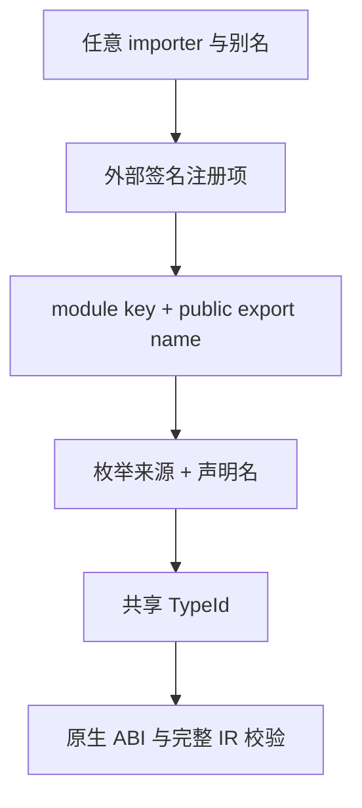
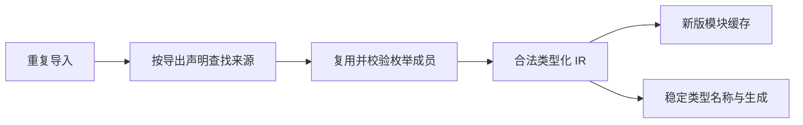

# 外部签名名义身份修复计划

## Intent：最终目标

修复相同 legacy 外部导出被重复导入时，项目分析返回无效 IR 诊断的问题。统一名义类型来源与原生导出 ABI 约束，保留成功分析结果必须通过 IR 校验的门禁。

## Data：可用证据

阶段 218 既有回归 8/12 通过，四项失败集中于双默认绑定、双成员绑定、跨 importer 绑定及分配失败轨迹。project.importExternal 使用 importer/binding/member 区分枚举；validateExport 要求同一 NativeModule.key 与 exportName 的 Input/Output TypeId 一致。导入别名改变了同一 ABI 的枚举身份，造成确定冲突。

## Edges：最终契约

导入是引用已有声明，不是声明实例化。同一 External.key()（identity 优先，否则 specifier）与同一公开 exportName() 的签名枚举共享身份；不同模块身份或不同公开成员的独立签名不按结构合并。默认函数的公开名取实现成员路径末段，与 IR External.exportName 一致。原生声明组的共享规则不变。

不放宽 validateExport，不取消项目 IR 门禁，不把失败改成预期错误，不新增测试用例。调整既有正向断言以验证共享身份及成功 IR。外部来源结构从 importer/binding/member 改为 module/member，同时更新生成类型名字与缓存格式；开发阶段不保留旧结构适配。

## Answer：交付与成功标准

最小修改身份生成、来源拷贝/相等、类型名字摘要与缓存版本。十二项名义来源回归全部成功，既有共享类型、artifact/link/cache、编译器及运行回归通过。记录验证与自我批判，完成后提交并 push。

## 执行记录

已核对根因与最终契约，准备修改。旧四项失败的断言描述的是原实现行为，并不是应凌驾于公开 ABI 的语言规则。

### 正式实施

已将外部签名枚举来源改为 `External.key()` 与 `External.exportName()`，再与声明名共同定位身份。`exportName()` 默认取实现成员路径的末段，与 IR 外部函数的公开名规则一致；显式 `export_name` 优先。导入文件及局部别名不再成为声明身份的一部分。

来源拷贝和比较、Zig 类型名称摘要同步使用该身份。模块缓存头从 `zxc.module.v1` 升级为 `zxc.module.v2`，旧数据按既有无效缓存路径重新生成，不解析为新结构。完整 IR 与重复外部导出的 ABI 校验保持原样。

既有名义来源回归更新为验证共享声明：两个默认别名共享 1 个枚举；两个不同成员跨别名共享各自的枚举，共 2 个；跨文件导入仍共享 1 个。保留成功 IR 检查及不同成员身份不相等的断言，没有把失败改成预期错误。

当前验证：名义来源、类型合并、artifact slot、缓存编解码及语义缓存专项 51/51，通过 30/30 构建步骤；编译器 352/352，通过 8/8 步骤。根完整回归已经启动，结果待确认。

### 自我批判

旧正向断言与 ABI 不变量相冲突，直接让旧断言通过会保留错误模型。这里选择统一声明身份，同时保留更严格的 IR 校验。该变更调整可观察的名义来源结构与生成类型名称，因此必须同时失效旧语义缓存。独立签名的不同导出仍不按形状合并；需要多个导出共享枚举时应使用共同的原生声明接口。

### 最终验证

- 独立 HEAD 检出仅迁入五处生产修改，复用现有名义来源与分配失败回归：12/12，通过 6/6 步骤。
- 当前工作目录专项：51/51，通过 30/30 步骤；编译器：352/352，通过 8/8 步骤。
- 根命令 `ZXC_TEST_SOLVER=/tmp/zxc-z3-5.1.0/z3-5.1.0-x64-osx-13.3/bin/z3 zig build test -j4 --summary all`：1,778/1,778 步骤、64,439/64,439 测试全部通过，退出码 0。

根回归覆盖当前工作目录中的额外既有测试扩充；提交只包括五处生产修改、公开说明与本计划/草稿，没有把其他会话的完整测试扩充或未完成 RX 推导一并提交。无分号迁移与本次身份修复在该完整回归中同时通过。后续收到的模板原始 CR/CRLF 反馈已有独立草稿，但本轮根回归未包含该草稿，不混用验证结论。
