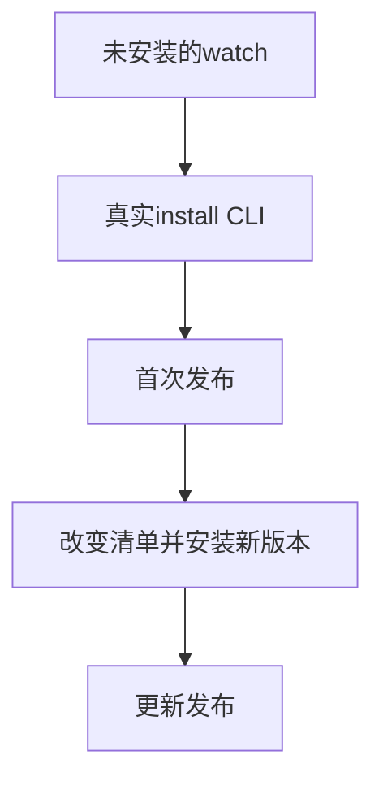
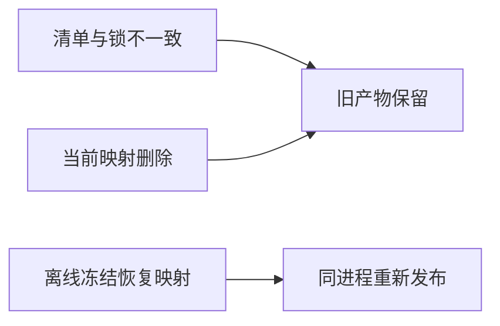

# 安装依赖图持续构建恢复验证

## Intent：最终目标

同一真实watch进程在未安装依赖、清单改变和项目映射缺失后能够恢复，失败时保留旧产物，成功后运行正确版本。

## Data：可用证据

复用两版本calc/core真实安装夹具。当前安装图加载记录锁文件和按锁摘要命名的映射输入，watch应监测缺失路径出现及锁变化。

## Edges：边界与限制

不修改生产源码，不重启watch模拟恢复。失败保留检查二进制与汇编哈希，成功检查实际应用输出。此轮不涉及原生归档、网络安装或进程中断事务。

## Answer：交付格式与成功标准

新增单个完整Node进程集成测试，检查首次安装恢复、版本升级恢复、映射删除后离线恢复，并等待自己的watch进程退出后清理临时目录。保留构建入口、日志、草稿与自我复核。

## 执行结果

新增1个真实watch进程Node集成测试，专项 `zig build test-package-install-watch --summary all` 已接入根构建。使用独立临时项目与ZXC_CACHE_DIR。

同一进程依次验证六个状态：

1. 未安装时报告缺少依赖，二进制和汇编均不存在。
2. 首次真实安装后自动构建，三组输入得到输入+9。
3. 只将左成员依赖改为^2.0.0，报告LockFileOutdated，双产物哈希不变，旧程序仍得到输入+9。
4. 真实安装更新锁后自动发布，锁节点由7变5（两个成员共用同一calc/core版本），程序得到输入+24。
5. 删除当前锁摘要对应的映射文件，报告未安装，双产物哈希不变，程序仍得到输入+24。
6. 删除索引与归档来源目录，执行离线冻结安装；锁文件与恢复映射原始字节不变，watch重新发布并得到输入+24。

五个可执行状态分别运行0、7、123，共15次应用调用。只有一个watch子进程，结束时发送SIGTERM并等待close后清理目录；没有重启来替代恢复。

首轮退出0：**10/10步骤、1/1 Node测试通过**，约45秒，日志 `/tmp/zxc-install-watch.log`。TypeScript检查退出0，日志 `/tmp/zxc-install-watch-typecheck.log`；格式、diff和一份草稿逐字节核对通过。

无生产修改或新实现缺陷。包安装相关Node测试现为15项（普通安装专项14项、安装watch专项1项），不计入JSONL目录。目录62,474、上游533/53,597、唯一关联2,980不变；最新完整根仍阶段170。

## 自我批判

不能仅凭watch输出built判定成功，必须执行新产物；失败时也运行旧程序并比对双产物哈希。同一集成流程中的多个状态不增加独立案例数。

本测试证明所观测状态变化会恢复，并不声称文件变化触发精确次数的内部编译；built计数仅作为状态发布的等待条件，正确性由实际结果和失败状态下的双哈希验证。
