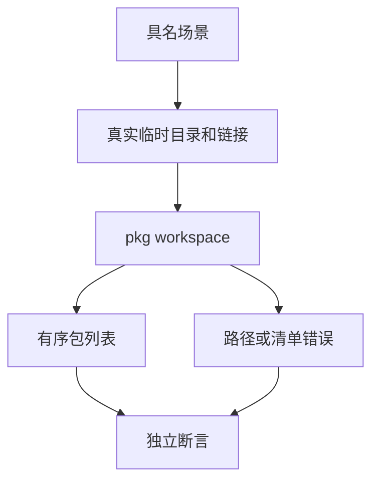

# 工作区成员发现验证

## Intent：最终目标

为 pkg workspace 的真实文件系统发现规则建立独立具名验证，覆盖模式、排序、唯一身份、忽略目录和符号链接边界。

## Data：可用证据

包管理实施文档明确根包总是包含；支持段内 */? 与独立 **，排除与声明顺序无关；跳过六类内部目录，不跟随目录符号链接；清单真实路径不得逃出根；嵌套 workspace 不另启动扫描。源码 workspace.zig 与 pattern.zig 提供当前公开行为。

## Edges：边界与限制

只在本轮创建的临时父目录内写入工作区、外部清单和符号链接。外部清单相对工作区在外、相对测试临时父目录仍在内。结果校验按确定顺序的路径与包名，不只比较数量；不把成员发现等同依赖安装或图解析。

## Answer：交付与成功标准

每种规则独立 Node test，调用真实 pkg workspace；合法场景检查根与成员有序列表，非法场景检查退出 1、空 stdout 与明确错误。接入已有包清单专项及根 test，测试数与 Zig/JSONL 分开报告。

## 专项结果与自我批判

新增 31 个独立 Node 测试全部通过：根包/空模式、字面路径、*/?/**、跨层与零层、排除声明顺序、递归排除、重复包含、缺清单目录、重复成员或根包名、非法成员、嵌套工作区、三个链接边界、六种忽略目录及四种不支持模式。

直接 CLI 31/31 通过；构建专项共 7/7 步骤，inspect 24/24 与 workspace 31/31 分别通过，日志 `/tmp/zxc-workspace-direct.log` 和 `/tmp/zxc-workspace-special.log`。TypeScript、格式和 diff 检查通过。

成员路径按数组原序严格比较，不能用排序后的集合掩盖生产排序错误；相同模式多次命中不能增加输出重复项。链接测试的外部清单仍放在本测试临时父目录内，清理只删除本测试创建的目录。

这些测试验证当前文件系统上的发现语义，不证明网络安装、版本范围求解、依赖图或跨平台链接权限。工作区错误案例核对明确诊断类别与退出协议；成员清单错误另检查行列，不将通用进程失败当作预期拒绝。此轮未发现生产缺陷，没有发送多余缺陷通知。

最终根级实际 Z3 回归 1063/1063 步骤、57,109/57,109 Zig 测试通过，另有 inspect 24/24 与 workspace 31/31 Node 测试通过，日志 `/tmp/zxc-workspace-root.log`。JSONL 登记与上游审阅数不变。
