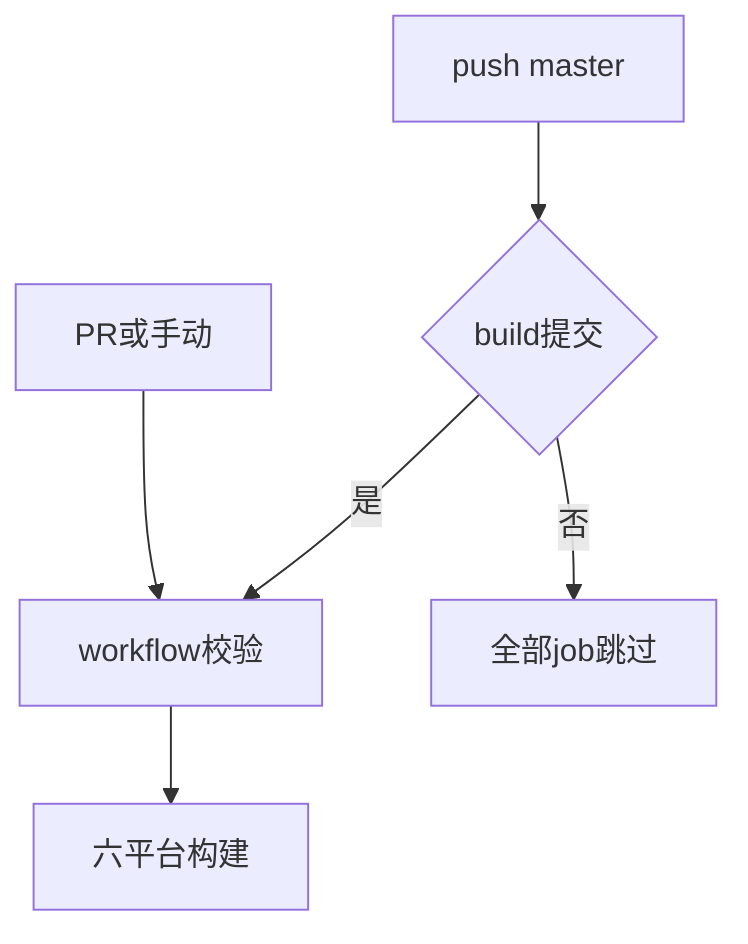
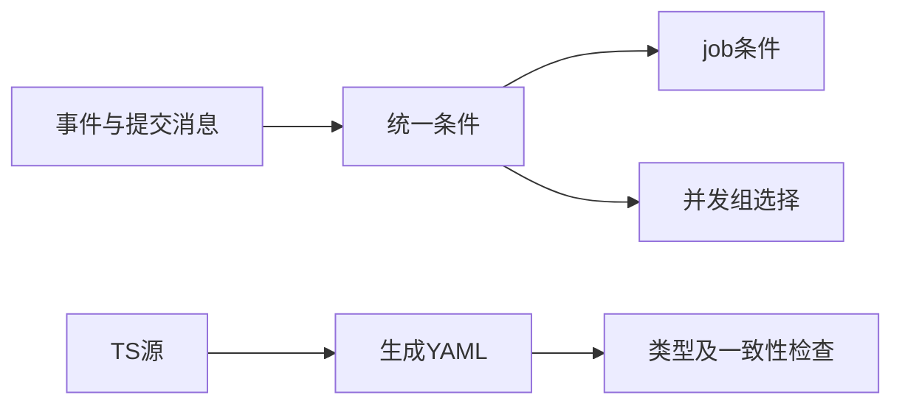

# 工作流提交过滤修复

## Intent：最终目标

master普通提交不运行构建作业，仅build类型提交自动执行；保留PR和手动触发。

## Data：可用证据

工作流由.github/tsflows/build.ts生成YAML。当前master所有push都启动作业。采用Conventional Commit风格，以head_commit.message的build:、build(或build!:前缀判定。

## Edges：边界与限制

GitHub push没有自定义提交标题过滤，使用job级if跳过，仍可能有skipped运行记录。一次push按最新提交判断，正文提到build不匹配。PR/手动保持允许。跳过运行使用独立并发组，避免取消正常构建。

## Answer：交付与成功标准

修改TS源、重新生成YAML、更新README，使用固定Bun执行build/check。无新增测试文件，无需触发远程构建。

参考：[GitHub workflow语法](https://docs.github.com/en/actions/reference/workflows-and-actions/workflow-syntax)。

## 验证与自我批判

Bun 1.3.10下build和check均通过，check包含TypeScript与生成YAML一致性；diff空白检查通过。未直接编辑生成YAML，未触发远程Actions或提交推送。

条件只判断消息前缀，build(scope)按build(前缀识别，并非完整Conventional Commit语法校验。未提供用户补充时按仓库现有提交风格采用这一规则。GitHub仍创建跳过记录的限制已明确说明，不能宣称事件层完全不产生run。检查依赖关系：build依赖workflow，workflow跳过则build跳过。并发组将允许执行的run与普通提交SHA分开，避免跳过run取消正常构建。
