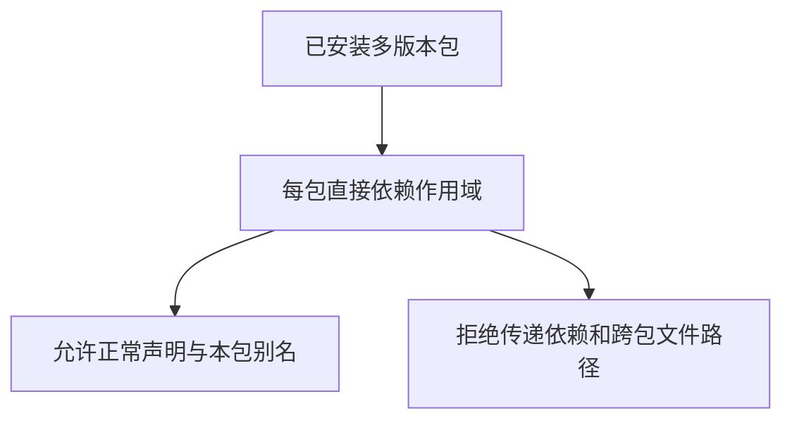

# 已安装包导入隔离与损坏恢复验证

## Intent：最终目标

确认外部包安装后仍执行每个包独立的导入权限，且损坏的共享内容和错误项目映射不能进入编译；修复数据后恢复真实应用运行。

## Data：可用证据

当前installed.load校验锁文件与工作区一致、映射路径摘要以及缓存回执；项目作用域由每个包直接依赖构建。复用已有两版本calc/core安装夹具和真实CLI。

## Edges：边界与限制

只修改临时安装数据，不修改生产源码。此轮不声称覆盖恶意并发替换、全部符号链接或跨平台路径。拒绝之后恢复必须实际重新编译运行，不能只看错误消失。

## Answer：交付格式与成功标准

按导入边界和安装完整性两组新增Node测试，保留合法直接声明与包内别名对照。负例必须退出1、指定诊断且不产生程序，恢复后确认计算结果；接入原安装专项。

## 执行结果

新增8个Node测试：6项导入边界（4负例、2运行对照）和2项损坏拒绝/恢复。继续使用 `zig build test-package-install --summary all`，原6项与新增8项联合执行。

四项负例分别为：成员直接导入未声明core传递依赖、工作区根导入成员的calc依赖、成员相对导入另一个工作区成员、成员相对导入共享缓存中的core文件。均退出1、包含明确包作用域诊断、不产生程序，且锁/映射原始字节不变。

正例在成员显式声明core后运行得到输入+2；另在工作区根和成员内放置不同helper，成员的@/引用与calc组合得到输入+49，证明别名归属当前包而不是工作区根。各执行0、7、123三组输入。

损坏场景分别改写已安装calc源码，以及把左侧calc映射替换成右侧另一版本的合法缓存路径。前者以CorruptPackageStore、后者以InvalidPackageInstallation拒绝构建，均不产生程序。恢复原始字节后锁/映射与原值一致，重新构建左应用并运行三组输入，均得到输入+9。

首轮全部通过：**13/13步骤、14/14 Node测试通过，退出0**，其中新增8项、既有6项。日志 `/tmp/zxc-package-install-boundaries.log`。新增场景执行4次成功构建和12次应用调用；连同既有运行集成，本轮共8次成功构建和24次应用调用，不另计为独立案例。

TypeScript检查退出0，日志 `/tmp/zxc-installed-boundaries-typecheck.log`；构建格式、diff及2份新增草稿逐字节一致性通过。复用的fixture.ts与registry.ts保留原文件，没有顺手重构。

没有生产修改或新增实现缺陷。包安装Node测试现为14项，JSONL目录62,474、上游审阅533/53,597、唯一关联2,980不变。最新完整根仍阶段170，本轮没有重复完整根。

## 自我批判

安装成功不等于隔离正确。必须通过同一真实构建入口同时验证允许和拒绝，避免只有负例且所有输入都被拒绝也算通过。

损坏用例使用语法正确的ZX源码和形状合法的映射，避免把语法/JSON错误误当作完整性校验通过。恢复阶段删除旧可执行文件后重新构建，不能靠旧程序通过运行断言。
