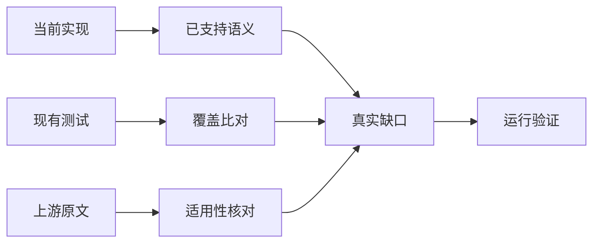
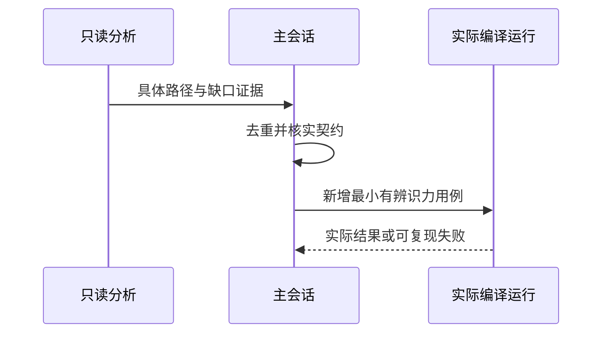

# 已支持语义测试缺口复核

## Intent：最终目标

从语言已支持的语义中寻找真实覆盖缺口，优先增加能发现实现缺陷的运行证据，而不是继续堆积不支持语法的入口拒绝。

## Data：可用证据

当前目录审计63,919案例，上游已审阅990份。既有集合生成器主要枚举i64值、集合长度和索引失败；已有完整Test262索引、元数据、逐项审阅记录及当前ZX契约。两个只读子代理分别核对可适配上游用例和原生实现缺口，主会话负责核实及落地。

## Edges：边界与限制

不将数组动态属性协议、稀疏数组或JS转换强行映射成ZX静态集合；不重复已有案例，不把计数增加当作覆盖增加。不修改并行实施中的生产源码，发现问题按用户授权反馈实现会话。Context注入功能已删除，排除其专属测试。

## Answer：交付与成功标准

记录候选缺口的源码依据、最近既有测试、最小可执行场景和独立预期；至少选取一个已支持行为完成正式测试及运行验证，或将真实实现失败准确反馈并保留可复现证据。

## 选定缺口与已有覆盖边界

compiler/tests/language/callback_scope_test.zig验证嵌套参数作用域的分析成功/失败；CLI transforms.zx已有map→filter→reduce一条实际运行链。现有packages/test集合目录主要平面i64转换与索引失败，未发现本轮选定三个场景的运行覆盖。

选择nested_map产出i64[][]、nested_initial在内层reduce初值读取row[0]、restored_row在内层reduce结束后读取row[0]。每种七组输入：空外层、一个空内层、两个空内层、单零元素、带负数多元素、中间空行、不同长度多行，共21项。

两个reduce场景数学结果相同，但初始化时的名称解析和内层回调结束后的作用域恢复是不同代码路径；不据相同输出声称求值时序已经被完整观察。空内层要求IndexOutOfBounds，空外层不调用回调并返回空列表。

## 后续候选与溯源区分

只读核对发现四份尚未审阅的模板原文值得后续优先处理：template-literal/no-sub.js、literal-expr-template.js、middle-list-one-expr-template.js、middle-list-many-expr-template.js，均可保留ASCII与小整数嵌套插值表达式。后续仍需主会话完整核验原文与生成结果，不在本轮记已审阅。

filter/15.4.4.20-6-1.js的空列表和map/15.4.4.19-8-c-ii-9.js的恒true映射主要补现有覆盖的上游溯源；reduce/15.4.4.21-9-c-ii-22.js有bool accumulator价值，但原文array-like包装与捕获需明确边界。splice/S15.4.4.12_A1.1_T3.js、T4.js及concat/S15.4.4.4_A1_T3.js可保留部分内容断言，不能声称消费式tuple与JS身份/变异契约相同。

## 修正已过时的审阅理由

发现dense_values.jsonl两条历史理由仍写clone；核对当前reverse owned/2/i64.zx、string/sort/owned/26_0/cases.zx及集合支持层后，改成真实的逐项构造owned列表描述。仅修正说明，保留上游哈希、审阅状态、关联案例和断言；修改前后已保存。输入不变确由集合支持层expectEqualDeep验证。

## 实际结果与自我复核

新增21项实际生成代码运行测试，21/21构建步骤、21/21案例通过，涵盖15项返回值与6项IndexOutOfBounds。生成器--check、类型及本轮格式检查通过。独立参考脚本执行实际ZX表达式，使用明确的数组越界代理建模ZX索引规则，全部21项通过；不声称普通JS空数组索引会抛错。

本轮不新增上游审阅数量，不把新的原生组合测试强行关联到依赖JS捕获或index回调参数的原文。两份分析报告经主会话核对，未把“packages/test未覆盖”扩大为“全仓库从未测过嵌套回调”。未修改生产源码，也未覆盖实现会话正在进行的完整回归。

最终目录审计通过：63,940案例，前端5,044、运行46,682，其余分类不变；上游990/53,597（539适配、103等价、348排除），关联4,166。目录一致性不表示本轮执行过全量案例。七份新增正式产物与草稿副本逐字一致。
