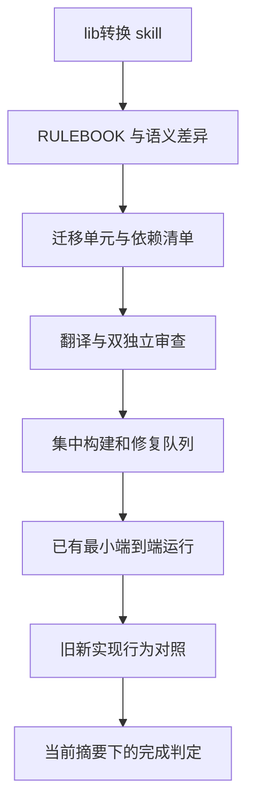

# 库转换技能实施

## Intent：最终目标

在 packages/translib 提供显示名为“lib转换”的 skill，将其他语言的库迁移成真实 ZX 库。提供可运行的依赖排序、证据失效、集中构建、修复队列与行为对照步骤，避免用文件存在、包装原库或单次编译成功冒充迁移完成。

## Data：可用证据

- 用户已提供 X 正文，要求参考六阶段迁移、双独立审查、统一规则和可执行行为判定。
- 参考项目为 anthropics/code-migration-kit-with-claude-code，核对提交 cf91c9d5068d9aaf95a36164169f08c3e636c909。上游自述为未持续维护的参考实现，不直接复制它的任务完成判定。
- 当前 实施前 packages/translib 不存在。packages/skills 是应用指导文档；本次独立技能包包含辅助脚本，不把编译器内部维护规则混入应用指导。
- 现有 zxc 支持 pkg.yaml、app/lib 编译与 JSON 参数执行；ZX 存在明确的类型、所有权、无环与副作用边界，不能假设任意源语言结构都可机械对应。

## Edges：边界与限制

- 技能指导 AI 翻译，脚本负责确定性步骤；不宣称提供通用语言自动转译器。
- 迁移单元可按 API 或模块划分，不要求源文件一一映射。来源、目标、规则、判定输入和命令必须纳入证据摘要。
- 程序只执行配置的参数数组，不通过 shell 拼接。统一构建使用原子目录锁互斥；失败日志形成机器可读队列，失败必须返回非零状态。
- 审查证据记录两个不同审查者、当前单元摘要与问题处置。脚本不能证明审查者在认知上独立，技能流程需保证隔离上下文。
- 行为对照复用用户已有输入，分别执行原实现与新实现，记录退出码及输出。JSON 比较不得将布尔值与数字混同，不得截断大整数，不得接受 NaN 或重复键。
- 任何配置或受跟踪文件变化都使相关证据过期；执行过程中变化也不能落成通过结果。
- 不新增测试用例，不调用浏览器。用既有列表反转模型、ZX 实现及全部原始输入做临时迁移演练，并核对已知错误候选确实被对照工具拒绝。
- 不自动修改用户的 AI 权限配置，不自动发起并行 agent。多 agent 执行需要当前会话已有授权；没有授权时仍可准备任务与证据，不声称独立审查已完成。

## Answer：交付与成功标准

交付 SKILL.md、中文参考、UI 名称、TypeScript/Bun 脚本和具体命令说明。流程包括可行性与 RULEBOOK、依赖单元清单、代表性试迁移、翻译与双审查、集中构建、smoke 与原实现行为对照。最终状态必须同时具有当前版本的审查、构建、smoke 和行为证据。

## 自我复核

流程检查只能证明记录和实际命令结果一致，不能证明未覆盖输入上的语义等价。用户的原始测试、源实现可运行性、平台范围与性能约束必须作为交付报告的边界。实现完成后追加真实演练结果，不把本计划当成已实现报告。

## TypeScript 实施修订

用户要求新增脚本全部使用 TypeScript/Bun，替换尚未交付的 Python 草稿。命令仍分 status/review/build/smoke/parity/check，执行配置的参数数组；JSON 对照独立保存数值词法并规范化十进制指数，避免大整数和负零损失。

执行锁改为原子创建锁目录，正常结束在 finally 中释放。Bun/Node 不提供跨平台的同构文件锁接口，本次不引入 FFI；异常终止后显式报锁占用，由负责人确认原进程已结束再删除锁目录，不宣称能自动判定陈旧锁。清单和证据按当前文件、依赖、工具身份和产物摘要失效。先在 docs 编写 TS 草稿，再同步正式技能目录。

清单用 environment 显式声明子进程继承的变量。实际环境用于参数查找和执行，其摘要参与证据；未声明变量不传入子进程。独立演练证明整包继承父环境会受无关工具上下文影响，不能在不同审查上下文间稳定复用，因此不采用全量父环境继承，也不按某个工具名称列特殊排除项。

## 执行结果

- 全部辅助脚本为 TypeScript/Bun，严格 TypeScript 检查通过，并纳入现有 GitHub 工作流的类型检查；技能 frontmatter 与 UI 元数据通过 Bun YAML 解析，引用文件存在。未安装全局技能或改写用户工具配置。
- 复用仓库 collections 的 reverse 原模型、shared/json 精确 JSON 适配、owned/3/i64.zx 和原始 28 条 JSONL。临时适配器只统一 value 外壳，不实现反转算法。
- build 实际导出 ZX 库，再构建导入该库的 ZX 消费者；smoke 执行消费者；parity 执行全部原始 28 条输入，通过 i64 极值在内的精确输出核对。
- 两个独立审查上下文重新阅读源码、目标、适配器及原始输出，当前摘要一致，均无未解决发现；记录两份实际审查报告后，check 返回 complete:true。
- 修改 RULEBOOK 会使证据过期，旧审查报告被拒绝；已声明环境变化使证据过期，未声明环境变化不影响执行环境或证据；并发写锁拒绝第二次写入。
- 对相同 28 条输入运行故意错误的候选，28 条全部被拒绝；真实编译失败保留 stderr，并同时生成单元定位与全局修复项；无法精确表示为 0–255 整数的退出码被拒绝。
- 最初的全环境摘要在独立上下文间失效，修复显式环境后重新构建、消费、对照和独立审查，没有给旧报告替换摘要。

## 验证边界

此演练覆盖声明的固定三元素 i64 反转范围及程序化证据流程，不推广到任意长度、其他 API、非法输入、其他平台、性能或形式化等价。Bun 运行验证在当前 macOS 宿主完成；未将跨平台 API 的使用推断为已在 Windows/Linux 执行技能。目录锁的异常退出恢复仍是显式边界。
