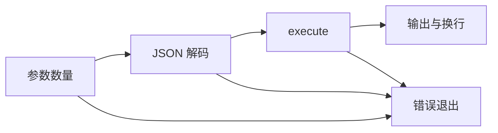
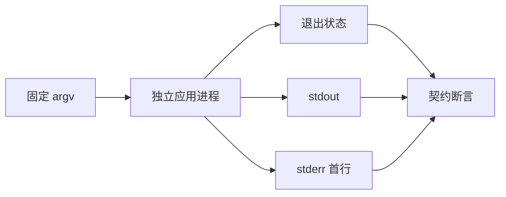

# 应用参数与输出协议验证

## IDEA

- Intent：验证生成应用的参数数量、JSON 解码、void 输出及执行失败的进程协议。
- Data：当前 cli/runner.zig 在解码前检查参数数量，在 execute 成功后才写 stdout；void 输出固定 null 加换行。
- Edges：测试实际 app，不修改 CLI 行为。错误断言首行稳定错误名、状态和空 stdout，不依赖机器堆栈。非法输入与运行时越界分开验证。
- Answer：三个实际应用，独立 Node 场景覆盖协议分支，接入根 test 并记录结果。

## 执行计划

1. 构建 void 输入、void 输出和列表索引三个应用。
2. 分别验证零/一/多参数及 malformed JSON。
3. 验证越界错误不会产生正常输出，运行专项并同步文档。

## 架构

## 数据流

## 执行结果

新增 28 个独立 Node 场景，实际构建三个应用。void 输入只接受零参数；普通输入只接受一个参数；参数数量先于 JSON 解码检查。void 输出在两个分支均为 `null` 加换行。空/截断/多余 JSON 分别拒绝，列表越界实际返回 IndexOutOfBounds 且 stdout 为空。

`zig build test-app-protocol --summary all` 退出 0，9/9 步骤、28/28 Node 测试通过，失败、取消、跳过均为零。日志 `/tmp/zxc-app-protocol.log`。类型、格式、diff 和草稿一致性通过。已接入根 test，无生产源码修改或新缺陷。

JSONL 61,382、上游 370/53,597 不变；JSON/应用协议 Node 合计 156（32+96+28），不并入 JSONL。最近完整根阶段 99，本轮专项不是新完整根证据。

## 自我批判

- 三个应用覆盖 runner 的主要参数/成功/解码失败/执行失败分支，不证明所有宿主 I/O 失败情况。
- 仅检查应用输出协议，没有验证 pipe 关闭、磁盘错误、stdout 写入失败或超大输出。
- 错误首行稳定断言保留了诊断类别，堆栈位置刻意不作为跨环境契约。
- void 输入没有把 JSON null 视为无参数，这是 argc 契约，不能与可选类型 null 混淆。
