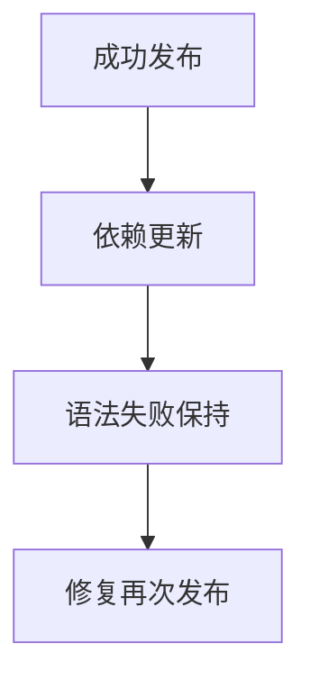

# 持续导出库恢复验证

## IDEA

- Intent：验证watch库模式更新、失败保留与输出目录用户文件保留。
- Data：真实zxc --watch --mode lib、library.json依赖清单、实际Zig消费者。
- Edges：目录逐文件发布不是目录级事务；测试在built日志后消费一致产物。
- Answer：实际库消费、原文件哈希和用户文件检查、恢复验证及独立专项。

## 结果

新增1个Node集成测试，启动实际zxc build --watch --mode lib。首次helper增量2、修改为5、注入语法错误、恢复为9，实际Zig消费者四次执行输入7，分别得到9/12/12/16。消费者按导出library.json的entry_dependencies/generated_modules构造模块参数，并实际调用library.execute，不只检查文本存在。

语法错误后root.zig、abi.zig、library.json及当前清单引用的所有生成模块哈希不变，旧库仍可编译调用。更新及失败过程中keep.txt用户文件内容不变；消费者源文件也留在输出目录参与下一次消费。测试结束关闭watch进程并清理临时目录。

`zig build test-watch-library --summary all`退出0，10/10步骤、1/1 Node测试通过，约5秒，无跳过，日志 `/tmp/zxc-watch-library.log`。类型检查、格式、diff与两份草稿通过，TS日志 `/tmp/zxc-watch-library-typecheck.log`。入口接入根test，没有生产修改或新缺陷。

目录62,438、上游508/53,597不变；watch集成现在应用/库各1个，共2个Node测试，内部四次Zig消费者不重复计入固定API数量。最新完整根仍阶段160，4个legacy失败未被本轮专项覆盖。

## 自我批判

在built状态后消费导出库，只证明每轮完成后的可用性，不证明发布过程中读者看到目录级原子快照。没有覆盖原生资源复制失败、旧模块文件清理、长时间watch内存增长或库接口形状变更；测试范围保持普通静态输入输出与依赖值变更。
