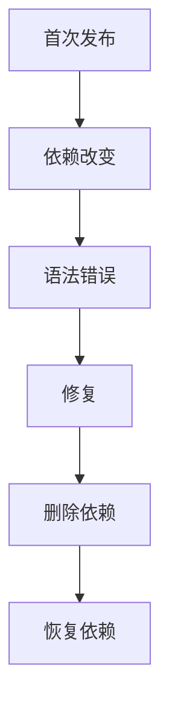

# 持续构建CLI恢复验证

## IDEA

- Intent：通过实际zxc build --watch验证源码依赖变更、失败保留与自动恢复。
- Data：当前watch CLI、built日志、发布文件哈希及应用运行结果。
- Edges：同一真实watch进程覆盖多次变更；不把固定等待时间当作构建成功。
- Answer：独立Node集成入口、根接入、确定状态日志后检查产物与清理进程。

## 结果

新增1个Node集成测试并接入test-watch-recovery及根test。实际运行同一个zxc build --watch进程，依次检查首次发布、依赖增量修改、语法错误、修复、删除依赖、恢复依赖。六个状态分别运行-2/0/9三个输入，共18次实际程序执行，输出对应增量1/3/3/8/8/2。失败状态二进制及汇编SHA256保持此前值，进程保持存活，修复后能自动发布。

首轮误把缺失依赖诊断预期为底层FileNotFound，等待条件无法满足；独立调用同一CLI确认实际为module: import target is missing from the source set。确定是测试等待条件错误后终止本测试watch进程，使首轮退出并清理，再改为等待准确模块诊断。未因日志安静盲目重启，也未改变产物保留断言。首轮日志 `/tmp/zxc-watch-recovery.log`保留。

最终 `zig build test-watch-recovery --summary all`退出0，10/10步骤、1/1 Node测试通过，约58秒，无失败/取消/跳过；日志 `/tmp/zxc-watch-recovery-final.log`。类型检查、格式、diff、一份草稿一致性通过，TS日志 `/tmp/zxc-watch-recovery-typecheck.log`。已向实现会话报告CLI链路通过证据，无生产修改或新缺陷。

目录62,438、上游508/53,597不变；新增watch Node测试另计，内部18次运行不当成18个独立案例。最新完整根执行仍阶段160，已知4个legacy失败仍保留。

## 自我批判

此测试补齐实际ZX前端到watch后端与发布链路，但只覆盖应用模式、普通ZX依赖和当前主机。库模式、原生/C头文件缺失重试、诊断去重、工作区候选变化及长期服务内存增长尚未覆盖。等待发布日志避免固定睡眠猜测，但无法穷尽所有并发编辑时序。
