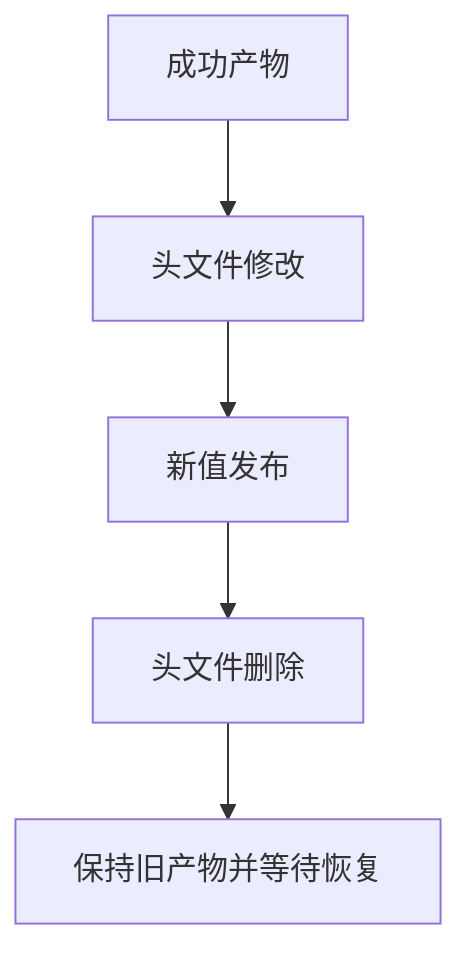

# 持续构建缺失头文件恢复验证

## IDEA

- Intent：验证首次缺失C头文件的watch恢复、头文件修改失效及删除后旧产物保留。
- Data：真实C导入声明、实际watch进程、后端错误及发布程序运行。
- Edges：诊断静默窗口只证明不重复输出，不单独证明内部重试次数。
- Answer：新增C头文件集成，初始缺失/创建/修改/删除/恢复与旧产物哈希检查。

## 结果

新增1个Node集成测试并接入test-watch-headers与根test。实际C接口声明绑定late.h中的static inline函数，初始头文件不存在，确认后端报告缺失且二进制/汇编均未生成。五秒窗口stderr保持不变；随后只创建头文件，不改ZX、清单或目录结构，watch自动发布。

头文件函数增量2→5→删除→9，四个可运行状态分别以-2/0/9输入调用应用，共12次实际执行，验证增量2/5/5/9。删除时后端错误允许再次报告，旧二进制与汇编SHA256均保持；恢复后发布并执行新结果。测试结束watch进程和临时目录均清理。

`zig build test-watch-headers --summary all`退出0，10/10步骤、1/1 Node测试通过，约49秒，无失败/取消/跳过；日志 `/tmp/zxc-watch-headers.log`。TS、格式、diff与一份草稿检查通过，TS日志 `/tmp/zxc-watch-headers-typecheck.log`。没有生产修改或新缺陷。

目录62,438、上游508/53,597不变；watch Node集成累计3个（应用ZX恢复、库模式、C头文件），不把内部执行次数扩成目录计数。最新完整根仍阶段160。

## 自我批判

五秒静默证明该时间窗口不重复打印同一错误，不直接证明内部重试次数；创建首次缺失头文件后恢复提供外部行为证据。此测试使用单层C头文件与简单inline函数，未覆盖传递include链、平台系统头差异、原生动态库或watch长期内存增长。失败输出保留只在构建失败阶段验证，不包括双产物发布中途IO失败。
