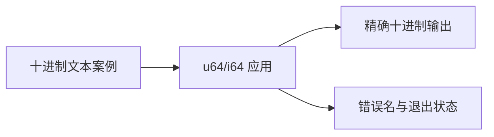

# 整数 JSON 精度与范围验证

## IDEA

- Intent：验证真实应用 u64/i64 的 JSON 整数精度、格式转换和范围拒绝，排除测试宿主 number 舍入导致假通过。
- Data：cli runner 使用 Zig JSON；固定 Zig sliceToInt 对整数字面量直接 parseInt，对小数/指数使用 f128 检查整数性及范围。
- Edges：全部输入与预期均保留十进制字符串，不经过 JS number。测试当前接受数字字符串和整数值的小数/指数形式的契约，不声明源码允许隐式转换。
- Answer：两个实际 app、独立命名 Node 案例、精确 stdout 与错误状态检查，专项执行证据。

## 执行计划

1. 构造两类整数的范围端点、2^53 邻域、相邻大整数。
2. 同值分别以 JSON 整数、数字字符串、小数和指数形式输入。
3. 验证溢出、非整数和错误 token，接入根 test。

## 架构

## 数据流

## 执行结果

新增 96 个独立 Node 测试：64 个合法格式/边界，16 个溢出，8 个非整数，8 个错误 token。两个实际应用分别为 u64 和 i64 身份返回。所有输入/预期为文本，覆盖 2^53 前后相邻值、u64 最大值及 i64 两端，输出必须精确等于预期十进制加换行。

`zig build test-json-integer --summary all` 退出 0，9/9 步骤、96/96 Node 测试通过，失败、取消、跳过均为零。日志 `/tmp/zxc-json-integer.log`。类型、格式、diff 和草稿一致性通过。新入口接入根 test，无生产源码修改或新缺陷。

JSONL 61,382、上游 370/53,597 不变。JSON 应用专项现有 32 枚举 +96 整数 =128 个 Node 测试；不并入 JSONL。最近完整根阶段 99，本轮仅运行整数专项。

## 自我批判

- 宿主没有使用 JSON.parse/Number 转换测试值，避免 64 位整数精度丢失；这不证明所有其他测试宿主路径都同样安全。
- 本轮只覆盖整数身份返回，不涉及运行时整数运算；运算溢出由其他专项验证。
- 小数/指数形式使用整数值与简单 e0，尚未覆盖极端指数、巨大输入文本或所有浮点到整数路径。
- 当前接受数字字符串，是应用 JSON 解码规则，不是 ZX 源码类型转换规则。
- 新入口已接入根依赖，但专项通过不自动成为新的完整根基线。
