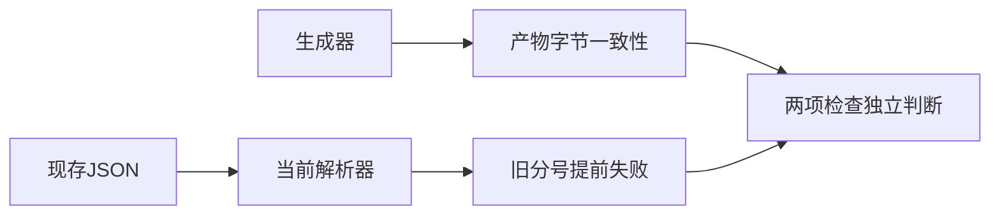
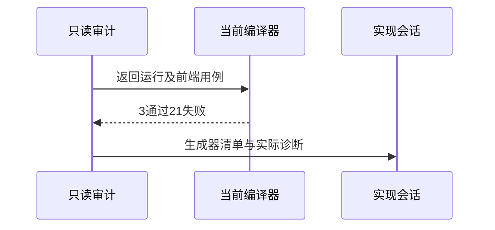

# 无分号测试迁移复核

## Intent：最终目标

确保语法迁移后测试仍验证目标语义，避免生成一致性通过却因旧分号在错误阶段失败。

## Data：当前证据

只读运行最近十个生成器--check，五通过、五失败。失败为switch_scalars、switch_statement、return_statement、if_nested、if_statement的生成ZX不一致；逐项日志及JSON清单保存于同名目录。

组合执行返回专项和前缀language/statements/return前端过滤，实际同时包含return_top_level。结果23/25构建步骤成功，3/24测试通过、21失败，退出1。三运行测试LF/CR/CRLF仍返回1；前端21项残留分号，提前syntax或解析失败，未达到原期望诊断。完整日志保存在同名目录的返回专项.log。

## Edges：边界与限制

实现会话仍在迁移，结论是此刻快照，不能断言完成后的版本有同样问题。不改动其生成器/旧语料，不把失败改为预期syntax。Context专项已移除。

## Answer：交付与成功标准

提供十生成器清单、组合运行失败日志、关键文件SHA256，并将准确迁移问题发给实现会话。等待其生成器、产物和诊断语义一致后再复验，不宣称整套迁移完成。

## 自我复核与更正

阶段223读取时result包含lineBreak空返回分支；本轮复验时该判断已被实现会话移除。当前实际运行证明return跨LF/CR/CRLF仍连接表达式并返回1。因此更正此前对中间态的临时描述，不继续宣称现行ZX采用JS ASI。

--check通过的return_top_level仍可全数执行失败，说明字节一致性并不是语义回归。这也是不能只报告生成器检查通过的原因。本轮没有新增测试或放宽断言，没有覆盖其他迁移场景；目录计数不变。
