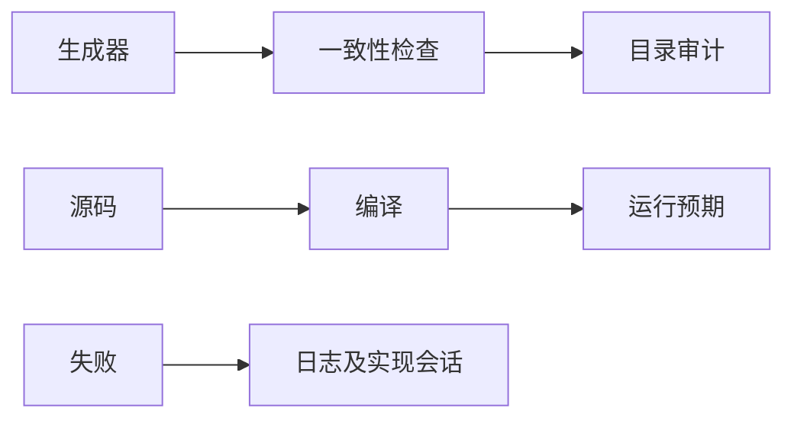
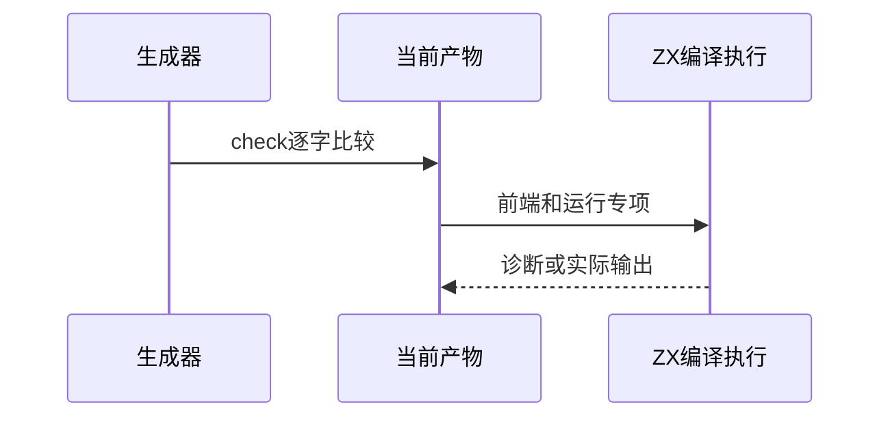

# 无分号迁移第二轮复核

## Intent：最终目标

在目录审计恢复后验证近期控制流语料的生成一致性与真实编译执行，核实阶段224及226具体失败是否已修复。

## Data：可用证据

上一轮十生成器五不一致，return前端21失败；switch empty/no_fallthrough被spacing拦截。阶段228类型与目录审计恢复，但没有重新执行这些失败组。

## Edges：边界与限制

实现会话仍在迁移，保存本轮日志和关键文件哈希。只读检查现有生成器，不自动重写既有产物；组合专项不替代全仓库运行。

## Answer：交付与成功标准

记录全部近期生成器--check结果，执行switch运行与前端、return运行与前端；分别报告执行成功和编译前阻断，反馈新失败证据。

## 实际结果

13个近期生成器--check全部通过，包括前轮不一致的switch_scalars/switch_statement/return_statement/if_nested/if_statement。结果、每份日志和生成器SHA已保存。

switch运行四专项与前端组合：65/65步骤、97/97测试通过，其中37前端、60运行/轨迹；原empty和no_fallthrough编译阻塞消除。

return运行与前端组合：25/25步骤、24/24测试通过，其中21前端、3运行。LF/CR/CRLF预期仍为1，实际执行通过，不将迁移中间态误报为JavaScript ASI行为。

if轨迹与前端组合：23/39步骤，已执行155/155通过（107前端、48轨迹），五份源码在编译前被spacing拦截：early_return、discarded、nested_outer_partial、nested_inner_partial、nested_both_partial。整套if专项失败；完整日志及源码哈希已保存，具体文件和模板同步修复请求已发送实现会话。

## 自我复核

本轮证明生成一致性不能代替编译执行：五份if源码虽然与生成器逐字一致，仍不符合AST空行分组规则。没有删除断言、改变预期或改写并行迁移文件。已执行155/155不包含被阻断的组，不能宣称if全部通过。

本轮没有新增目录案例，沿用阶段228审计基线63,900；没有重跑全仓库，不扩大本轮成功范围。Context专项保持已删除状态。
