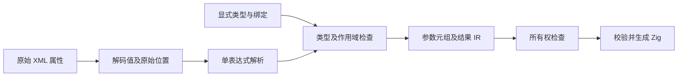
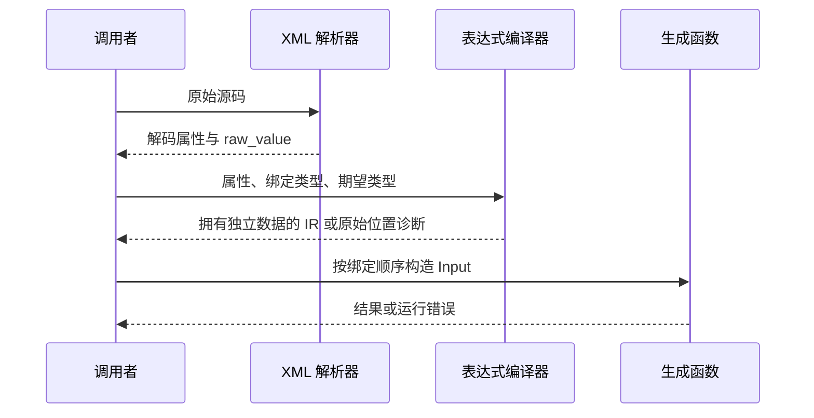

# 显式表达式编译交付计划

## Intent：最终目标

为 RX 属性提供可复用的表达式解析、显式输入绑定、类型分析、代码生成入口和原始 XML 诊断位置映射。输入数据全部由调用者声明并通过生成函数参数传入。

## Data：可用证据

工作区已有 parse_expression、expression、expression_binding、expression_program 与 application.expression 实现。独立测试会话提供 40 个绑定分析/编译 API 测试、9 个生成代码执行测试及 15 个 XML 位置测试。参考本地成熟实现 frontend/parse.zig 的 arena 所有权和诊断返回方式；普通表达式语义复用 analysis/expressions.zig。

此前完整根回归包含这些工作区实现，但提交应单独验证不依赖其他未提交源码。原生函数重联结修复已另行提交。

## Edges：边界与限制

不重新引入隐式注入，不实现或宣称完成 service 调度、事件、Store 宿主联结、分支环境合并和完整 RX 应用生成。绑定路径唯一且不得互为祖先；值不允许 void；绑定不能被回调隐式捕获。分析与生成结果拥有 arena，外部运行时数据仍由宿主管理。

不新增测试；使用其他会话已存在的专项。暂存生产功能和本轮文档，不把整套未提交测试开发一并提交。移除此前原型需要、当前功能未使用的 compiler.NominalType 根导出。

## Answer：交付格式与成功标准

公开 parseExpression、expressions.analyze/compile、application.expression.compile 和 attributeLocation/attributeEndLocation。提供 API 参考和已有回归证据；暂存版本能独立编译。仅 analyze 不能当作运行许可；Zig 生成仍经过完整 IR 校验与所有权门禁。

## 执行与自我复核

已整理并暂存独立解析、绑定、分析/编译和 XML 适配实现，删除未被本功能使用的根 NominalType 导出。公开参考记录参数、输入元组顺序、生命周期、原始位置映射、工具链元组输入限制与未覆盖的 RX 调度边界。

| 检查                                     | 结果                       |
| ---------------------------------------- | -------------------------- |
| 工作区表达式绑定、实际运行、XML 位置专项 | 18/18 步，64/64 测试通过   |
| 暂存版本 compiler 回归                   | 49/49 步，347/347 测试通过 |
| 暂存版本根构建                           | 14/14 步通过               |
| 暂存版本表达式专项                       | 17/17 步，64/64 测试通过   |

隔离验证从 Git 暂存区导出全部源码；仅将已有表达式测试原样复制到隔离测试包，使用保存的精简构建注册执行，未复制其他未提交生产实现，也没有新增用例。工作区和隔离注册的步骤数差一来自专项聚合方式不同，测试总数均为 64。相关日志与注册文件在显式表达式编译/验证。

首次从仓库根调用专项因该层未注册目标而退出，随后在 packages/test 执行成功。既有完整根回归中的 4 个 legacy 枚举身份失败未在本轮解决，不能宣称仓库全量通过。

自我复核：独立测试覆盖实际生成代码、位置边界与分配失败，但仍是有限输入，不证明所有表达式组合。源码与 AST 结果释放后仍可用的所有权，不等于延长宿主运行时借用值的寿命。XML 映射依赖同次解析的 attribute 数据。完整 RX 流程仍未完成，不能把表达式 API 等同于应用执行器。
