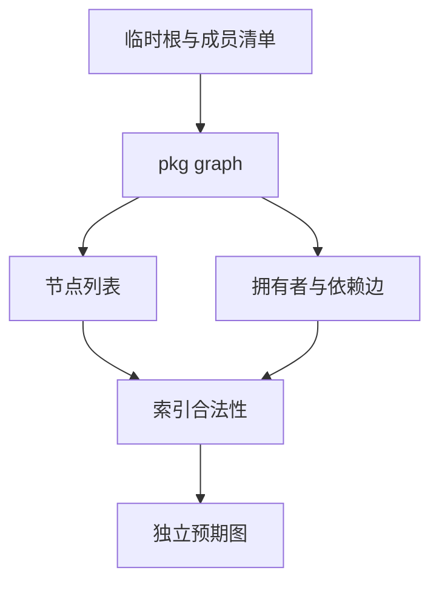
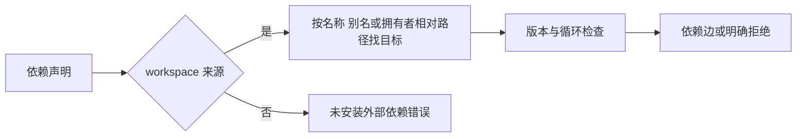

# 本地工作区依赖图验证

## Intent：最终目标

验证 pkg graph 输出的真实本地依赖边、拥有者归属和错误边界，不以成员发现替代图正确性。

## Data：可用证据

当前 graph 只解析 workspace: 来源；支持包名、别名、作用域名、相对拥有者路径和版本要求。区分 dependencies/dev_dependencies，拒绝重复分类、自环与间接环；发现但根未引用的成员也校验。

## Edges：边界与限制

所有清单与目录仅在测试临时目录内。版本案例仅验证明确的范围边界，不声称 node-semver 全部语法等价。本轮不进行网络获取或安装；普通外部版本要求必须明确失败，不能偷偷用同名工作区包满足。

## Answer：交付与成功标准

独立 Node 测试核对有序节点路径和名称；依赖 target 必须是合法索引，再转换成包名与拥有者、别名及 development 标志一起比对。拒绝场景检查完整诊断、退出码与空 stdout。接入包清单专项及默认根测试。

## 执行与自我批判

32 个新图场景全部通过。直接 CLI 日志 `/tmp/zxc-graph-direct.log`；构建系统专项 8/8 步骤，inspect 24/24、workspace 31/31、graph 32/32，共 87 个独立 Node 测试通过，日志 `/tmp/zxc-graph-special.log`。TypeScript、Zig 格式和 diff 检查通过。

正向用例先验证节点路径与名称，再检查每条 target 是范围内整数，最后以实际目标名核对拥有者、依赖声明名及 development 标志。未宣告依赖的成员存在不产生隐式边；未被根引用的成员自环/间接环仍拒绝，开发边也参与循环检查；共享叶子的菱形图合法。

版本场景覆盖精确、caret、tilde、组合比较及裸 workspace ^/~ 的当前契约；这不是完整版本范围语法证明。图输出正确不证明编译时文件导入隔离，也不证明安装、锁文件或网络获取。未发现生产缺陷，无生产源码修改。

本轮只新增 CLI 图测试并加入已被根 test 依赖的包清单专项循环，未改变语言实现及 JSONL 目录，因此运行相关专项，未重复整套 Zig 根回归。最近完整根证据仍是阶段 75：1063/1063 步骤、57,109/57,109 Zig 测试通过；不能把它说成本轮新增的全量执行结果。
