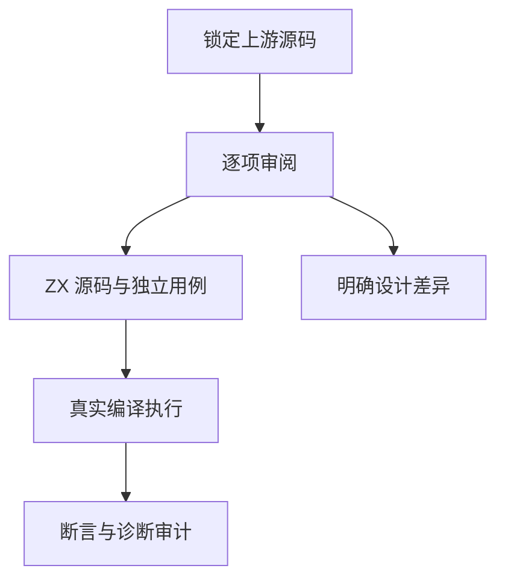
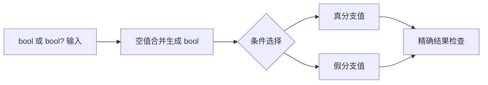

# 条件运算符逐项对齐

## Intent：最终目标

为条件运算符剩余 17 个上游文件逐项建立真实语义证据，补足分支值类型和空值合并优先级，保持 ZX 静态契约。

## Data：可用证据

固定 Test262 版本的 conditional 目录，已有 yes/no 索引短路案例。逐文件审阅发现原测试分别涉及空白、布尔/数值/字符串/null 分支、包装对象、in 语法、Symbol 与尾调用。

## Edges：边界与限制

非 bool 条件明确拒绝；不把包装对象身份、undefined、Symbol 或递归尾调用解释成已支持。数值位模式保留并非本批原文件断言，不能借此虚增上游覆盖。保持原有运行驱动，仅增加实际编译的表达式与独立具名案例。

## Answer：交付与成功标准

新增布尔、数值、字符串、可选值选择及六种 bool? 空值合并组合；空白和类型边界有独立诊断。执行通过后逐文件登记 SHA、断言、差异。文档记录运行结果并自我批判。

## 专项执行结果

新增 32 条运行案例（bool 14、数字 4、字符串 4、可选值 4、空值合并 6）和 18 条前端案例。包内 `zig build test-frontend test-runtime --summary all` 为 745/745 步骤、41,792/41,792 测试通过。最初误从仓库根调用包内 test-runtime 别名，构建系统明确拒绝；改在 packages/test 执行后通过，不计为语言失败。

逐文件登记 11 adapted、6 excluded，conditional 目录查询剩余零个未审查。总审查 267/53,597（145 adapted、102 equivalent、20 excluded），仍有 53,330 未审查；关联 751 个案例。登记数 53,002，runtime 38,718、frontend 3,074，其余分项不变。

## 自我批判

原始字面量测试可能被编译器常量折叠，因此另保留已有 yes/no 动态输入索引短路测试，并新增输入驱动的六种空值合并组合。本批不宣称证明任意副作用或所有输出类型的动态路径；包装对象和 undefined 在混合文件中明确留作设计差异。for/[In]、Symbol、递归 TCO 六个文件分别说明排除原因，不用静态语法错误冒充相同 ECMAScript 规则。未发现生产实现缺陷，没有发送不必要的缺陷通知。

TypeScript、生成一致性、目录审计、格式与 diff 检查通过。混合空白顺序已对齐原始文件，最终根回归包含该调整。

最终根级 `zig build test --summary all`（实际 Z3）为 923/923 步骤、52,998/52,998 条 Zig 测试通过，日志 `/tmp/zxc-test262-conditional-root.log`。本阶段无生产源码修改。
