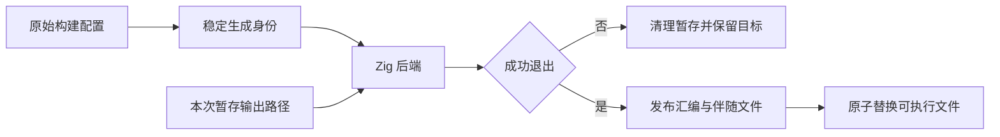
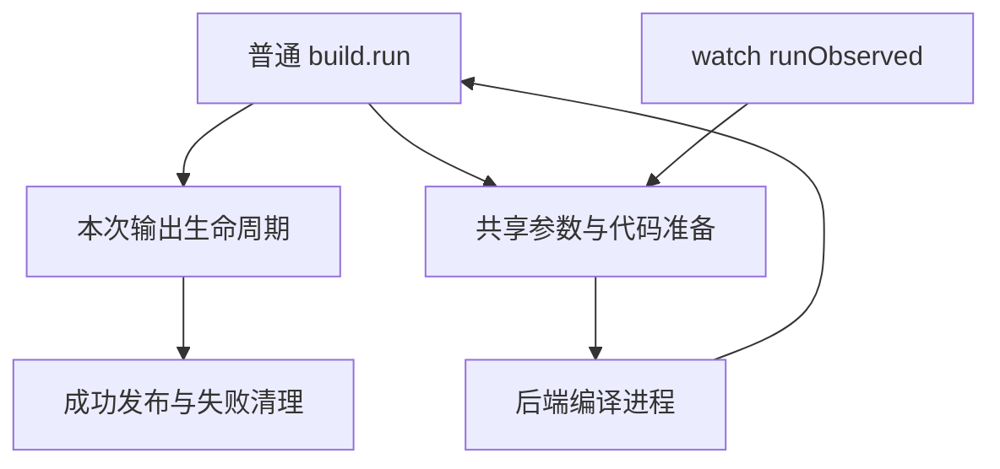

# 构建失败产物保护

## Intent：最终目标

普通应用构建失败不创建目标可执行文件、不截断既有目标；汇编输出遵守同一后端成功门禁。

## Data：可用证据

独立 test-native-aliases 反馈：abi_aliases:[] 导致合法的后端诊断，但全新 --out 留下零字节文件。cli/build.run 直接将正式目标传给 Zig -femit-bin；这条路径用于普通构建，并不等同于 --no-cache。watch 的 observed 路径已经在后端成功后使用 std.Io.Dir.copyFile 发布，Zig 0.16 的该 API 按文件原子替换并保留权限。

## Edges：边界与限制

采用现有 watch/library 的临时目录模式。为每次编译创建独立暂存目录，保留二进制与汇编各自的 basename；成功后将调试伴随文件和汇编发布，最后发布可执行文件。失败或启动错误只清理暂存目录。各文件原子替换不等于整个多文件集合事务；发布阶段 I/O 错误的跨文件回滚不在本次契约内。

临时路径不能进入生成产物摘要，否则会令每次调用失去缓存复用。保留原始 options 用于配置身份，将后端输出位置单独传给 prepare。不改测试期望、不新增测试文件。

## Answer：交付与验收

修复普通 build 的产物发布边界；运行测试侧提供的别名回归及既有构建模式。核对失败时新目标不存在、已有目标字节保留，成功时仍可执行，并核对汇编输出。实现与结果保存于本目录。

## 自我复核

需要区分后端失败保护与发布阶段多文件事务；也不能通过失败后删除目标实现保护，否则会删除旧版本。

## 实施记录

build/staged.zig 独立负责本次输出目录、成功发布与清理。prepare 接收 staged/observed 两种输出位置；原始 options 继续参与产物摘要。普通 run 在后端成功退出后发布，观察模式保持原有输入稳定性检查。调试伴随文件保留相对位置并先于主可执行文件发布；copyFile 逐文件原子替换并复制可执行权限。

测试侧提供的别名专项当前 8/8 通过，包括新目标不存在与旧程序 SHA-256 不变、随后执行三组输入。日志为 /tmp/zxc-staged-aliases.log。本轮未修改或新增测试用例。

复用已有共享原生对象示例进行 --no-cache 与 --asm 核验：先成功构建，再破坏原生实现触发真实后端错误。原程序和汇编文件 SHA-256 均保持不变；新目标的程序与汇编均不存在；本次 pending 目录无遗留子目录。详细结果见 [汇编与程序保护结果](构建产物发布/汇编与程序保护结果.json)。

自我批判：本次根因是将正式路径直接交给会提前创建文件的后端，并非 ABI 别名本身错误。修复覆盖所有普通应用构建，而非针对某个诊断删除文件。退出清理采用已有最佳努力模式；进程被强制终止可能留下未发布暂存目录。多文件发布阶段的 I/O 失败仍可能只更新部分辅助文件，不能宣称整个发布集合是事务。

最终验证：根构建 14/14 步骤通过（/tmp/zxc-staged-build.log）；既有 test-build-modes 2/2 步骤通过（/tmp/zxc-staged-modes.log），涵盖搬迁后的 ZX/Zig 消费、资源闭包、72 次聚合引用调用、25 次原生调用和 264 次压缩应用调用。复用同一示例再次构建，热态 analyzed=0、native_analyzed=0、generated=0、reused=3，证明暂存路径未导致本层生成缓存失效。最终本次 diff 空白检查通过。
