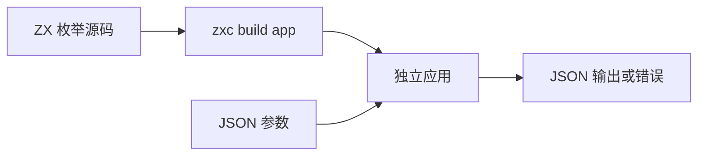
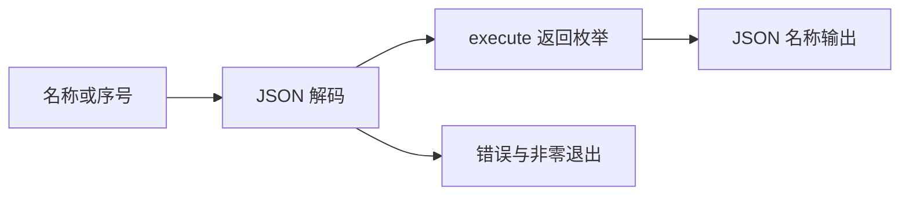

# 枚举 JSON 应用边界验证

## IDEA

- Intent：验证真实 app 产物的枚举 JSON 编解码，关闭编号桥接测试不能覆盖宿主入口的缺口。
- Data：compiler cli/runner.zig 使用 std.json.parseFromSliceLeaky 和 Stringify；固定 Zig 0.16 解码允许枚举名称、有效整数及数字字符串；错误由应用 main 返回。
- Edges：遵循当前编解码契约，不擅自把整数输入收紧为非法。两个应用分别覆盖 State? 和包含 State?/State[] 的对象；不泛化所有类型 ABI。
- Answer：独立命名 Node 测试、两次真实 app 构建，输入/输出/状态/stderr 断言及实际专项结果。

## 执行计划

1. 草稿构造直接可选枚举和嵌套枚举应用。
2. 测试合法名称/序号/空值与非法标签/结构/缺失字段。
3. 接入根依赖的 test-json-enum，执行并审计结果。

## 架构

## 数据流

## 执行结果

新增 32 个独立 Node 测试，构建两个真实应用后逐项执行：十个 scalar 正例、十个 scalar 负例、四个嵌套正例、八个嵌套负例。枚举名称、有效序号及序号字符串均转为名称输出；null 与空列表保持。可选字段允许值为 null，但字段本身缺失仍为 MissingField。

`zig build test-json-enum --summary all` 退出 0，9/9 步骤、32/32 Node 测试通过，失败、取消、跳过均为零。日志 `/tmp/zxc-json-enum.log`。类型、格式、diff 与草稿一致性通过。已加入根 test 依赖，无生产源码修改或新缺陷。

JSONL 61,382、上游 370/53,597 不变；32 个测试为独立 Node 场景，不并入 JSONL。最近完整根仍阶段 99，本轮仅枚举 JSON 专项。

## 自我批判

- JSON 对序号及数字字符串的接受来自当前应用解码器契约，测试没有把它误写成枚举与整数的源码隐式转换。
- 两个应用执行的是身份返回，验证编解码链路；枚举计算行为由阶段 106 等其他测试验证。
- 错误仅断言稳定的首行错误名、退出码和空 stdout，没有绑定机器相关堆栈路径。
- 覆盖三成员枚举及 optional/list/object 组合，不声明所有类型与任意嵌套的 ABI 均已覆盖。
- 新入口已接入根依赖，但尚未重新执行整个根回归，不能把专项通过写成新根基线。
