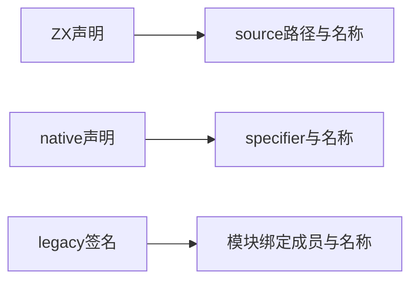
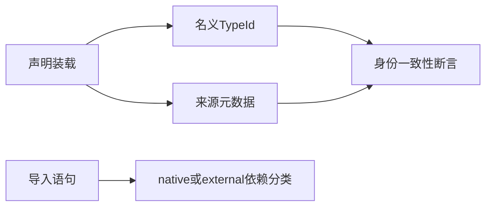

# 枚举来源与外部依赖验证

## IDEA

- Intent：验证名义枚举来源不按同名结构错误合并，并区分native与legacy依赖身份。
- Data：nominal_origins来源为source/native/external；native按specifier复用，legacy按导入模块/绑定/成员独立实例化。
- Edges：只验证当前分析元数据与类型身份，不宣称持久缓存联结完成。
- Answer：同声明复用、异声明隔离、外部依赖类别、拥有关系与分配失败证据。

## 执行计划

1. 对source同名枚举检查不同来源与不同TypeId。
2. 对native同specifier和不同specifier作合法对照。
3. 验证legacy不同绑定/成员的完整身份，并注入资源失败。

## 首轮缺陷证据

首次构建遇到并行写入中的artifact.zig缺失，已同步实现会话并由其补齐。文件补齐后专项真正执行：7/11通过、4失败；增加单次legacy导入对照后8/12通过、4失败，日志 `/tmp/zxc-nominal-origin-control.log`。单次导入、source/native来源、Context seed及native配置生命周期通过，重复legacy绑定、跨importer同绑定与相应资源轨迹失败。

project.analyze对这些重复legacy枚举导入返回.ir，但validateIr返回contract：invalid ZX IR version, structure, types or bindings。external.load每次建立独立enum TypeId，而native_modules.validateExport要求同specifier/exportName的输入输出TypeId相同，形成冲突。已将完整复现、文件位置与日志发送至用户指定实现会话，没有修改生产或放宽断言。此节记录修复前证据，最终状态以下续验证为准。

## 当前交付与待决策状态

共12个具名Zig测试，当前8通过、4失败。`zig build test-nominal-origins --summary all` 实际退出1，3/6步骤成功，最终当前日志 `/tmp/zxc-nominal-origin-control.log`。新专项已接入根依赖，未跳过或屏蔽失败。最近完整根阶段122发生在这些测试之前，不能当作当前全绿证据。

通过部分验证source同名不同声明身份、共享声明只记录一次、native同specifier复用/不同specifier隔离、native/external依赖分类中的已执行断言、Context预置枚举不冒认来源、native标识字符串拥有关系、单次legacy枚举导入对照，以及native分配失败轨迹。重复legacy的来源断言尚未越过IR有效性门禁，不将其预期写成已验证事实。

实现会话已确认：只放宽IR校验会把冲突传递到Zig生成类型，必须先确定旧式接口的身份语义。它已向用户提出“同一注册接口共享类型身份”与“保留每次导入独立身份”的选择；测试侧不代答、不重复询问、不擅改生产契约。当前legacy预期来自此前明确记录的独立实例契约，若用户决定改变契约，需要据新契约调整断言并验证生成代码，而不是为了通过随意降低要求。

源码和草稿格式、diff及一致性检查通过。JSONL仍61,614，上游400/53,597，12个测试独立统计。生产实现由指定会话处理，本会话未修改生产。

## 自我批判

- 本轮没有完成全绿验证，四个真实失败必须保持可见。
- 同名枚举元数据正确不能抵消IR整体无效；因此没有绕过validateIr继续宣称身份验证通过。
- 用户的身份选择不能由等待时长、推荐选项或其他会话推测代替。
- 修复后仍需验证ABI/生成代码路径，避免把问题从IR门禁移到Zig编译。
- 整体目标仍可推进其他独立工作，不将这一局部待决策项误标为整个任务完成或全局阻塞。
