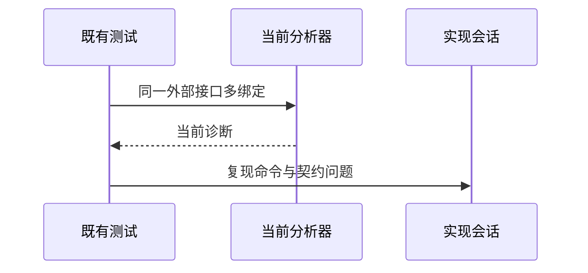

# 枚举来源迁移后复验

> 后续状态（阶段238）：当前工作区专项12/12通过；采用更新后的同一外部导出共享名义身份规则，详见《模板插值分隔符与身份复验》。下文保留阶段218历史失败证据。

## Intent：最终目标

复验包迁移后既有枚举来源失败，定位当前失败阶段并反馈实现会话，不放宽断言掩盖问题。

## Data：可用证据

当前test-nominal-origins包含12项：来源/重复导入和分配失败。首轮8通过4失败；与旧记录不同，当前失败发生在期望分析IR时，须取得实际诊断。

## Edges：边界与限制

只补充测试失败输出，不修改生产实现或既有成功标准。通用预置类型表测试与已移除的Context注入无关，保留其覆盖。

## Answer：交付与成功标准

保存当前命令日志、准确诊断与失败案例，按公开契约核对后通知实现会话。修复未确认前不标记通过。

## 实际结果

在packages/test运行 `zig build test-nominal-origins --summary all`：3/6步骤成功，8/12测试通过、4失败，退出1。补充diagnostic输出后重跑仍相同；完整日志保存在 `枚举来源复验/专项失败.log`。不新增用例，不更改预期，不更新目录计数或宣称修复。

失败为legacy默认多绑定、命名成员多绑定、跨importer同名绑定、legacy分配失败轨迹。单legacy绑定、普通source/native及预置类型表对照通过。当前与旧记录的区别是project.analyze内部已调用IR验证，因而直接返回contract诊断而非把无效IR交给外部检查。

## 根因线索与处理

当前modules/project.zig的importExternal以importer/binding/member分别登记名义来源。ir/native_modules.zig的validateExport则要求相同module.key和exportName的Input/Output TypeId相同；core/IR契约第98行也要求重复公开名称签名一致。两套身份规则需要统一，不能只关闭校验或把独立身份测试改成预期失败。

以上为源码支持的冲突定位，尚未通过生产修复证明唯一根因。已将最新命令、诊断、四个场景、对照结果和契约问题发送实现会话；等待其明确或修正最终身份规则后再复验。

## 自我复核

首次带诊断的命令误在仓库根运行，提示没有该step；随后从packages/test正确运行得到上述真实结果。没有把命令目录错误计作生产缺陷。

辅助检查只新增失败诊断输出，既有IR、名义数量、类型成员与独立身份断言不变。通用类型表的context不是已移除的Context注入，不移除这条独立能力测试。完整包/根回归未在本轮运行，本轮不受阻，其他语义覆盖可继续推进。
