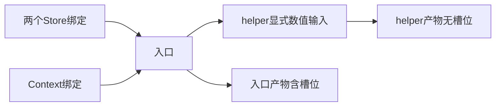
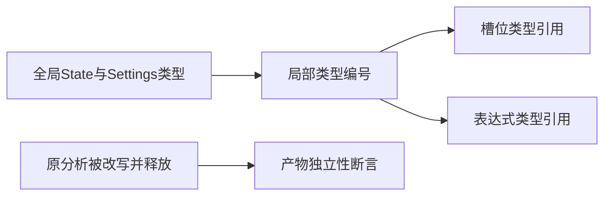

# 模块产物状态槽位验证

## IDEA

- Intent：验证入口模块产物保留Store/Context能力槽位，普通helper不继承入口能力。
- Data：当前artifact.extract只为entry复制槽位，Store读写权限和Context类型均来自有效项目分析。
- Edges：不声称RX注入或Store持久提交已运行；本轮检查提取产物，不依赖待决策legacy接口。
- Answer：槽位路径/句柄/id/权限、局部类型映射、节点引用、独立拥有及分配失败。

## 执行计划

1. 建立两个Store、一个Context和普通helper的实际ZX项目。
2. 检查入口/非入口隔离及非平凡类型重编号。
3. 改写并释放原分析数据，检查产物仍保留正确槽位和字段名。

## 执行结果

新增7个独立Zig测试：5个槽位行为、2条分配失败轨迹。真实ZX项目包含可读写primary Store、只读secondary Store、settings Context及普通helper。入口执行一次Store写入，读取两Store及Context，再将数值显式传入helper。

检查 Store 槽位数量、顺序、路径、句柄、读写权限及 State 共享类型。helper 的 Noise 枚举用于验证全局到局部类型映射，store_get 与 store_set 仍检查槽位和表达式编号。增量通过显式 Input 传入。

提取后改写原分析中的Store路径/句柄、Context id和对象字段名称，并释放分析arena，产物仍保留原字符串与结构。入口和helper提取分别执行逐分配失败检查。

在packages/test执行 `zig build test-artifact-slots --summary all` 退出0，6/6步骤、7/7测试通过，日志 `/tmp/zxc-artifact-slots.log`。新入口接入根依赖。格式、diff、草稿一致性通过，无生产修改或新缺陷。

JSONL61,614、上游400/53,597不变，最近完整根阶段122。本轮专项不代表已消除阶段125的legacy枚举身份问题。

## 自我批判

- 验证的是提取后的能力元数据与节点引用，不是RX运行时注入、作用域恢复或Store持久提交。
- 本轮只用两个对象类型；复杂递归容器、原生ABI与跨产物联结需要独立证据。
- 分配失败只穷举两个具体轨迹，不等于任意程序均有资源安全证明。
- 只读Store没有写入语句，验证了权限保留；权限拒绝本身属于已有Store分析专项，不能宣称本轮新增覆盖。
- 未运行完整根，旧式枚举待决策项仍需后续修复与回归，不能用本轮绿色专项掩盖。
