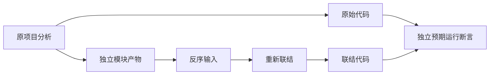
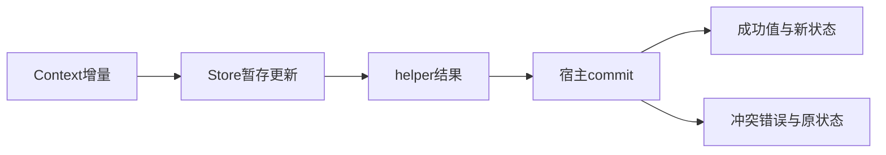

# 模块产物联结运行验证

## IDEA

- Intent：将提取后的独立产物重新联结并实际执行，验证语义及状态提交没有丢失。
- Data：当前artifact.linker.link公开入口，已有普通模块和Store/Context夹具。
- Edges：原分析和提取产物均在后续阶段前释放；本轮不依赖legacy枚举接口，不声称持久缓存或RX执行已完成。
- Answer：原始/重新联结两份代码的独立预期断言，覆盖纯函数、状态提交与冲突。

## 执行计划

1. 从两个真实项目提取全部模块并释放原分析。
2. 反转产物输入顺序，联结后释放产物，再生成Zig。
3. 编译原始和联结模块，分别对照明确预期执行。

## 执行结果

新增4个独立Zig运行测试，覆盖两个真实ZX项目。生成器先发射原分析代码，提取全部模块并销毁原分析；将产物数组反序传入linker.link，销毁全部产物后校验联结IR，再发射联结代码。最后同时编译原始/联结模块，对两者分别断言明确预期，而不是只比较两者相等。

普通项目验证helper加1，输入0、7、65535及u64最大值减1。能力项目验证primary从3暂存更新为5，结合secondary=5得到返回10，旧快照仍为3、只读secondary不变，Context增量2不变，commit只发生一次且pending中secondary为空。冲突时返回Conflict、宿主状态仍3、attempts=1/commits=0；连续两次成功则返回10/12、最终状态7、commits=2。

在packages/test执行 `zig build test-link-runtime --summary all` 退出0，9/9步骤、4/4测试通过，日志 `/tmp/zxc-link-runtime.log`。两个版本和输入循环不重复扩大具名测试计数。新入口接入根依赖；格式、diff、草稿一致性通过，无生产修改或新缺陷。

JSONL仍61,614，上游400/53,597，最新完整根阶段122。本轮未回归阶段125旧式枚举接口问题，不以本轮通过宣称该问题已修复。

## 自我批判

- 宿主commit是内存测试宿主，证明暂存/失败契约，不证明数据库持久性或跨线程原子提交。
- 两个fixture来自既有模块图及槽位测试，覆盖明确但规模有限；不代表所有native接口或复杂图均可联结。
- 最大值附近仅验证无溢出的加1输入；溢出与所有优化模式需要既有安全专项或后续独立验证。
- 真实代码执行补上提取结构检查的缺口，但持久缓存、热重载和RX自动注入仍不是本轮已交付能力。
- 当前保留旧式枚举未解决证据，不能把独立专项绿色当作完整根绿色。
