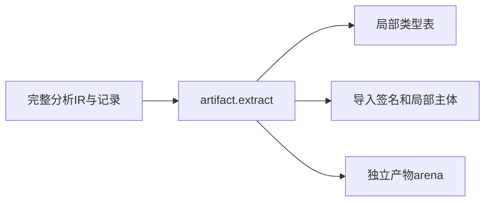
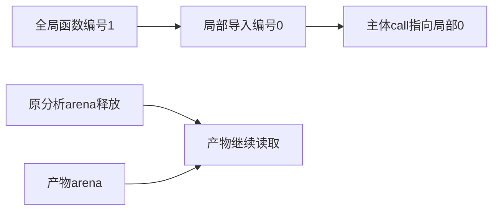

# 模块局部产物提取验证

## IDEA

- Intent：验证project.artifact.extract生成独立持有、局部编号的模块产物，而不是借用全局分析结果。
- Data：当前artifact模型、类型映射及节点复制实现；已验证source模块记录夹具。
- Edges：模块产物尚未联结为完整程序，不直接把导入签名当函数体运行；legacy枚举身份问题独立待用户决策。
- Answer：纯类型/函数/入口提取、非平凡函数编号映射、最小引用类型、生命周期、非法输入与资源测试。

## 执行计划

1. 复用已有模块图夹具，检查导出/导入/主体及类型裁剪。
2. 建立全局编号不同于局部编号的函数图，验证调用引用映射。
3. 释放分析结果后读取产物，测试拒绝边界和分配失败。

## 执行结果

新增14个独立Zig测试：6个提取行为、6个拒绝/范围边界、2条分配失败轨迹。共享模块图夹具通过独立Zig模块导入复用，没有复制生产实现。

纯类型产物保留导出和枚举来源而无函数主体；标量helper省略无关全局枚举但保留Count类型导入；入口保留未调用但已检查的函数/枚举导入、源码摘要和主体。原分析arena销毁后，路径、依赖名称、函数符号、枚举成员和来源仍可读。

非平凡编号场景分别验证：全局函数编号1在helper产物中改为局部0，导入签名和call引用同步；先装载无关Noise枚举时，Mode的全局与局部TypeId确实不同，局部导出和nominal_types仍指向正确Mode类型。

拒绝边界涵盖diagnostic分析、越界模块下标、无效IR版本、被引用枚举缺来源和重复来源。未被helper引用的枚举缺少来源不阻止该helper提取，验证按实际引用裁剪。入口及纯类型提取分别执行完整分配失败轨迹。

最终在packages/test执行 `zig build test-module-artifacts --summary all` 退出0，8/8步骤、14/14测试通过，日志 `/tmp/zxc-module-artifact-tests-final.log`。已接入根依赖；格式、diff、草稿一致性通过。无生产修改或新缺陷。

JSONL61,614、上游400/53,597不变；最新完整根阶段122。本轮专项通过不消除阶段125仍待用户身份决策的4个legacy枚举失败，不宣称当前根全绿。

## 自我批判

- 产物包含导入签名，不是已联结完整程序；本轮没有把它冒充可直接运行的IR。
- 当前验证source模块提取，native ABI、Store/Context槽位与复杂嵌套节点复制仍需专项。
- 类型裁剪和编号映射正确不等于统一类型表、跨产物联结或热重载已经完成。
- 非法输入测试只覆盖列出的门禁，不是任意伪造记录的全量证明。
- 生命周期访问及分配失败检查不替代后续真实生成代码运行验证。
