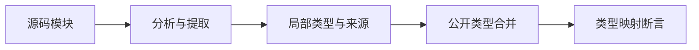
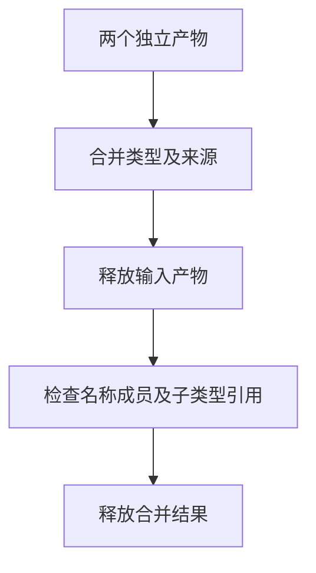

# 模块类型合并身份验证

## IDEA

- Intent：验证模块局部类型合并保留结构共享与枚举声明身份，并拥有独立数据。
- Data：公开 `project.artifact.type_link.merge`，由源码分析和提取生成的纯类型模块。
- Edges：不修改生产；不替用户决定legacy接口身份；单独测试类型合并，不当作完整联结或执行证明。
- Answer：结构、身份、失败及资源测试，保留草稿和日志。结构相同应共享；声明不同应区分；同声明形状冲突应拒绝；失败释放所有资源。





## 结果

新增12个独立Zig测试：6个身份/结构/生命周期、4个损坏边界、2条分配失败轨迹。初次11个测试通过，增加实际不同局部编号案例后再次执行：

```sh
cd packages/test
zig build test-type-merge --summary all
```

最终8/8步骤、12/12测试通过，退出0，日志 `/tmp/zxc-type-merge-final.log`。已接入根 `test` 依赖。

- 独立模块的optional/list/tuple/object结构相同，映射后共享类型。
- 同一路径同名枚举共享身份，包含枚举的四种容器也共享；不同来源保持五种类型全部不同。
- 同声明成员发生变化返回ConflictingNominalType。
- 额外前置Noise声明使Mode局部编号确实不同；反序输入后Mode仍合并为同一身份。
- 原产物释放后，合并结果保留枚举名称、成员、来源路径、对象字段名与枚举子类型引用。
- 拒绝缺失来源、重复来源、名称不匹配、自引用容器；正常及名义类型冲突路径逐分配失败无泄漏。

正式测试 `packages/test/tests/incremental/type_merge/`，同内容草稿 `docs/2026-10-04/类型合并测试草稿/`。本轮未修改生产源码，无新增缺陷通知。

## 自我批判

同路径不同源码的两份产物用于验证局部编号与冲突判定，不表示版本缓存可以忽略源码摘要。类型合并入口本身不检查依赖图和函数体，不能替代完整联结验证。本轮名义身份仅覆盖source，不将其推断为native或legacy ABI证明；legacy枚举身份决策仍未由本轮处理。资源注入仅作用于merge，夹具单独使用测试分配器创建销毁。

格式、diff、草稿一致性检查通过。目录61,614与上游已审阅400/53,597不变；最新完整根阶段122，阶段125四个失败本轮未回归。

