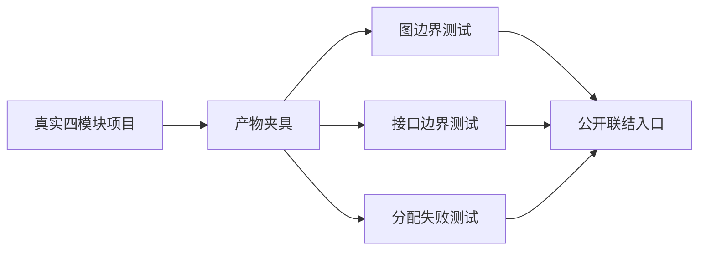
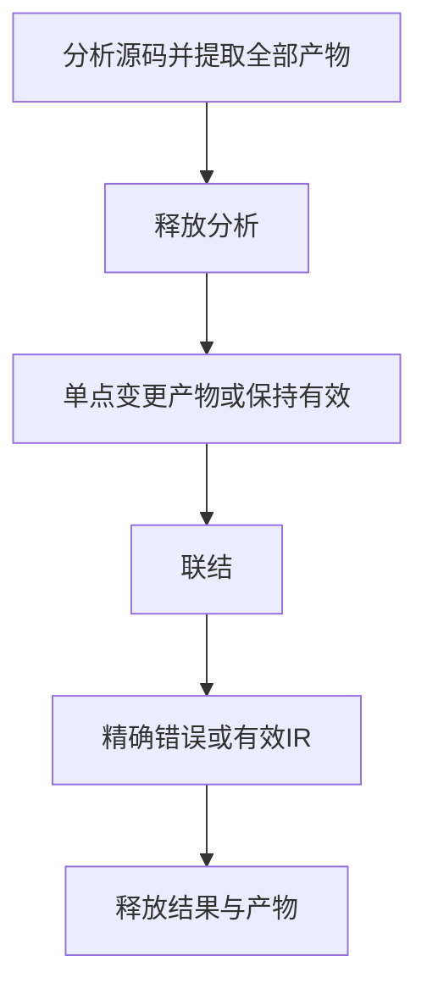

# 模块联结失败边界验证

## IDEA

- Intent：验证独立模块产物在重新联结时的依赖闭包、入口与接口边界，以及失败路径资源释放。
- Data：当前公开 `project.artifact.linker.link`；阶段124真实四模块项目及阶段128运行证据。
- Edges：只新增测试和构建入口；不修改生产实现，不改变尚待决策的legacy枚举身份契约；不把模拟产物损坏当作合法源码。
- Answer：分层Zig测试、同内容草稿、专项日志、结果及自我批判。成功标准是有效项目通过最终IR检查，损坏项目返回明确错误，逐分配失败无泄漏。

## 执行安排

1. 复用真实分析和提取夹具，先释放分析，再调用公开联结入口。
2. 对模块路径、入口、依赖图和导出做单点变更，分别验证拒绝原因。
3. 对正常、缺失依赖、循环依赖和接口冲突分别穷举分配失败。
4. 接入根测试，保存草稿，复核本次diff并登记结果。





## 结果

新增18个独立Zig测试：9个图边界、5个接口边界、4条分配失败轨迹。执行：

```sh
cd packages/test
zig build test-link-boundaries --summary all
```

专项8/8步骤、18/18测试通过，退出0；日志 `/tmp/zxc-link-boundaries.log`。测试已接入根 `test` 依赖。

- 图：空集合、未知入口、空路径、重复路径、缺失共享类型模块、缺失未调用函数、自环、经入口的传递环；纯类型入口排除不可达坏依赖。
- 接口：缺失类型导出、重复导出名、缺失导入类型绑定、缺失函数体、函数体路径与模块路径不一致。
- 资源：只向联结器注入分配失败，分别覆盖成功、缺失依赖、循环、接口冲突。夹具使用测试分配器独立创建和销毁，避免把提取器分配混入本轮轨迹。
- 成功路径检查最终IR及两个导入函数；纯类型入口检查无函数、保留两个导出。

测试位于 `packages/test/tests/incremental/link_boundaries/`，同内容草稿位于 `docs/2026-10-04/联结边界测试草稿/`。本轮无生产源码修改，无新缺陷通知。

## 自我批判与边界

本轮错误输入是对真实产物的单点损坏，证明联结入口校验，不代表这些错误能由合法源码生成。空路径与重复路径在全输入集合上检查；不可达依赖图的排除仅由纯类型入口场景证明。不将这组测试扩张为完整缓存、并发、native ABI或跨版本序列化保证。运行行为沿用阶段128的独立执行证据，本轮不重复计算。

目录仍61,614个登记案例，上游仍400/53,597个文件已审阅；18个API测试不计入JSONL目录。最新完整根仍阶段122；阶段125的4个legacy失败本轮未重跑，不宣称已修复。格式、diff及草稿一致性检查作为收尾执行。
