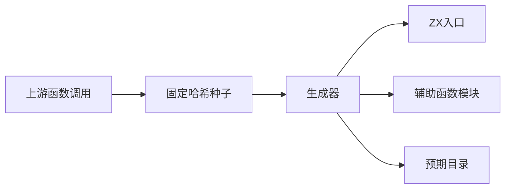
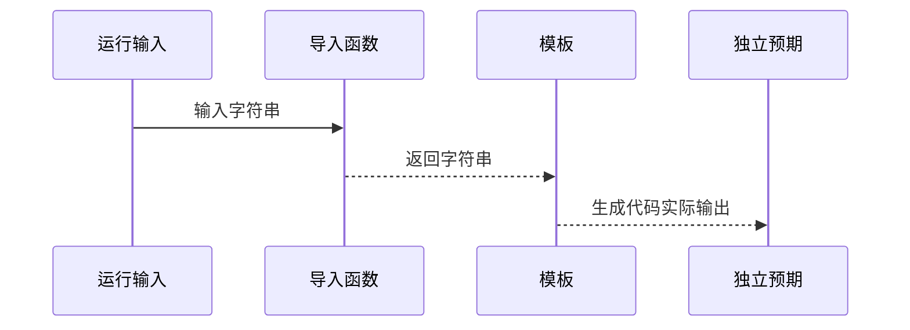

# 模板函数调用对齐

## Intent：最终目标

阶段243：保留Test262三个位置的真实函数调用，并检查运行时返回字符串进入模板的行为。

## Data：可用证据

固定上游三个expr-function原文均调用fn返回result。现有嵌套模板生成器提供目录格式，运行构建支持sources显式声明辅助模块。

## Edges：边界与限制

ZX单函数模块以导入替代JS局部函数声明，并传递显式输入；原文result及模板结构不变。原文映射与动态补充独立登记。对象方法、this、闭包、tag/raw不作通过声明。不编辑生产实现。

## Answer：交付与成功标准

三个原文预期及三个位置的运行时字符串对照通过真实CLI→Zig执行；上游哈希、独立参考、目录审计、生成一致性与类型检查通过。

## 执行结果

`zig build --build-file packages/test/build.zig test-template-calls --summary all`：33/33步骤，15/15案例通过。三个原文函数返回result；另外12项以空串、result、字面${unchanged}和中文换行为运行输入，由identity模块真实返回后在三个位置拼接。CLI依赖辅助源码，避免辅助模块改动被构建缓存漏掉。

独立参考逐一验证三份原文SHA-256，原文strict/sloppy六断言通过，并读取实际ZX入口和辅助函数体，对十五预期交叉验证。生成器--check、TypeScript类型检查、目录审计通过。

目录为64,062案例：运行46,782，前端5,050，轨迹1,084，隔离464，模块10,446，Store236。上游1,018/53,597（561适配、103等价、354排除），未审阅52,579，关联4,214。

## 自我批判与边界复核

原文无参JS局部函数被转换为显式单输入ZX导入函数，固定辅助函数忽略输入，只保留实际调用和返回值语义，不证明无参或局部声明语法。动态identity函数只证明字符串结果传播，不独立证明求值次数；既有template_order轨迹用例承担顺序和异常边界，本轮不重复计数。

不把三个method用例混入此次审阅：它们还需要对象可调用成员能力的独立契约证据。没有生产源码改动、全仓回归或浏览器验证。本轮未发现需要通知实现会话修复的新缺陷。
