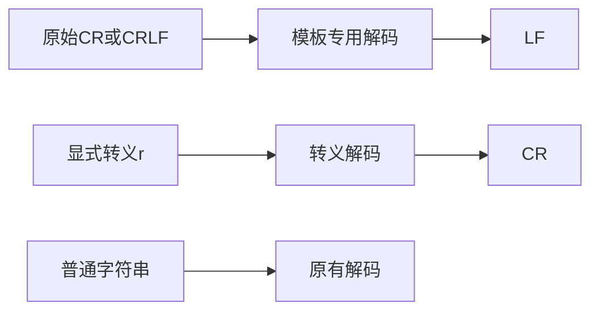
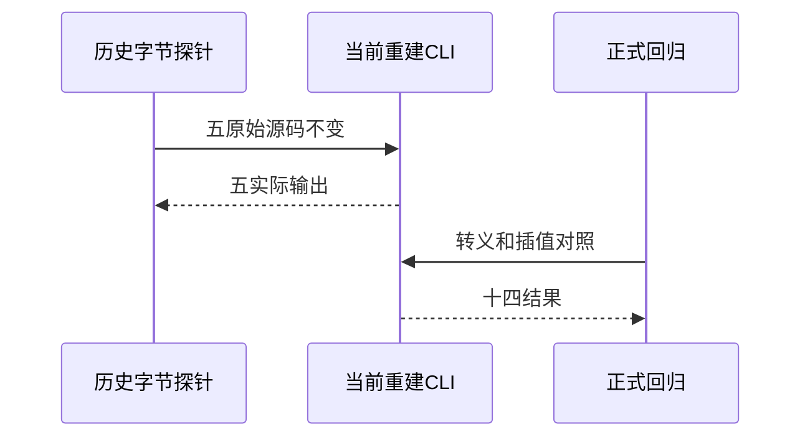

# 模板原始换行修复复验

## Intent：最终目标

独立关闭阶段237的CR/CRLF实际差异，同时保护显式转义、普通字符串、插值分段和连续换行。

## Data：可用证据

当前正式源码新增decodeTemplate且模板分析调用它，IR契约明确原始CR/CRLF归一LF，显式\r和普通字符串不变。保留阶段237五源文件的原始字节，重建独立CLI并复跑。

## Edges：边界与限制

不覆盖历史失败日志；正式案例和复验副本分开保存。上游tag/raw/调用次数不适配，只登记三个普通模板解码值。普通字符串与反斜线字符的对照不能被模板归一误伤。

## Answer：交付与成功标准

原五字节探针全部对齐，新增十四项运行覆盖五分隔符、六保护/组合对照和三个原文模板值；哈希、独立参考、类型和审计通过后关闭两差异。

## 实际结果

从当前源码重建CLI成功，五份旧探针与阶段237源码逐字节一致，全部经CLI生成Zig、单独编译并执行。LF/CR/CRLF现均输出410a42；LS为41e280a842、PS为41e280a942，5/5匹配。新复验脚本退出0，阶段237原失败日志与源文件保持不变。

正式十四项回归13/13步骤14/14通过：原始CR/CRLF归一、显式模板\r/普通字符串\r仍为CR、原始+转义混合保留差别、字面反斜线r不误解码、插值分段及连续CR保持正确数量。三个原文模板值保留CRLF+LF+CR、LS、PS。

完整原文SHA及strict/sloppy18参考断言通过，实际ZX函数体十四输出独立一致。生成器--check、类型、构建格式及非原始CR测试载体的新增文件空白检查通过，五正式文件副本逐字一致。原始CR是被测试字节，不为满足文本空白检查改写源码。

目录审计通过：64,047案例（运行46,767、前端5,050、轨迹1,084），上游1,015/53,597（558适配、103等价、354排除），未审阅52,582；关联4,211。tv-line-terminator-sequence登记为部分适配，只关联三个cooked值，不包括tag/raw/调用次数。

## 差异关闭与自我复核

阶段237两处差异依据上述独立执行证据关闭，已通知实现会话；不是仅依据其99项专项报告。生产修复由实现会话完成，本会话只新增测试和复验。

为避免掩盖问题，探针重建使用新安装目录，历史文件不覆写，源码通过bytes方式复制。源码位置不变的契约由实现说明，本轮未另外验证所有token/AST位置；不扩展成功范围。没有全仓库运行、浏览器检查或Context专项恢复。
