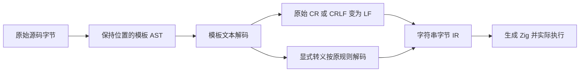
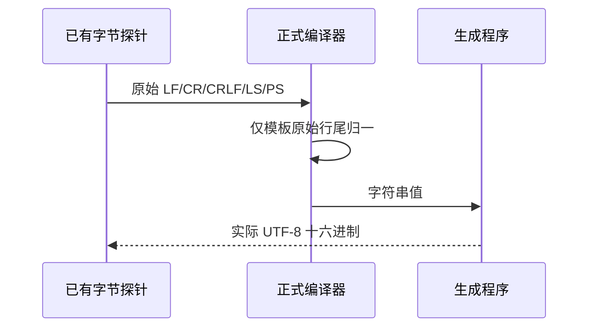

# 模板原始换行修复计划

## Intent：最终目标

同一模板文本在 LF、CR、CRLF 源码行尾下产生一致的换行值。将模板原始 CR 与 CRLF 归一为 LF，避免跨平台检出改变字符串行为；保留显式转义及普通字符串语义。

## Data：可用证据

阶段 237 的已有五份字节保真源码与实际执行记录位于 `模板换行差异复核/`。CR 输出 410d42、CRLF 输出 410d0a42，而参考值均为 410a42；LF、LS、PS 已一致。对应 Test262 原文的 18 项参考断言通过。

当前模板 text 经 analysis/strings.zig 进入共用 string_literal.decode，未区分模板原始行尾与普通字符串。词法和 AST 保留原始文本与位置；原始 CR 本身在模板内可接受，显式反斜线换行仍不属于已支持的转义。

## Edges：边界与限制

- 仅在模板文本解码时归一原始 CR 与 CRLF；在处理反斜线转义之前判断原始字符。
- 显式 `\r` 仍生成 CR，`\n` 仍生成 LF；普通字符串及模块路径解码不变。
- LF、LS、PS 原样保留；不添加 tagged/raw 模板或其他未支持的转义。
- 不修改输入文件字节、token/AST span、插值顺序及运行时接口。
- 不新增测试用例，不使用浏览器；运行反馈提供的现有五项实际编译执行及既有回归。
- 当前外部签名身份修复的根回归完成后再应用正式源码，避免混淆两项修复的验证结果。

## Answer：交付与成功标准

只修改通用解码器的内部模式与模板调用入口，保留 decode/equal 的原契约。五份既有探针全部得到参考输出；编译器和模板相关现有回归通过，公开契约明确原始行尾与显式转义的区别，独立提交并推送。

## 执行与自我复核

已定位根因并形成两文件草稿，尚未修改正式源码。修复必须先判断源码字节，再解释转义；不能对解码完成后的字符串全局替换 CR，否则会错误改变显式 `\r`。

独立草稿快照构建通过 14/14 步骤；复用反馈中的五份原始字节源码，CLI 生成 Zig、编译并执行后 5/5 均与参考值一致。逐字节比较确认五份输入未改变。已有 template_characters 数据包含显式 `\r` → CR 的实际用例，正式应用后直接执行该既有回归，不新建测试。

### 正式实施与验证结果

两处正式源码已应用：模板文本使用 decodeTemplate；decode/equal 仍按普通字符串规则工作。归一判断位于读取原始字符后、处理转义之前，只影响未转义的 CR/CRLF。公共 IR 契约及四种语言的语法参考已同步。

- 独立草稿根构建 14/14、编译器回归 352/352 通过。
- 五份原始字节探针 5/5 实际执行一致，输入 SHA 未变。
- 正式源码的模板字符、假分隔符、嵌套与前端专项：99/99，通过 47/47 构建步骤，包含显式 `\r` 的保留验证。
- 验证目录用局部 `.gitattributes` 的 `*.zx -text` 保持五份探针字节，避免其他平台的 Git 行尾转换掩盖原始 CR/CRLF。

没有新增测试用例；复用反馈提供的五份探针及既有模板回归。保留反馈的原始失败目录，新的执行结果独立存放。外部身份修复的完整根回归发生在本修改之前，因此不将其 64,439 项结果冒充本修改后的全仓回归。

自我复核：检查了连续原始 CR/CRLF 的消费边界，显式转义在返回解码字符之后不会再经历行尾归一，插值表达式的字符串值也不重新归一。未扩张 tagged/raw 模板、行续接或普通字符串支持范围。
