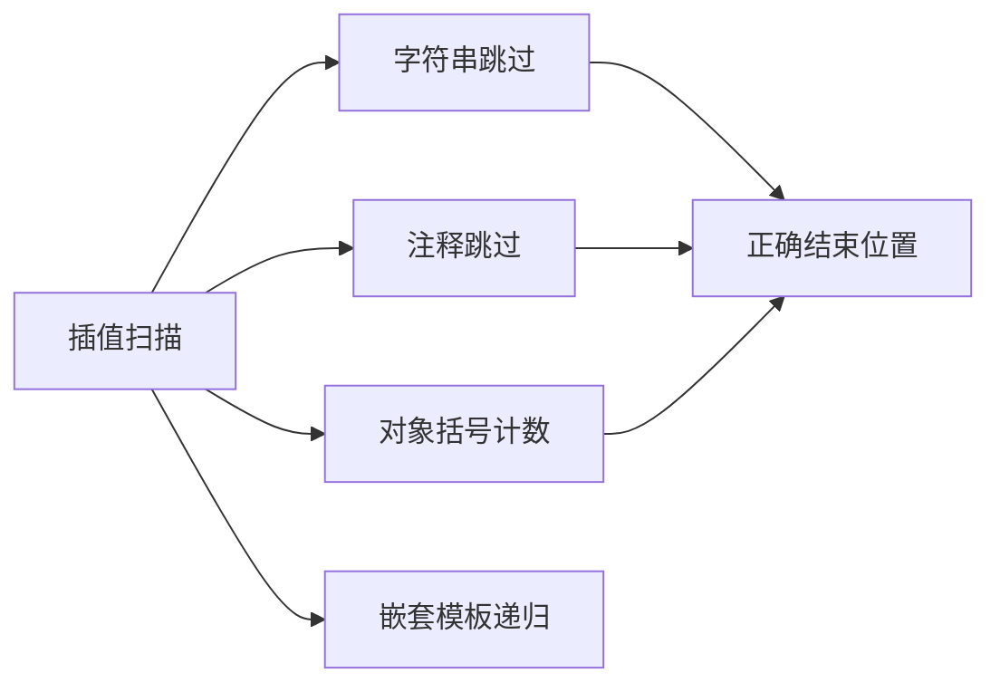
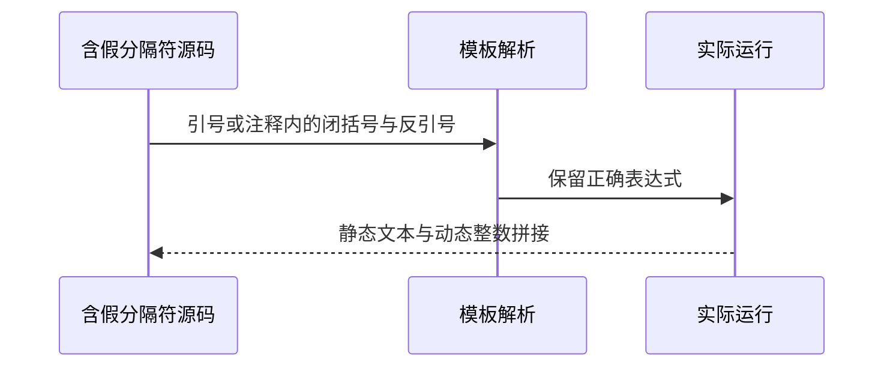

# 模板插值分隔符与身份复验

## Intent：最终目标

验证模板插值内的字符串、对象和注释不错误终止插值，同时复验已进入当前工作区的外部枚举身份修复。

## Data：可用证据

模板扫描器跳过引号及注释、递归处理嵌套模板；现有注释测试主要解析分析，尚需组合实际输出。当前枚举来源专项使用相同导出共享名义身份的契约，保留不同导出独立的对照。

## Edges：边界与限制

本轮模板测试是ZX原生边界，不强行关联Test262。CR/CRLF归一化仍未改动，阶段237两差异继续待处理。枚举复验针对当前契约和更新后的测试，不能称旧独立绑定身份断言原样通过。

## Answer：交付与成功标准

十项实际模板运行覆盖引号中花括号、转义引号、对象花括号、包含假分隔符的块/行注释及嵌套模板。枚举来源当前12测试成功结果和身份契约差异单独记录。

## 实际结果

十项模板运行13/13步骤10/10通过；实际ZX函数体在独立JS参考中执行十输入，结果一致，且核验块注释/行注释中的假分隔符仍保留在源文件。生成器--check、类型、构建格式与本轮新增文件空白检查通过；三正式副本逐字一致。

目录审计通过：63,975案例（前端5,044、运行46,717），上游998/53,597不变，关联4,180。新增的是原生模板组合运行，不增加上游审阅数。

## 枚举身份修复复验

当前工作区test-nominal-origins：6/6步骤12/12通过。测试已按同一逻辑外部导出共享名义身份的规则更新：legacy默认多绑定检查1身份，不同命名导出保留2身份，跨源文件同导出共享身份；不同native specifier仍分开。此次明确验证当前规则，不称阶段218原先按binding拆分的预期原样通过。

已将复验结果及当前规则反馈实现会话，历史失败文档增加后续状态标记。完整根回归仍由实现会话进行，本轮只运行该专项。

## 自我复核

字符扫描组合成功不证明原始模板CR/CRLF归一，阶段237两项差异仍待处理。行注释运行例使用LF，其他换行注释规则有先前独立覆盖，未将本轮范围扩大为所有行终止符。静态文字四项与动态注释六项分别有可检查预期，不把仅解析成功当运行成功。

本轮未修改生产源码、枚举预期或待处理换行预期；没有浏览器或全仓库回归。Context专项保持已删除。
