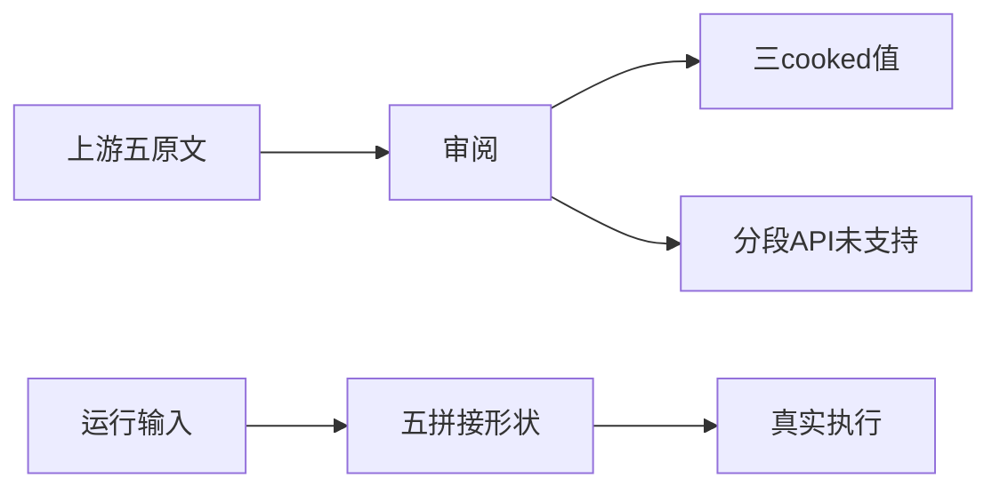
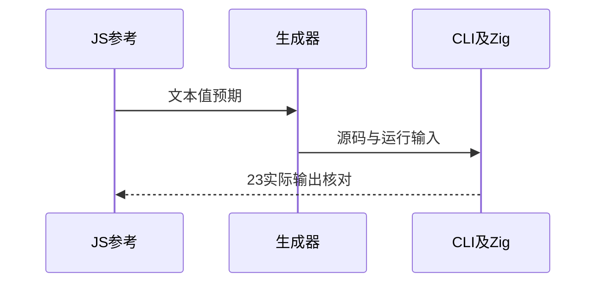

# 模板文本分段对齐

## Intent：最终目标

阶段245：验证无插值文本和空/非空头中尾段拼接，保留运行时字符串数据。

## Data：可用证据

五份Test262原文全量审阅。no-substitution的空与foo、zwnbsp的直接U+FEFF文本可保留cooked值；head/middle/tail原文检查tag接收的分段数组，不能以普通完整字符串替代分段API断言。

## Edges：边界与限制

两份仅部分适配普通cooked值，不包含tag/raw/调用次数，zwnbsp不包括Unicode转义形式。另三份登记excluded。自行增加动态拼接案例不冒充这三份上游用例通过。只新增测试。

## Answer：交付与成功标准

23项真实编译运行：3个固定cooked值；空/非空头中尾合并重复空头/空尾后共5形状，各4项运行时数据。原文哈希、全量JS参考、实际ZX表达式参考、生成/类型/目录审计通过。

## 实际结果

`test-template-segments`真实CLI生成并执行Zig：13/13步骤、23/23测试通过。空串、foo及直接U+FEFFtest三个cooked值保留；20项动态拼接覆盖空边缘、非空头、空/非空中段及非空尾。运行输入包含空值、中文、字面插值符号和LF。

原文五SHA哈希及strict/sloppy共60断言通过；独立脚本直接读取实际ZX分支表达式，验证23个预期并检查表达式与输入组合没有重复。生成器--check、类型、目录审计与格式检查通过。证据副本保存在同日模板文本分段测试草稿目录。

当前64,135案例（运行46,805，前端5,100，轨迹1,084，隔离464，模块10,446，Store236）；上游1,039/53,597（563适配、103等价、373排除），未审阅52,558；关联4,217。

## 自我批判

空头与空尾都生成同一`${in.left}`，原计划两组会重复，因此合并为一组，从27项降为23项。这些用例验证普通文本拼接，不能代替tag接收的分段数组；三个head/middle/tail上游用例保持excluded。两份adapted只声明3个cooked值，并没有完整适配原文所有断言。

本轮未发现新实现缺陷，无生产源码改动、全仓回归或UI验证。Unicode转义形式仍是阶段244记录的能力差异。
