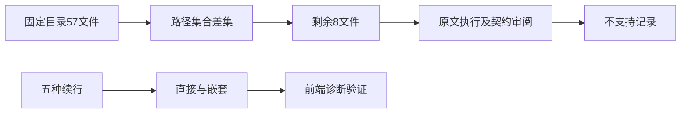
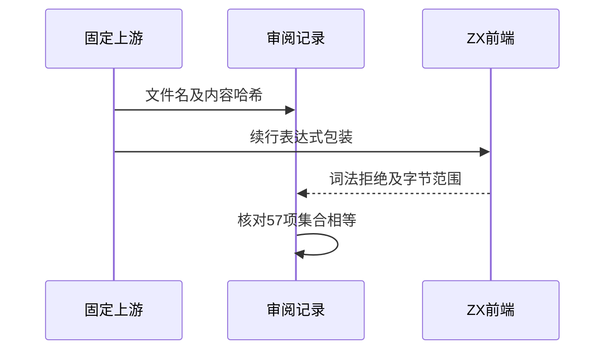

# 模板目录剩余用例审阅

## Intent：最终目标

阶段246：补齐固定Test262模板目录57文件的逐项审阅，验证尚未直接覆盖的反斜线续行边界。

## Data：可用证据

逐路径比较磁盘57份上游与当前review，剩余8份：3方法、eval的U+180E、hex、续行、NUL、UTF16。全部原文完整读取；方法需要对象函数值，eval需要动态代码执行，四TV用例需要当前未实现的转义及tag协议。

## Edges：边界与限制

8份登记excluded，不能用普通导入调用、静态文本或解码后常量冒充原文。目录审阅完成不等于目录兼容完成。新增续行拒绝测试是ZX当前边界证据，不增加上游通过数。

## Answer：交付与成功标准

LF、CR、CRLF、LS、PS五种续行在直接/中文前缀嵌套两位置得到准确parse/lexical/span；上游8SHA与全原文双模式执行通过；57目录无漏审和重复审阅；生成、类型及审计通过。

## 实际执行与目录核验

新增10项前端续行边界，5/5步骤、10/10通过；parse阶段lexical和字节span符合当前实现。相同10表达式在独立JS参考中产生AB或前AB后，证明差异确实存在，不把拒绝写成兼容通过。

8份完整原文SHA与strict/sloppy共56断言通过。扫描全部审阅目录，模板路径集合与固定上游57份完全相等，全部57哈希与原文一致，没有漏项或重复项。结果24份adapted、33份excluded；adapted仍包含明确声明的部分适配，不能按24份完整通过理解。

生成一致性、类型、目录审计及构建格式检查通过。当前64,145案例（运行46,805、前端5,110、轨迹1,084、隔离464、模块10,446、Store236）；上游1,047/53,597（563适配、103等价、381排除），未审阅52,550，关联4,217。

## 自我批判与后续

完成的是57文件的审阅覆盖，不是模板语言的完全兼容。对象方法、eval、tagged/raw及未支持转义仍保留缺口。实现会话已收到阶段244的转义能力差异，本轮增加续行证据；没有遇到违反既定契约的新缺陷。

本轮只验证新增10项前端边界与参考脚本，没有重跑全部模板运行组或全仓测试。后续应结合实现会话新能力继续测试，并转向其他未审阅Test262目录；不继续在已审阅模板目录通过重复形状增长数字。
