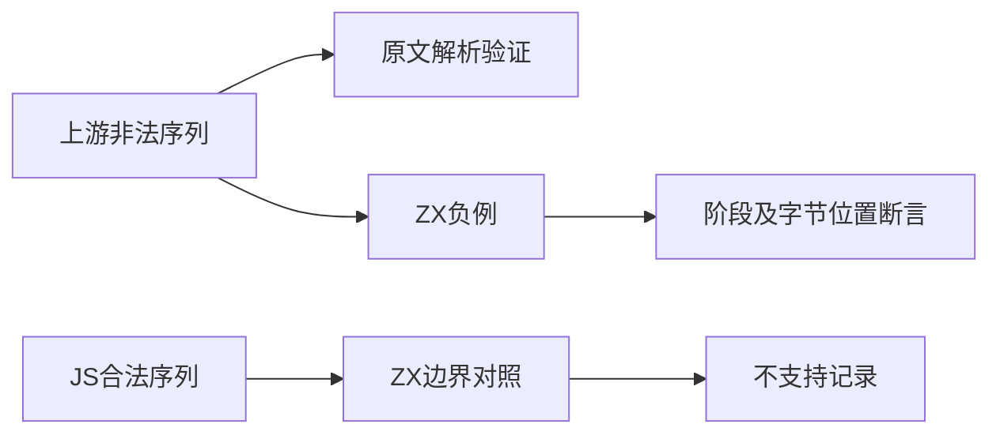
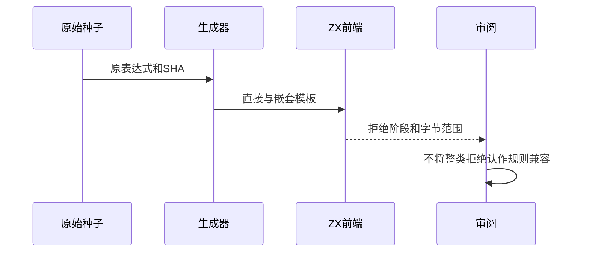

# 模板转义拒绝边界审阅

## Intent：最终目标

阶段244：逐项审阅16份非法模板转义，验证拒绝阶段和字节位置，防止把ZX整类语法不支持误报成ECMAScript转义规则兼容。

## Data：可用证据

固定上游包括3份hex、3份数字转义、8份unicode及2份unicode边界。当前frontend/template.zig仅允许双引号、反斜线、n/r/t、反引号和美元符号转义；string词法目录的既有负例主要针对双引号字符串。

## Edges：边界与限制

完整保留上游字节与哈希；ZX包装只将插值内单引号inner改为双引号。对照合法JS的hex、unicode、码点、NUL及identity转义，证明当前拒绝并不区分合法与非法序列。上游登记excluded，不计为适配或等价通过；本地测试检查自身契约。无生产源码修改。

## Answer：交付与成功标准

16原文两种模式均SyntaxError；直接与带UTF-8前缀的嵌套模板准确报告lexical及字节span；合法JS但ZX不支持的转义也拒绝，支持转义正例通过分析。生成一致性、类型和审计通过。

## 实际执行结果

新增50项前端测试，5/5步骤、50/50通过：16非法序列×直接/嵌套=32项，5合法JS但ZX不支持序列×2=10项，4支持转义×2=8项。拒绝用例全部断言parse阶段、lexical诊断和反斜线起始的两字节范围；嵌套模板中的中文前缀用于检验字节偏移。

独立Node参考验证16份上游SHA及表达式，原文strict/sloppy共32次SyntaxError；32包装后的非法表达式仍SyntaxError；18个合法对照均能解析。没有运行$DONOTEVALUATE。生成器--check、TypeScript类型检查、目录审计及构建格式检查通过。

当前64,112案例：运行46,782，前端5,100，轨迹1,084，隔离464，模块10,446，Store236。上游已审阅1,034/53,597：561适配、103等价、370排除，未审阅52,563，关联4,214。16新增审阅均excluded，明确不增加上游通过数。

## 自我批判

这些本地负例通过的是现有小范围转义契约，不是JS的hex、Unicode、码点上界或八进制禁止规则。加入合法JS的对照是防止负例假阳性的关键证据。既有双引号字符串案例不能直接替代模板扫描；本轮不重复加入已有双引号矩阵。

支持转义正例本轮只验证前端分析，没有新增运行值验证；既有template_characters和template_newlines承担相应运行覆盖，本轮未重跑这些组。没有全仓回归、生产改动和UI检查。能力差异仍然存在，不用排除记录宣称完整Test262对齐。
