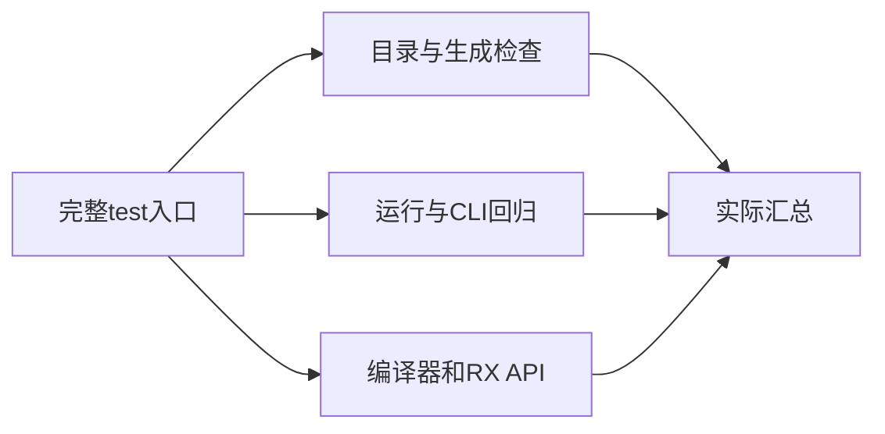
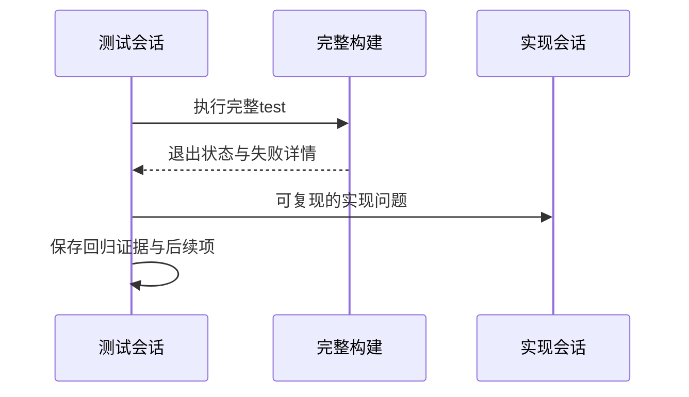

# 测试包阶段200完整回归

## Intent：最终目标

核实近期新增测试与当前生产实现的集成状态，重新识别完整测试包的真实失败，避免只依赖专项通过。

## Data：可用证据

当前packages/test完整构建入口、最新专项日志和实现会话进度。固定Test262索引53597条、已审阅661条，不因运行回归改变覆盖登记。

## Edges：边界与限制

当前工作区存在其他会话正在实现的改动，结果是本次构建读取状态的证据，不能等同于固定提交发布认证。完整测试包不等于根仓库全部包。既有legacy枚举失败需实际复核，不沿用旧结果。

## Answer：交付与成功标准

运行packages/test下zig build test --summary all，保存退出状态、汇总和失败细节；发现实现问题按用户授权发送实现会话。通过与未通过分别记录，不跳过用例或降低断言。





## 实际结果

`packages/test` 中执行 `zig build test --summary all` 已结束，退出1。原始日志 `/tmp/zxc-stage200-full-test.log`：1533/1539步骤成功，3个直接失败步骤；63609/63613个Zig测试通过，4个失败。不要把传递失败步骤数等同于失败测试数。

28组Node测试的汇总合计2015项，2015通过，0失败、0取消、0跳过；这不是Zig汇总的一部分。另有自定义CLI输出，包括RX CLI 11场景、原生调用25输入、原生声明72聚合引用调用及两条分配失败遍历、压缩264应用调用等，不与上述统计简单相加。

本轮新增的Context分析/运行/名义类型运行、独立表达式绑定/运行、XML位置、RX调用点联结/组合运行节点全部成功。TypeScript `pnpm typecheck`退出0，日志 `/tmp/zxc-stage200-typecheck.log`。读取到的HEAD为3b9386d0865222013463a8947d698acfbb6e6c0a，但工作区存在未提交改动，不能以此SHA单独重现本次状态。

## 未通过项与复验

4个Zig失败全部在test-nominal-origins：legacy默认双绑定、named多成员、不同importer同名绑定，以及对应资源测试。均为分析返回IR后validateIr报告contract错误，未越过IR有效性门禁；不将其简化为来源数量预期问题。已向指定实现会话发送本次完整证据与处理请求。

第3个直接失败步骤为test-verification Node脚本：本次启动完整回归时遗漏既有ZXC_TEST_SOLVER设置，默认z3不在PATH，产生FileNotFound。已确认既有求解器版本Z3 5.1.0，并用同一个zxc产物显式指定路径，20场景全通过；日志 `/tmp/zxc-stage200-solver-recheck.log`。这是本次运行环境遗漏，不是生产回归，也没有修改测试预期。原始完整运行仍保留退出1，未伪称整次全绿。

可复验求解器命令：

```sh
ZXC_TEST_SOLVER=/tmp/zxc-z3-5.1.0/z3-5.1.0-x64-osx-13.3/bin/z3 node tests/verification/verify_test.ts ./.zig-cache/o/7e8956680d1fcb5421a0c9d4a0f6a659/zxc
```

后续完整回归应显式设置上述ZXC_TEST_SOLVER。当前4个legacy失败尚未解决，不为仅去掉环境错误重复执行同一整包；修复或新的生产变更后再跑相关及完整范围。

## 自我复核

本轮没有新增测试或修改生产代码，完成了完整包运行和真实环境故障复验。没有把专项通过推断为全包通过，没有跳过历史失败。尚未重跑根仓库完整ReleaseSafe范围；本次默认test包是Debug。整体Test262与全特性目标未完成，目录63323、上游661/53597均不因回归改变。
