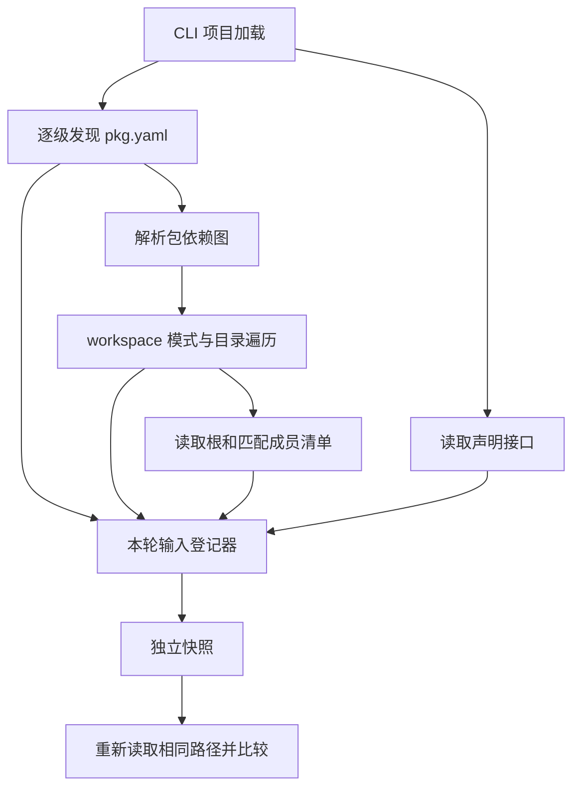
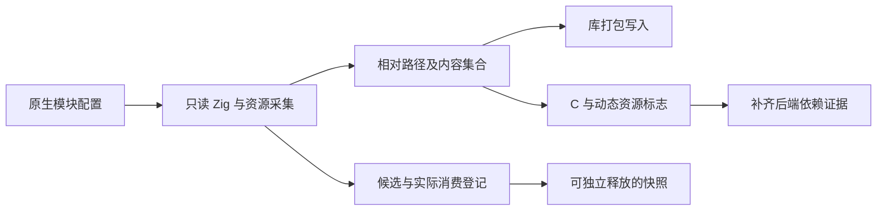
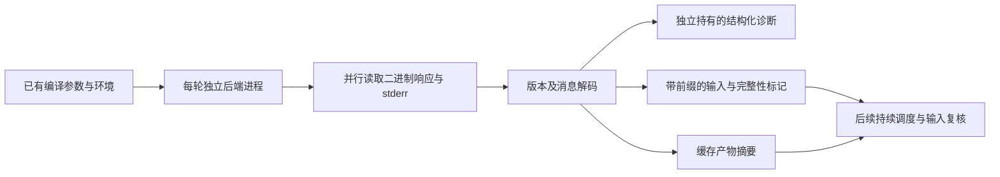
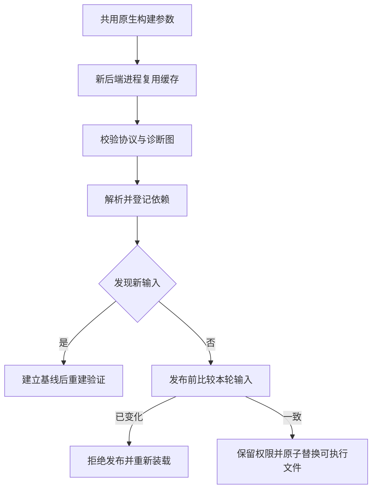
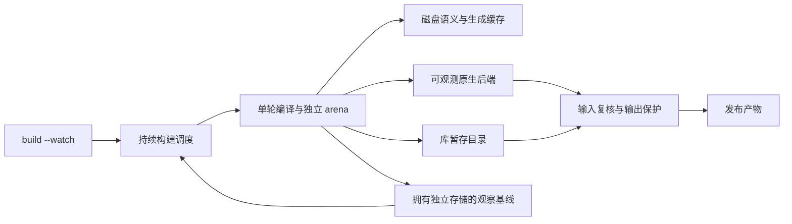
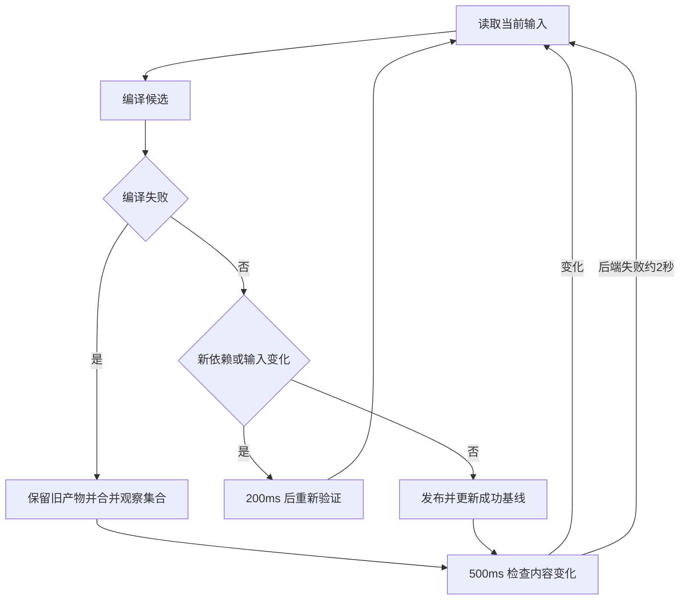

# 热重载输入观测方案

## Intent：最终目标

在不擅自选择运行时替换模型的前提下，建立 watch/reload 共用的输入变化判定。源码修复、新建缺失依赖、删除及恢复都应触发新的编译尝试；无关文件和派生产物不进入输入集合。

## Data：可用证据

当前 CLI 应用一次执行后退出，RX 仍缺少正式执行宿主；用户此前取消动态插件和专用 runtime。已询问开发时重建重启或保留进程状态热替换，答复前不实现依赖该选择的进程控制。

现有 sources.read 会跳过不存在的导入文件。清单发现还会探测上层和嵌套 pkg.yaml，workspace 选择目录会影响包图；不能仅从成功后的 Program 推导完整输入。native_references 已能读取 Zig 字面量导入与嵌入资源，但尚不能完整取得 C 传递头文件。

## Edges：边界与限制

- 文件快照使用内容摘要和物理路径，不依赖 mtime；相同内容的普通原子保存不构成变化，符号链接目标改变仍可识别。
- 缺失路径保留身份。路径替换为目录等非普通文件时记录种类，避免把它当作空源码。
- 权限及其他 IO 错误继续返回，不能全部伪装为缺失。文件内容流式摘要，避免把大资源整体放入内存。
- 装载前先登记候选，读取后记录本轮实际消费的内容。失败轮保留最后成功集合与本轮尝试集合；不能因失败丢失修复入口。
- 清单探测、workspace 目录选择和配置声明的原生接口已接入可选观测；完整 watch 仍需 Zig/C 原生源码依赖及调度接入。只有输入快照不等于热重载。
- 新产物发布前应复核输入，避免把编译期间发生的修改当成已经编译的版本；暂不在本阶段决定进程或状态如何切换。

## Answer：交付格式与成功标准

先提供拥有独立 arena 的文件快照和输入登记器，接入 ZX 源码装载中的缺失候选及包边界探测。复用已有源码手动验证相同内容、修改、删除、恢复、路径集合顺序、符号链接目标及独立生命周期；不新增测试用例。随后继续扩展完整输入采集，再按用户选定的运行模型接入发布。

## 本阶段实施记录

实现位置为 `packages/compiler/src/cli/watch/inputs.zig` 与 `snapshot.zig`。`sources.readWithInputs` 和 `package/source.validateWithInputs` 接收可选登记器；原入口继续使用空登记器，现有 CLI 尚未启用 watch。

登记候选时立即读取状态，不能等构建结束后才补齐缺失路径的基线。否则，某个依赖在装载失败后、基线采集前出现，会被误认为本轮已经消费。读取源码成功后，`record` 使用实际消费的字节更新摘要。登记器销毁后，导出的快照仍独立持有路径、摘要和物理路径。

复用现有 `add.zx`，在临时目录操作副本，手动验证了以下 12 次观测；没有新增仓库测试用例：

| 操作                             | 与初始快照相同 |
| -------------------------------- | -------------- |
| 内容不变                         | 是             |
| 仅改变修改时间                   | 是             |
| 原子替换为相同内容               | 是             |
| 内容追加换行                     | 否             |
| 恢复原始内容                     | 是             |
| 创建原本缺失的文件               | 否             |
| 再次删除该文件                   | 是             |
| 符号链接改指向内容相同的另一文件 | 否             |
| 恢复符号链接目标                 | 是             |
| 删除原文件                       | 否             |
| 用目录替换原文件                 | 否             |
| 恢复普通文件                     | 是             |

重复路径归一后剩余 3 个条目。上述比较均发生在原输入登记器销毁后，DebugAllocator 未报告泄漏。原始结果保存在 `增量编译/输入观测/文件变化观测结果.json`。

最终代码通过指定文件的 `zig fmt --check`；根目录 `zig build --summary all` 为 14/14 步成功，`packages/compiler` 下 `zig build test --summary all` 为 49/49 步成功、347/347 测试通过。两份构建日志随实施副本保存；这些结果不包含此前独立反馈的 nominal-origins 语义争议套件。

## 自我复核与尚未完成的部分

- 初版延迟采集缺失路径的问题已修正。演示程序初版未消费输入行的换行符，已修正后重新完成全部观测；不把那次失败计为通过。
- 内容摘要不是文件系统事务。文件可在摘要、源码读取和物理路径查询之间改变；完整调度器仍须在发布前复核，并对变化重新装载，不能据此承诺任意并发写入下的原子快照。
- 文件原语阶段的验证仅覆盖文件状态与独立生命周期；清单和 workspace 的后续接入与验证见下一节，C 头文件依赖闭包仍未完成。
- 当前改动没有进程重启、状态迁移或运行中函数替换。后续运行模型仍需与此前取消动态插件和专用 runtime 的约束对齐。

## 清单与 workspace 接入

`discover.findWithInputs` 登记从入口向上探测的每个 `pkg.yaml`，包括缺失路径。`package/project`、`graph`、`workspace` 逐层传递同一个登记器；项目加载内部临时 arena 释放后，记录仍归外部登记器所有。`cli/project.loadWithInputs` 还记录最终选中的清单和声明的 `.d.zx` 接口文件。

workspace 已有遍历器会遍历非忽略目录来匹配模式。现在在进入每个目录前记录其直接子目录名称的排序摘要，目录不存在、恢复和物理目标变化也参与比较。遍历和摘要共同使用 `package/workspace/directory.zig` 中的忽略规则，防止两套规则分叉。文件内容不参与目录摘要；只有实际读取或探测的清单、源码、接口文件单独登记。

这个实现保守地观测所有实际遍历目录的结构变化，尚未按照 glob 前缀剪枝。它不会扫描所有普通文件的内容，但 workspace 中未匹配目录的结构变化也可能触发一次重新发现；不承诺零冗余重建。

复用现有 `workspace_cases.ts` 的 `matched directory without manifest` 场景，在临时目录中调用真实 `workspace.loadWithInputs`，得到 9 个输入记录。销毁 workspace 结果和登记器后执行 10 次观测：根/成员清单修改、缺失成员清单创建、新成员目录创建都能识别，恢复后再次相同；`.zxc` 缓存目录及未读取的 `readme.txt` 变化保持相同。DebugAllocator 无泄漏报告。另有 8 次目录原语观测，覆盖普通文件忽略、忽略目录、成员创建、目录改名及恢复。

目录加载最初用于演示的独立模块根过窄，Zig 拒绝导入模块目录外的共享目录规则。正式 CLI 构建不受影响；演示改为在临时目录复制源码层级，并由顶层 facade 暴露输入登记器和 workspace，实际编译及运行通过。没有为验证增加正式源码导出，也没有修改现有测试用例。

最终根构建 14/14 步成功；现有 `test-package-manifest` 专项 14/14 步成功，五组共 1677 个 Node 测试通过，包含清单、workspace、依赖图、包导入和初始化。原始日志、10 次接入观测和 8 次目录观测放在 `增量编译/输入观测/`。

自我复核发现，同一轮多次读取同一清单时，仅保存最后一次消费内容会掩盖混合版本。已将初步探测与实际消费区分：同一路径已经消费过，再次消费不同内容或不同物理目标，会永久标记本轮 `consistent = false`；快照比较因此始终返回不同，必须由调度层重新装载。初步探测到实际首次读取之间的变化不被误认为重复消费。

复用现有 `add.zx`，四次实际读取验证：首次消费和相同内容再次消费一致；读取修改后的内容产生不一致；恢复原始内容后仍保持不一致。DebugAllocator 无泄漏报告，结果保存在 `重复消费一致性结果.json`。此修正之后重新通过根构建；包管理专项在此修正之前运行，其旧入口没有启用登记器。

本阶段仍未把观测器接入持续调度，没有实现失败轮与最后成功轮的集合合并。上述通过结果也不能推导任意并发写入下的文件系统原子快照。

## 原生输入采集实施计划

Intent：将原生模块的只读依赖发现与库产物写入分开，使 watch 能复用同一套路径边界、Zig AST 导入和资源规则。

Data：`native_sources.write` 当前在同一个循环中读取、解析及复制文件；`native_references.read` 已区分 Zig 文件导入、嵌入资源、动态资源与 `@cImport`。现有库构建专项覆盖可搬移资源包和越界拒绝。

Edges：继续遵守模块根的词法与物理路径边界；缺失引用在读取前登记，失败也不能丢失该入口。命名模块依赖由项目配置提供。动态资源仍需显式 `bundle_files`。C 传递头文件不能通过 Zig 文件 AST 完整识别，必须保留未解决状态，不得把只识别到 Zig 文件的结果标记为完整。

Answer：提取只读采集模块，库打包使用该结果写出相同清单与内容；为观测器提供可选登记参数。复用现有资源包验证读取集合与变化检测，并重跑既有库构建专项；保留 C 依赖发现的后续工作，不生成新测试用例。

### 原生采集实施与验证

新增 `cli/native_sources/collect.zig`，接收带 `path` 的 Zig 原生模块配置，返回模块根相对路径、文件内容、文件种类、引用来源及 C/动态资源标志。所有结果使用调用方 allocator，适合一轮构建的 arena；输入登记器单独持有快照所需状态。候选文件在物理路径检查和读取前登记，因此不存在的传递文件也会留下修复入口。

`native_sources.write` 现在只负责把采集结果写入库目录、计算已有清单要求的 SHA-256 和添加目的路径前缀。资源去重、先作为 asset 后作为 Zig 解析的提升行为、词法与符号链接越界拒绝均由同一采集实现负责。读取本身不生成库文件；完整采集成功后才开始复制原生资源。

复用现有 `native_bundle_test.ts` 的原生资源包建立临时副本，只执行其创建输入的部分。真实采集得到 `root.zig`、传递 `nested/step.zig` 和 `delta.txt` 三个输入。销毁采集 arena 和登记器后，六次观测正确识别 Zig 或资源内容修改、恢复及删除；另一次从缺失资源开始的失败加载仍保留三个路径，随后创建资源能够触发变化。合计八次观测通过，DebugAllocator 无泄漏报告。

根构建 14/14 步成功。现有 `test-build-modes` 2/2 步成功，其中包括搬移后的 ZX/Zig 原生库消费、资源摘要、动态资源声明、四类路径拒绝、72 次原生聚合调用及两轮分配失败遍历、25 个原生调用输入、264 次压缩独立解码或拒绝验证。本次没有新增或改写测试用例。

自我复核：只读采集仍使用现有静态 Zig AST 规则，不能据此声称完成 C 头文件闭包。C 的后续取证优先考虑当前固定 Zig 版本官方 build runner 使用的 `--listen=-` / `file_system_inputs` 协议，而非解析 `.zig-cache` 私有文件或自行近似 C 预处理。

### C 依赖协议实际取证

对当前 Zig 0.16.0，复用现有 native_math 编译产物及多模块参数，并在临时目录复制工具链头文件进行修改和恢复。没有修改安装中的工具链或正式 fixture。

| 场景                                       | 实际协议结果                                                        |
| ------------------------------------------ | ------------------------------------------------------------------- |
| 首次成功                                   | 826 个输入，含 9 个直接或传递头文件，有 `emit_digest`               |
| 原样再次编译                               | `cache_hit=true`，仍返回输入列表                                    |
| 修改传递头文件                             | `cache_hit=false`，仍包含头文件                                     |
| 删除传递头文件                             | 550 个输入，没有 `.h`，无产物摘要，有非空 ErrorBundle；退出码仍为 0 |
| 首轮缺少根或传递头文件                     | 同样没有头文件列表                                                  |
| 同一进程失败后恢复头文件，仅发送 `.update` | 连续两次仍失败                                                      |
| 恢复后启动新进程，沿用完全相同参数与缓存   | 成功，恢复 826 个输入和 9 个头文件                                  |

官方本地实现依据为 `std/zig/Client.zig`、`std/zig/Server.zig`、`std/Build/Step.zig` 和 `std/Build/Step/Compile.zig`。消息头为小端 tag 与长度；输入路径带 cwd、Zig lib、local cache 或 global cache 前缀；ErrorBundle 表示一次 update 结束，失败也不能单凭子进程退出码判断。正式适配必须检查工具链版本并使用标准库的 ErrorBundle 解码与渲染。

另一个已验证约束是 `--listen=-` 与显式 `-femit-bin=<路径>` 不兼容。watch 的后端适配需以 `--name` 和 `emit_digest` 定位缓存产物，再在输入复核成功后发布到用户路径。普通单次构建目前仍使用原输出流程。

据此，后续持续构建采用每轮新后端进程并复用缓存；失败时保留最后成功的依赖集合。首次 C 失败没有完整输入集合，需要安静、限频的后端重试来发现缺失头文件恢复，不能把不完整列表伪装成精确监听。新发现的后端依赖应先建立基线并进行下一轮验证，再发布产物，避免把构建后的采样冒充构建前输入。

这些是接入约束和实测证据，协议适配器与持续调度尚未实现；没有验证 `-fincremental` 下的常驻后端，不能把同进程恢复失败的结论外推至所有 Zig 模式。原始消息、解析 JSON、取证脚本及汇总保存在 `输入观测/后端依赖协议/`；脚本保留当次临时路径，重跑前需重新准备对应副本。

## 后端协议适配实施计划

Intent：提供一轮独立后端构建接口，可靠区分成功、编译错误与协议错误，并交付依赖和缓存产物摘要。

Data：上一节的真实协议消息及当前标准库的 Client、Server、Build.Step 实现。

Edges：绑定编译 zxc 的 Zig 版本；每轮发送 update 与 exit，不保留后端进程。stdout 为二进制协议，stderr 与其并行收集，不能因管道堵塞挂起。结果必须独立持有字符串和诊断；失败时保留已返回的输入，但不把它标记为完整。此层不负责覆盖用户输出文件。

Answer：将进程通信与消息解码分成两个职责文件，返回拥有独立 arena 的结果。使用已保存的真实消息和现有 C 编译参数验证解码、诊断、缓存命中及结果生命周期；暂不改变普通单次构建的输出行为。

### 适配器实施与结果

`cli/backend/process.zig` 启动一次带 `--listen=-` 的后端命令，发送标准库定义的 update 和 exit 消息，关闭 stdin，并通过 `std.Io.File.MultiReader` 并行收集 stdout 与 stderr。单个输出流上限为 128 MiB；进程退出后交给解码器。调用方仍负责构造与协议兼容的编译参数。

`cli/backend/protocol.zig` 校验当前 Zig 版本、消息边界、路径前缀、产物摘要长度与诊断负载长度，使用标准库解码 ErrorBundle。结果独立持有输入路径、诊断和 stderr，并返回产物摘要、缓存命中、进程终止状态、构建成败及输入完整性标记。只有成功编译且确实收到输入消息时，`inputs_complete` 才为真；失败返回的部分列表仍可用于保留观察入口。

对已保存的 12 份真实消息执行解码：10 份完整会话正确识别成功或 C 编译错误；两份来自常驻进程后续 update 的片段没有版本握手，被按本接口契约拒绝。最初的验证脚本误把这两份片段也算作完整会话，修正预期后重新核对全部结果，没有放宽版本校验。

所有解码结果都在原始消息缓冲区释放后统计依赖、读取诊断并渲染错误。成功响应保留 826 项输入和 9 个头文件；失败响应为 550 项、0 个头文件、3 条根诊断，输入完整性为假。DebugAllocator 无泄漏报告。

真实进程接口还复用了此前 C 编译参数，完成缓存命中、删除临时副本中的传递头文件、恢复头文件、再次命中缓存四轮构建。失败响应被判为失败，恢复后成功；新增完整性字段后又验证了最终成功结果。两个演示程序直接编译新适配器，普通根构建不会因尚未导入这些文件就替代该验证。

最终根构建 14/14 步成功；指定新文件的格式检查及 `git diff --check` 通过。响应解码、进程恢复和最终构建日志均保存在 `增量编译/输入观测/`。

自我复核：初次实现引用了该 Zig 版本已移除的 `std.meta.intToEnum`，按本地源码改为 `std.enums.fromInt` 后，两条演示编译通过。尚未增加 CLI 调用、产物发布、超时策略或连续调度，也没有执行分配失败遍历及协议模糊测试。结构检查不等于适配任意 Zig 版本；这仍是当前固定工具链的一轮协议接口。

## 构建链路与发布接入计划

Intent：让现有模块化构建命令能够使用一轮后端协议，并把成功产物安全发布到原输出路径。

Data：现有 `cli/build.zig` 已完整生成模块、ABI、原生依赖和目标参数；标准库 `Io.Dir.copyFile` 提供保留权限的原子文件替换，`zig.binNameAlloc` 提供目标相关的产物名称。

Edges：复用同一参数构造，不复制第二份原生构建配置。新接口使用显式缓存目录，以准确解析协议路径前缀；普通构建保持原输出方式。首次发现后端输入只建立基线，不立即发布；发布前必须重新比较本轮输入。汇编和可执行文件分别替换，不承诺跨文件事务。

Answer：增加可观测构建入口和带输入复核的发布入口，使用现有应用与 C 示例验证新发现输入阻止发布、下一轮验证后发布及可执行权限。持续循环和失败重试仍由后续 watch 调度器负责。

### 测试反馈优先修复：ErrorBundle 内部引用

阶段 149 的独立测试指出，仅检查 ErrorBundle 外部长度仍会接受内部越界索引。暂停发布接入，新增 `cli/backend/error_bundle.zig`，在结果暴露给标准库读取或渲染之前检查根列表、消息、notes、字符串、来源位置及 reference trace。

校验按真实标准库布局读取，不针对反馈中的数组值设分支。消息与来源作为两类图节点进行迭代深度优先遍历，区分访问中与已完成节点，拒绝循环并允许合法共享。所有索引先验证范围，字符串必须在存储范围内终止；来源位置额外检查标准库使用的行列加法、span 减法及 trace sentinel 隐藏计数加法。sentinel 的数量没有被当作字符串索引；标准库采用饱和减法的 span_end 也没有被人为限制。

为保护后续标准库的递归消费，最大图深度为 256，最大累计节点展开数为 1,048,576，超限返回 `BackendDiagnosticsTooComplex`。这限制图展开量，不代表渲染字节总量有界。校验器自身不递归，临时 arena 与返回结果的 arena 分开管理。

最初修复编译发现字段计数是 usize，而范围助手起点写成 u32；调整范围助手的索引类型后，阶段 149 现有回归 17/17 通过。阶段 150 独立补充后，协议专项 9/9 步成功、25/25 测试通过，覆盖有效与损坏诊断的逐分配失败清理等边界。12 份真实协议消息再次保持原分类，真实 C 诊断能够渲染。没有修改测试或放宽预期。

自我复核：上一阶段把内部数据结构过度视为可信编译器产物，只做外层检查，未达到可安全消费的接口边界。此次修复检查消费所需的引用和算术条件；仍不声称已经执行协议模糊测试或所有图形态的独立回归。

### 可观测构建与发布实现

`cli/build.zig` 的普通构建与 `runObserved` 共用参数构造，包括模块依赖、ABI、原生模块、库路径、目标和优化选项。可观测构建增加协议选项和显式缓存路径，以 `application` 为缓存产物名；按协议前缀把输入解析为绝对路径并登记。全局缓存尊重 `ZIG_GLOBAL_CACHE_DIR`，否则使用 zxc 用户缓存中的 backend 目录。

`cli/build/observed.zig` 独立持有后端结果和缓存产物路径。可执行文件名使用 `std.zig.binNameAlloc` 按目标确定；汇编从对应缓存目录取得。首次发现输入时，结果标记 `new_inputs`，发布立即返回 false。已知输入必须在构建前登记；发布再比较实际内容、路径和一致性标记，发现变化则拒绝发布。

发布使用 `Io.Dir.copyFile` 原子替换单个文件并保留可执行权限，先复制请求的汇编，再复制可执行文件。输出与已登记输入重叠，或可执行与汇编使用同一路径时，明确拒绝；两个输出文件并不构成跨文件原子事务。

复用现有 native bundle 场景：第一次实际构建成功但 `new_inputs=true`、`published=false`；第二次命中缓存，`new_inputs=false`、`published=true`。发布后的应用输入 9 返回 13，汇编文件非空。复用已有 `原生构建示例` 的 C 与 Zig 混合调用，同样经过两轮验证后发布，执行输入 `{"value":9,"factor":2}` 返回 `{"root":3,"scaled":18}`。

在第二轮后端完成、发布前暂停并修改现有资源，发布返回 false，原可执行文件和汇编文件逐字节不变。将输出指定为输入 `main.zx` 时，返回 `OutputOverlapsInput`，原源码保持不变。演示均使用临时副本，DebugAllocator 无泄漏报告。

普通应用／库专项仍为 2/2 步成功，覆盖已有原生、搬移库、资源及压缩验证；协议内部校验在这次专项之后修复，另由上面的协议专项和新链路实际构建验证。新接口尚未接入 CLI 持续循环，没有据此宣称 watch 已可用。跨目标文件名使用标准库规则，但本阶段没有运行跨平台发布或调试符号附属文件验证。

最终根构建 14/14 步成功，指定文件格式检查与 diff 检查通过。参数准备直接返回参数数组，未保留只有一个字段的额外 Command 包装。

## 持续构建入口实施计划

Intent：提供实际可运行的 `zxc build --watch`，覆盖 app/lib 构建，失败后继续等待修复，继续复用已有细粒度缓存。

Data：源码、清单和 workspace 观测，可观测后端、发布复核及原生资源采集均已完成实际验证；C 首轮失败需要限频重试。

Edges：本入口只持续生成产物，不运行或替换用户进程。每轮使用新的工作 arena，普通命令沿用同一编译函数。成功后替换观察集合，失败时合并最后成功的输入；过期后端路径不能永久保留。库先生成暂存产物、复核输入，再逐文件发布，不承诺整个目录的原子事务，也不删除用户在输出目录添加的其他文件。

Answer：拆出可返回状态的一轮编译，增加 watch 参数与轮询调度，并复用既有 app/lib 示例进行源码变更、缺失依赖恢复、失败产物保留及无变化时安静等待的实际验证。先保证正确性，再评估轮询成本；不新增测试用例。

## 持续构建实现与复核

按 IDEA 执行上述计划：Intent 是稳定的构建循环；Data 是真实 CLI 与现有应用、库、C 接口场景；Edges 是不执行应用、不迁移状态、库发布不是目录事务；Answer 是 `build --watch`、下述证据和使用文档。

一轮编译从 main 提取为 compile.run，返回 success/failed/retry/backend_failed。每轮独立 arena，watch 持有独立的最后成功快照、当前基线和后端路径。新后端依赖先观测，再重建验证；旧后端依赖只在本轮实际后端不再报告且前端未读取时移除。失败基线补入最后成功路径的当前状态，避免旧摘要导致无变化忙循环。普通命令仍走同一编译入口。

已复用现有模块场景实际启动 CLI：初始输出 [4,7,12]，修改叶模块后变为 [5,8,13]；分析、生成计数均为更新一个模块、复用两个模块。非法名称编译失败时二进制字节不变；恢复源码可继续构建；删除再恢复相同内容的依赖也能触发恢复。空闲时没有多余成功构建。

库模式复用 native bundle：原始消费执行 9→13，嵌入资源增加一个字节后重新导出并消费得到 9→14；删除资源时原清单与已导出资源字节保持不变，恢复后回到 13；用户放在输出目录的附加文件保留。

首次 C 头文件缺失没有发布产物；仅创建所需头文件、不修改 ZX 或配置，后端限频重试能够恢复，执行结果为 {root:3,scaled:18}。初次验证发现随机 cimport 临时目录导致重复报错，现仅在去重指纹中规范化已知后端缓存 tmp 下的 16 位十六进制目录，原始错误输出保留；输入变化会清空去重状态。最新复核结果另附。

### 收尾审查

发布检查增加物理父目录解析，检查输出与输入的真实路径重叠；避免父目录符号链接绕过词法检查。末级输出符号链接在 Zig 原子复制时会被替换，不会沿末级链接覆盖目标。库逐项预检全部目标后才开始复制。此检查不声明抵抗另一个进程在核对与复制之间恶意替换目录的文件系统竞态。

审查还发现历史 native 接口诊断文本来自分析 arena，而 verified_compile 返回后该 arena 已释放。Diagnostic 增加显式可选文本所有权、clone/deinit；编译返回诊断前复制，Result/ModuleResult 释放所拥有文本。借用的静态诊断保持原语义。非 verified 编译入口的分析诊断也执行相同复制，避免同类悬垂。

自我批判：早期应用探针误以为报错会包含源码标识符，实际编译器报告通用 unknown value，已修正观测条件并重跑，未把探针失败算为通过。C 恢复成功不能推导诊断安静，真实重复日志促成本次修复。每轮仍重新创建进程内解析缓存，复用的是磁盘模块产物，不声称解析 AST 跨轮驻留。当前会重复哈希工具链依赖，后续可以基于证据优化，不能以性能理由漏掉真实输入。

最终真实 CLI 复核：首次 C 缺失错误在恢复前 4.5 秒内仅输出一次，创建头文件后成功构建并执行。输出父目录链接到源码目录时返回 OutputOverlapsInput，源码字节保持不变。错误 native 接口显示完整接口路径、行列与 unknown or unsupported type，退出 1 且没有发布输出。现有编译器回归 49/49 步、347/347 测试成功；根构建 14/14 步成功。证据在 `增量编译/输入观测/` 中。

本轮另有两个手工探针设置错误：模块副本未保持其 @/ 导入对应的目录结构，及错误注入替换了示例不存在的 u64。前者只停在缺失导入，后者成功构建正常示例；均未作为缺陷修复证据。修正目录结构及按已有 f64 注入错误后重跑通过，保留这项自我批判以明确验证来源。

诊断所有权的独立修复已按最小范围暂存，提交 `3efa945` 并推送至 origin/master；新 ModuleResult 的同类所有权处理仍随增量构建功能一起交付。集成构建首次发现测试入口复制源码清单漏掉新增 watch/output.zig，已补充该依赖并重跑；没有将这次依赖缺失记录为通过。

接入回归重跑最终通过：`test-build-modes test-backend-protocol test-backend-runtime test-package-manifest` 共 33/33 构建步骤、43/43 Zig 测试，以及 1,678 项 Node 检查通过；其中真实后端冷构建、缓存恢复、输入变更与失败产物保留集成是 1 项。应用／库构建专项同时覆盖已有原生调用、资源搬移和 264 次压缩验证。完整结果见 `增量编译/输入观测/持续构建接入回归结果.log`。本轮所有自行启动的 watch 进程均已停止。
