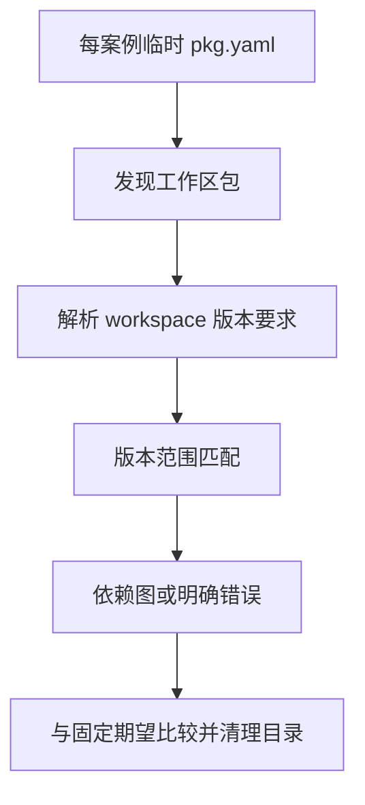

# 版本范围独立对照验证

## Intent：最终目标

通过真实 `zxc pkg graph` 验证包版本范围，独立检验完整版本、部分版本、通配符、比较器、连字符、析取、caret、tilde 和预发布门控。测试不得用被测 Zig 算法生成期望。

## Data：可用证据

- 当前 `packages/pkgs/src/version.zig` 与 `version/partial.zig`。
- `packages/compiler/src/package/graph.zig` 的工作区解析入口。
- 本地已安装 npm `semver@7.8.5`，作为固定独立参考实现；[上游范围规则](https://github.com/npm/node-semver#ranges)。
- 复用既有 `graph_test.ts` 的真实临时工作区、退出码、诊断和图边断言。

## Edges：边界与限制

- 不要求兼容 npm 的宽松版本、空范围或 v 前缀。
- `workspace:*`、`workspace:^`、`workspace:~` 是协议快捷形式，允许命中当前包的预发布版本；单独验证，不能套用普通 semver 通配规则。
- 不修改实现会话正在处理的生产源码；缺陷携带最小重现通知该会话。
- 独立于 Test262 和 JSONL 数量统计。此阶段不覆盖外部包安装、网络或发布归档。

## Answer：交付与成功标准

固定范围和候选版本，保存参考实现生成的布尔向量；每个组合独立命名执行。合法范围分别覆盖接受和拒绝，非法范围断言精确错误。生成脚本与草稿保存在本目录下的“版本范围测试草稿”，正式测试接入现有包管理专项和根测试。

## 执行结果与自我批判

- 59 个有效范围 × 25 个候选版本 = 1,475 个独立对照；另有 18 个非法范围与 9 个工作区快捷形式，共新增 1,502 个命名 Node 测试。
- 参考范围包括完整/部分版本、大小写通配符、独立比较器、带空格比较器、AND、OR、矛盾条件、连字符、零主版本 caret、tilde、预发布数字标识排序、构建元数据无关性和每个 OR 分支的预发布门控。
- 非法范围覆盖缺失段、前导零、额外段、通配后数字、部分版本附预发布、空标识、非法运算符、缺操作数、连字符缺端点/多余项及已匹配 OR 后仍需校验非法分支。
- 直接图测试 **1,534/1,534** 通过，日志 `/tmp/zxc-version-direct.log`。
- 包管理构建专项 **9/9 步骤、1,605 个 Node 测试** 通过（inspect 24、workspace 31、graph 1,534、import 16），日志 `/tmp/zxc-version-special.log`。
- `pnpm typecheck`、`zig fmt --check packages/test/build.zig`、`git diff --check` 均通过。未重复完整根回归；最近完整根仍为阶段 75。
- 无生产源码修改、无新增实现缺陷，不发送无问题通知。JSONL 仍为 57,113，上游审阅仍为 287/53,597。

固定参考实现目录共有 54 个文件。按路径字典序，对每个文件依次输入“相对路径、NUL、文件内容、NUL”的 SHA-256 为 `2a4a71e5821e022a92071f46d9775cf2326e64560fb0d25da377ed7d361e2b3c`。草稿 `generate.mjs` 强制校验版本 7.8.5，生成静态布尔向量；运行正式测试无需安装或调用 semver。正式 `range_cases.ts` 与草稿内容一致，构建系统显式登记文件输入，避免结果缓存遗漏。

自我批判：参考实现不能定义 zxc 的全部包管理契约，因此仅采用明确语法交集，协议快捷形式另行断言。矩阵覆盖多个语义边界，但并未穷尽版本整数溢出、超长输入或所有非法字符串；没有据此声称版本解析与发布行为已经完备。这些测试属于真实 CLI 集成测试，不虚增 Test262 覆盖率。
