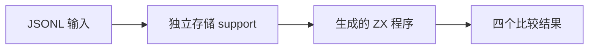
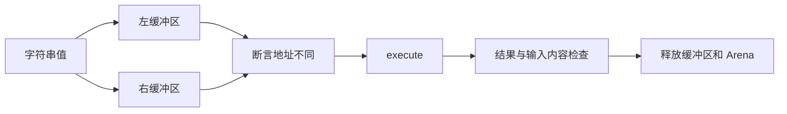

# 独立存储字符串相等验证

## IDEA

- Intent：关闭字符串字面量可能被驻留而掩盖指针比较错误的证据缺口。
- Data：阶段 101 的 optional string 矩阵；现有 runtime suite/support 接口；生成代码实际执行入口。
- Edges：每个非 null 输入复制到各自分配的缓冲区，空字符串也分配至少一字节并使用零长视图。两地址不同必须先断言。null 的普通字符串对照使用空字符串回退，不宣称 null 与空字符串同义。
- Answer：64 个独立输入案例，普通与可选相等/不等四结果、输入内容未修改检查、真实运行结果与资源释放。

## 执行计划

1. 在现有 runtime 框架增加一个专用存储构造 support，不另建编译流程。
2. 构造 null、空串、相同/不同 ASCII、中文、内嵌 NUL 后差异和前缀长度的两两矩阵。
3. 执行运行专项，校验生成、类型、审计与草稿一致性。

## 架构

## 数据流

## 执行结果

最终新增 64 个案例，八种值两两组合；每条先分配两个独立缓冲区并断言地址不同，再执行生成代码，检查四个比较结果与输入内容保持不变。空字符串使用独立一字节分配的零长切片；内嵌 NUL 后差异和前缀长度均有反例对照。

首轮 36 个案例通过后，补充 `a` 与 `a\0c`，最终 `zig build test-runtime --summary all` 退出 0：972/972 步骤、42,976/42,976 测试通过，日志 `/tmp/zxc-string-storage-final.log`。类型、生成一致性、审计、格式、diff 与草稿一致性检查通过。无生产源码修改或新缺陷。

登记累计 58,259（runtime 42,976，其余不变）。上游审阅仍为 364/53,597；本轮增强自有执行证据，不增加上游审阅。最近完整根阶段 99。

## 自我批判

- 本轮强制独立地址，关闭阶段 101 中字面量驻留可能掩盖指针比较的问题；这不是借用身份或生命周期的一般证明。
- 两个 null 值的普通比较使用空串回退，回退本身可能共享地址；非 null 的相同字符串，包括空串，才是强制独立存储证据。
- 只验证有限字节序列，不外推所有 Unicode 规范化或字符串排序行为。
- 支持代码通过测试分配器释放存储，但没有逐次分配失败注入；不将正常释放误称为完整 OOM 覆盖。
- 原生输入的两个存储保持到 execute 结束；输出只有 bool，不涉及字符串逃逸生命周期。
