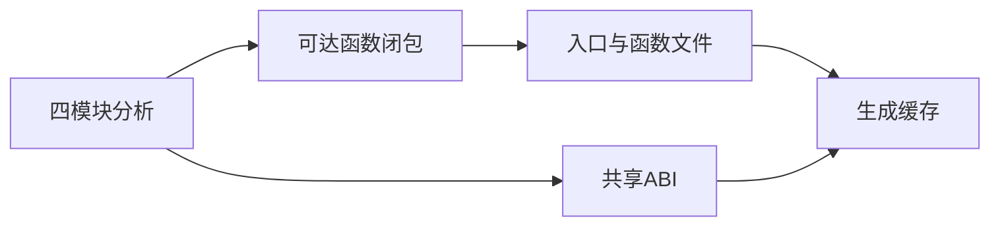
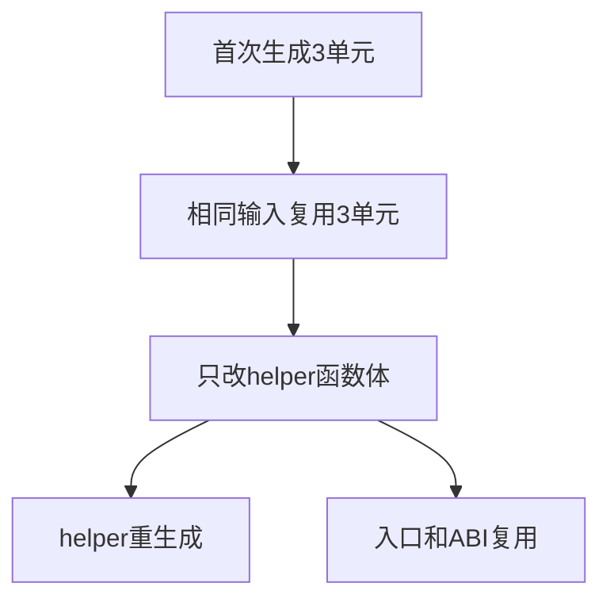

# 独立模块生成缓存验证

## IDEA

- Intent：验证独立代码生成的可达性、依赖清单、增量命中、生命周期与拒绝边界。
- Data：公开compiler.zig.emitModules/emitModulesCached及真实四模块夹具；未调用的导入仍被分析，但无需生成函数文件。
- Edges：只新增测试，不修改并行开发的生产实现；本轮API生成证据不替代独立模块实际编译执行。
- Answer：依赖/缓存计数与输出逐字节检查、失败门禁、分配失败；日志和草稿。

## 结果

新增9个Zig测试：3个可达性/缓存场景，3个拒绝门禁、1个生命周期、2条分配失败。执行 `zig build test-module-generation --summary all`，8/8步骤、9/9测试通过，日志 `/tmp/zxc-module-generation.log`。

- 原IR有两个导入函数，但实际只调用helper；仅输出一个函数文件，入口依赖精确指向它，helper没有函数导入。
- 初次生成3个单元，重复输入generated保持3、reused增加3；所有文件名称、源码、依赖列表及ABI与无缓存输出逐字节一致。
- helper从加1改加2，仅函数源码变化、稳定名称不变；入口和ABI保持相同，累计generated=4、reused=2。
- 命中结果经历后续缓存替换、缓存及分析销毁后，与重新无缓存生成逐字节相同。
- 拒绝诊断分析、错误IR版本、未证明契约；无缓存及缓存填充/命中/替换逐分配失败通过。

测试位于 `packages/test/tests/incremental/module_generation/`，4份同内容草稿位于 `docs/2026-10-04/模块生成测试草稿/`，已接入根test。格式、diff及草稿一致性通过，无生产源码修改。

## 已知失败复核

本轮另实际重跑 `test-nominal-origins`，当前仍8/12通过、4个legacy失败，日志 `/tmp/zxc-nominal-stage142.log`。失败均为重复legacy枚举接口产生的IR契约错误，未放宽断言或替用户决定身份语义。已将当前复测证据发送给用户指定实现会话。

## 自我批判

源码逐字节及命中计数证明生成层复用，不证明每个拆分文件已被实际编译执行，也不证明Zig机器码完全无需重编译。本轮未覆盖native类型顺序变化、Context槽位或磁盘生成缓存；后续需要针对新生成入口补独立消费与运行证据。

目录62,036、上游461/53,597不变；最新完整根仍阶段122，当前根存在已复核的四个legacy失败。

