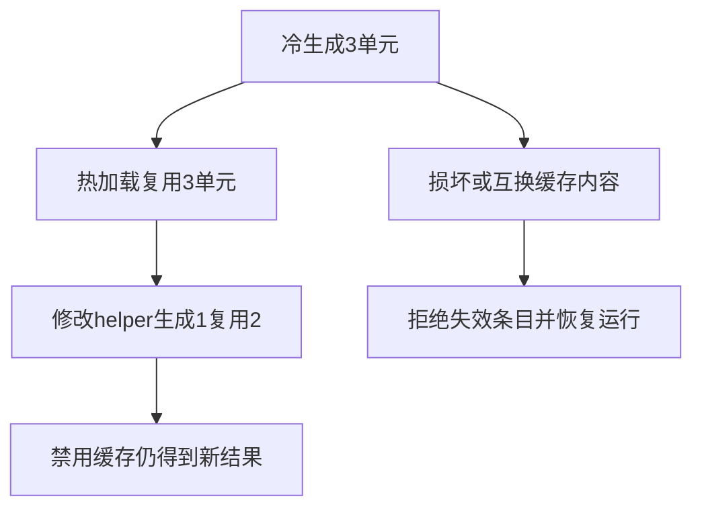

# 生成缓存跨进程运行验证

## IDEA

- Intent：证明独立生成模块及磁盘生成缓存能被真实app构建消费，命中、变更、损坏恢复后执行正确。
- Data：CLI build app、generation统计、真实双模块项目、磁盘缓存内容与应用输出。
- Edges：不修改生产实现；临时项目隔离；本轮不代表native ABI与所有跨平台目标。
- Answer：冷/热/修改/禁用四阶段运行、损坏修复、错误键内容交换测试，精确生成计数与独立输入输出断言，保留草稿日志。

## 结果

新增3个Node场景，执行8次独立CLI app构建，其中6次构建后分别运行输入0、7、65535，共18次应用调用。`zig build test-generation-runtime --summary all` 退出0，10/10步骤、3/3 Node测试通过，日志 `/tmp/zxc-generation-runtime.log`。

- 冷构建generated=3/reused=0/loaded=0/written=3；热构建generated=0/reused=3/loaded=3/written=0，两版执行均加1。
- helper改成加2后generated=1/reused=2/loaded=2/written=1，运行结果变成加2。--no-cache构建报告generation disabled，运行仍加2，磁盘生成缓存所有路径和字节内容保持不变。
- 三份生成缓存均截断后discarded=3，重生成并写入3份，完整app运行正确。
- 两份缓存交换内容后，即使各自内容摘要有效，键检查仍discarded=2；第三份命中，其余重生成，app执行正确。

每次构建都通过实际嵌入Zig工具链消费独立函数文件、入口与共享ABI，不是只检查生成字符串。测试位于 `packages/test/tests/incremental/generation_runtime/`，复用已有持久缓存项目夹具；2份草稿位于 `docs/2026-10-04/生成缓存运行测试草稿/`。已接入根test。

包级TypeScript检查、Zig构建格式、diff及草稿一致性通过。没有生产源码修改或新缺陷通知。

## 自我批判

生成计数证明是否复用lowering结果；仍可能执行Zig后端编译，不能据此声称机器码零重编译。损坏测试是截断与键错配，不覆盖可信摘要被重新构造后的恶意源码。场景是纯数值源码函数，不涵盖native ABI、Context/Store、泛型或跨平台。

实现会话已收到阶段142四个legacy失败的复测反馈，最新状态仍需身份契约决策，不会放宽IR门禁。最新完整根阶段122；目录62,036、上游461/53,597不变，本轮没有重跑已知失败。

