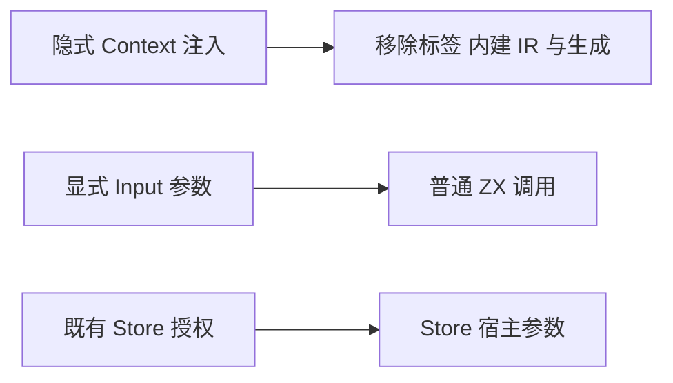
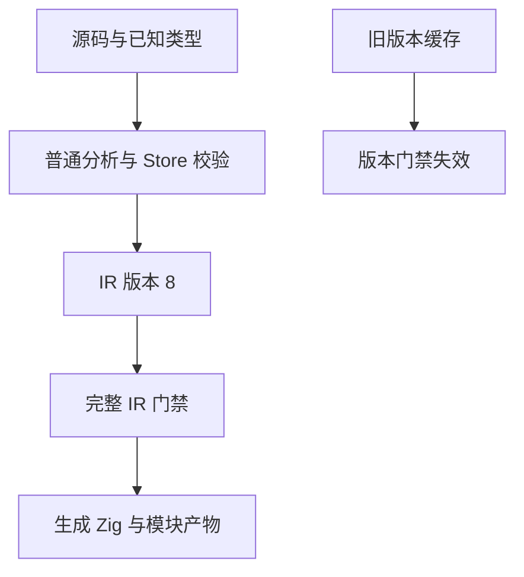

# 移除上下文注入计划

## Intent：最终目标

按用户最新决定移除 Context feature，消除 RX Context 标签、ZX useContext 内建、注入专用 IR 和后端行为。它不再属于系统实现目标，不继续实现其调用点或运行器。

## Data：可用证据

当前功能横跨 RX Schema、编译器入口绑定、ContextSlot/context_get、所有权与验证、genz 隐藏参数、模块产物及缓存恢复。工作区还存在未提交的专用调用点原型与其他会话创建的测试。Store 早已使用名为 Context 的编译环境与宿主参数，不能按单词全局删除。

## Edges：边界与限制

删除专属字段、标签、节点、生成类型和特殊函数识别。保留 Store、通用表达式与 XML 属性位置能力、共享类型表和名义来源联结；它们具有独立用途。普通 Call.fn 的现有装载与检查保留。取消新建的 Context 调用点原型，不把它作为另一个通用能力继续发布。

IR 从 7 升至 8，拒绝旧结构及缓存，不退回旧版本编号。语义缓存既有 ir_version 检查负责失效；外层封装格式不改。Context 专项测试与注册移除，混合 Store 测试改为显式 Input 传参并保留 Store 行为覆盖。删除专属文档、示例、草稿与生成产物；其他功能草稿同步移除专属字段。开发阶段不保留兼容入口或迁移逻辑。

## Answer：交付与成功标准

正式源码不存在 Context 注入入口或专属 IR；RX Context 标签无法通过 Schema，未导入的 useContext 按普通未知函数拒绝。Store、模块缓存、库生成与现有普通表达式保持可用。变更按最小语义块完成，复核本次 diff；不新增测试用例，不使用浏览器。

## 执行与自我复核

已移除 RX 标签与未提交的 provider/call 原型、ZX 内建读取、绑定选项、IR 字段、模块产物与恢复字段、生成字段、所有权与证明专用分支。删除专属测试注册、草稿、文档、示例及生成产物；混合 Store 测试改用显式 Input，保留两槽位、权限、独立拥有数据、重联结和提交失败检查。

开发阶段不增加兼容开关、迁移层或弃用别名。IR 版本递增仅标识当前结构，旧缓存直接失效。保留分析环境 Context 的 types/nominal_types/stores、Store 宿主参数及通用 XML/表达式能力；这些不是已删除的隐式注入特性。

尝试 grit 批量规则时，当前工具不接受 Zig language 声明，未产生修改；随后按明确的节点、字段与分支逐项清理，并复核 diff。未新增测试用例，未使用浏览器。

| 验证                                | 结果                                                                               |
| ----------------------------------- | ---------------------------------------------------------------------------------- |
| 工作区根构建                        | 14/14 步通过                                                                       |
| 工作区 compiler 回归                | 49/49 步，347/347 测试通过                                                         |
| Store 产物槽位、重联结执行、RX 文本 | 33/33 步，131/131 测试通过                                                         |
| 暂存区隔离 compiler 回归            | 49/49 步，347/347 测试通过                                                         |
| 暂存区隔离根构建                    | 14/14 步通过                                                                       |
| 旧 RX 示例                          | Context 标签报 unexpected_element                                                  |
| 旧 ZX 示例                          | useContext 报 unknown imported function                                            |
| 工作区完整根回归                    | 1523/1530 步；63818/63822 Zig 测试通过，4 项原有 legacy 失败；另有一次 Z3 环境缺失 |

指定已有 Z3 后，形式化验证专项 10/10 步、20 个 CLI 场景通过。完整根中的 Node 标准报告共 2015/2015 通过；该数字不包含独立打印场景数的驱动，不能替代完整根步骤结果。未为环境变量重新运行整套根回归，因此不宣称完整根全绿。

旧示例在确认拒绝后已删除。隔离目录只包含暂存版本，用于确认提交不依赖工作区的独立表达式与其他会话测试开发。其他会话尚未提交的混合测试已同步调整，但不把其整套开发成果纳入本次提交。

自我复核：已扫描 packages 与保留的源码草稿，未发现专属标签、节点或绑定字段残留。不能把编译器与专项通过外推为完整根通过；4 个既有 legacy 枚举身份失败仍待解决。通用类型来源元数据和 Store 不是删除对象，保留它们不构成 Context 兼容层。
