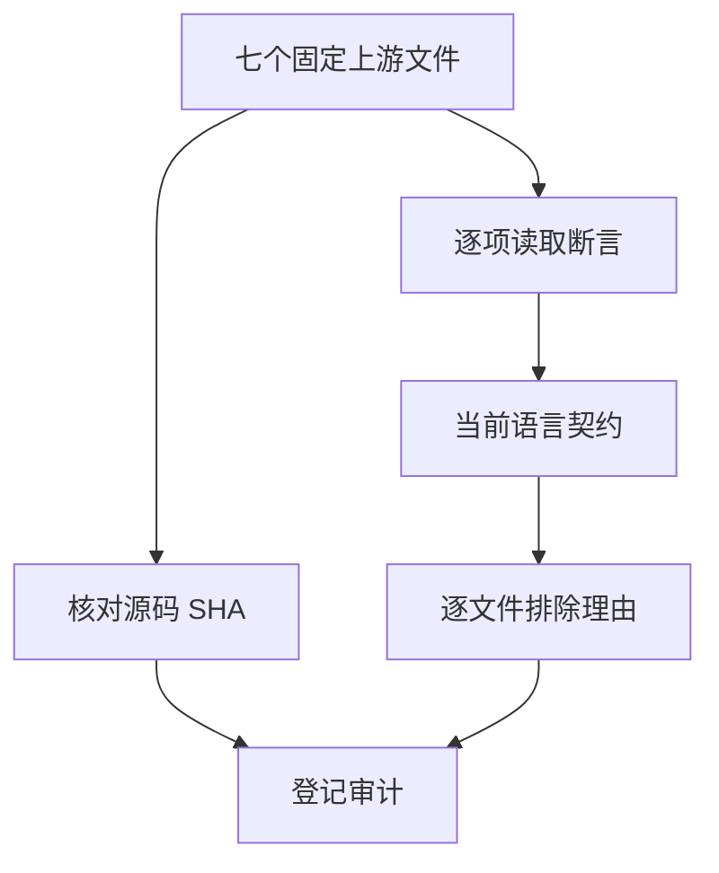
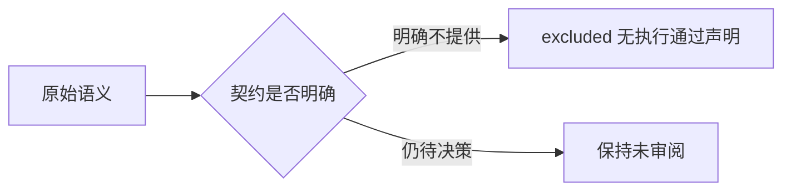

# 空值合并剩余边界审阅

## Intent：最终目标

逐文件结束有明确契约依据的空值合并边界审阅，保留尚未确定的文法问题，不用测试通过数量代替语义覆盖。

## Data：可用证据

已完整读取三个 bitwise chain 文件、follows-undefined、Symbol 文件、两个 TCO 文件。设计文档 6.3 列出支持的操作符，syntax.zig 的完整 Operator/规则集合与之对应，不含按位 &/|/^。设计文档明确不提供 symbol、独立 undefined 值和递归；IR 要求调用图按拓扑排列。

## Edges：边界与限制

excluded 仅表示当前静态 ZX 设计范围，不表示原测试执行通过。位运算排除依据是当前完整操作符集合，而非声称位运算本身与静态语言不兼容；未来若加入位运算，三个文件必须重新打开审阅。四个无括号逻辑混合负例涉及未明确的文法决策，继续保持未审阅。

## Answer：交付与成功标准

七个文件分别保存 SHA、原断言含义和排除理由，运行全量登记审计与目录查询。此阶段只改审阅元数据和文档，不新增运行案例、不重复执行无关根回归。最近根回归仍为阶段 68，不能把审阅审计当成新的语言运行结果。

## 逐项决定

| 文件 | 原断言与边界 |
| --- | --- |
| chainable-with-bitwise-and.js | null/undefined 触发 42 & 43 并得 42，false/true 保留自身；当前 ZX 没有按位 AND，不能用逻辑 AND 替换 |
| chainable-with-bitwise-or.js | null/undefined 触发 1 \| 42 并得 43，false/true 保留自身；当前 ZX 没有按位 OR，不能用逻辑 OR 替换 |
| chainable-with-bitwise-xor.js | null/undefined 触发 1 ^ 42 并得 43，false/true 保留自身；当前 ZX 没有按位 XOR，不能用不等比较或固定结果替换 |
| follows-undefined.js | 四项均以独立 undefined 值开头，结果分别 42/undefined/null/false；不能将 undefined 偷换为 ZX 可选 null |
| short-circuit-number-symbol.js | 十一项均保留同一 Symbol，含其处于链首或空值后的位置；普通记录身份测试不能替代 Symbol 身份 |
| tco-pos-null.js | null ?? 递归调用必须在 MAX_ITERATIONS 深度成功并仅计数一次；无环调用图不支持递归，不以普通回退测试代替 TCO |
| tco-pos-undefined.js | undefined ?? 递归调用的同一尾调用保证；同时依赖独立 undefined 与递归，均超出契约 |

## 自我批判

这些决定不能增加“语言已实现”的范围，也不增加案例数。对未实现运算符要区分当前语言定义与未来需求，不能将所有实现缺口永久归为设计排除。已有正向值、身份、顺序适配独立保留；本阶段不会借这些测试为不支持的值类型和运算符背书。

## 结果

七个文件 SHA 均匹配锁定索引，全量矩阵审计通过；coalesce 查询仅剩四个 cannot-chain 文法负例。上游已审阅 287/53,597（158 adapted、102 equivalent、27 excluded），关联 964 个案例，剩余 53,310。运行目录保持 53,360 条不变。本阶段不新增或重跑语言测试，最近完整根结果来自阶段 68：979/979 步骤、53,356/53,356 Zig 测试通过；实现会话正在 GCS 格式规则工作，这一历史结果不自动覆盖后续并行变更。diff 检查通过。
