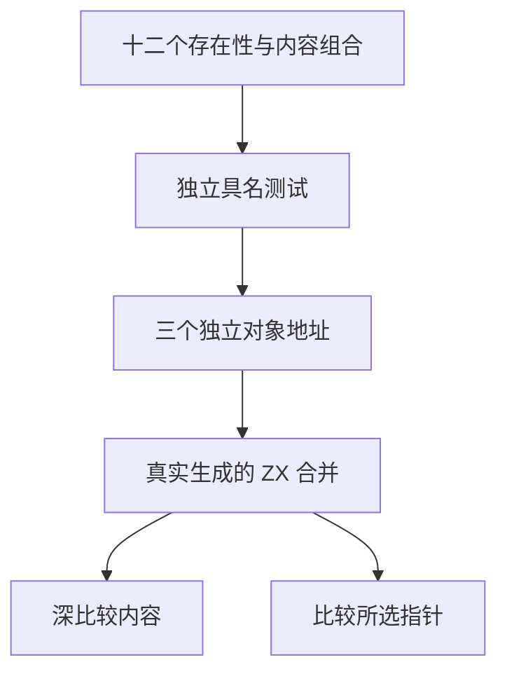
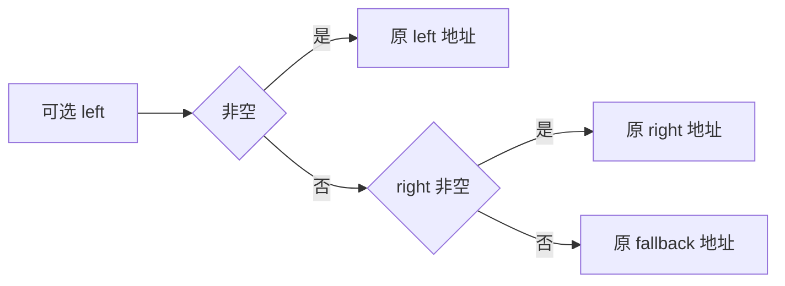

# 空值合并对象身份验证

## Intent：最终目标

验证空值合并返回所选输入对象的同一引用，识别内容相同但身份不同的误选或隐藏复制。

## Data：可用证据

Test262 short-circuit-number-object.js 含十一条对象身份断言，并为对象设置返回 null 的 toString/valueOf。ZX 不提供动态转换钩子和任意对象真值，借用聚合由引用表示；现有 control/collections 驱动只深比较内容，不能证明身份。

## Edges：边界与限制

测试驱动独立创建三个可观察地址不同的可变栈对象，再以只读引用传入真实生成程序；避免编译期相同常量合并掩盖误选。不为语言添加引用相等运算符。不把普通结构体解释成带 JS 转换钩子的对象，不声称 undefined、异型回退或任意类型链等价。

## Answer：交付与成功标准

新增专门的空值合并身份驱动，复用缓存内具名测试发射器；四种左右存在性与三种内容关系共十二条独立案例，检查精确返回内容、指针身份、三个地址互异及输入未变化。实际运行后再登记上游文件。

## 执行证据

十二条身份用例实际通过；完整运行目录 789/789 步骤、38,910/38,910 测试通过，日志 `/tmp/zxc-test262-coalesce-identity-special.log`。新增 coalesce_identity 驱动保持既有 control 发射调用契约，只将此套件路由到专门检查器。没有修改通用集合深比较行为。

对象上游文件登记 adapted；源码 SHA 与固定索引匹配，十二条具体内容结果均由审计关联，指针及输入不变断言由每个具名测试调用的专门驱动执行。最终登记 53,360，runtime 38,910，其他分项不变；上游 280/53,597（158 adapted、102 equivalent、20 excluded），关联 964，未审阅 53,317。

## 自我批判

同内容不同地址是身份测试的关键：若只使用不同内容对象，选错对象可能已被深比较发现，但无法独立证明引用保留。驱动明确检查三个对象地址互异，再检查实际返回指针，避免常量合并弱化测试。所选地址由输入存在性独立判断，不读取生成源码或生产选择逻辑。

身份保留证据限于当前借用记录与合并路径，不代表动态 JS 对象、转换方法或语言级引用比较已实现。没有生产实现修改或新缺陷通知。类型检查、生成一致性、矩阵审计、格式及 diff 检查通过。

最终根级实际 Z3 回归为 979/979 步骤、53,356/53,356 条 Zig 测试通过，日志 `/tmp/zxc-test262-coalesce-identity-root.log`。
