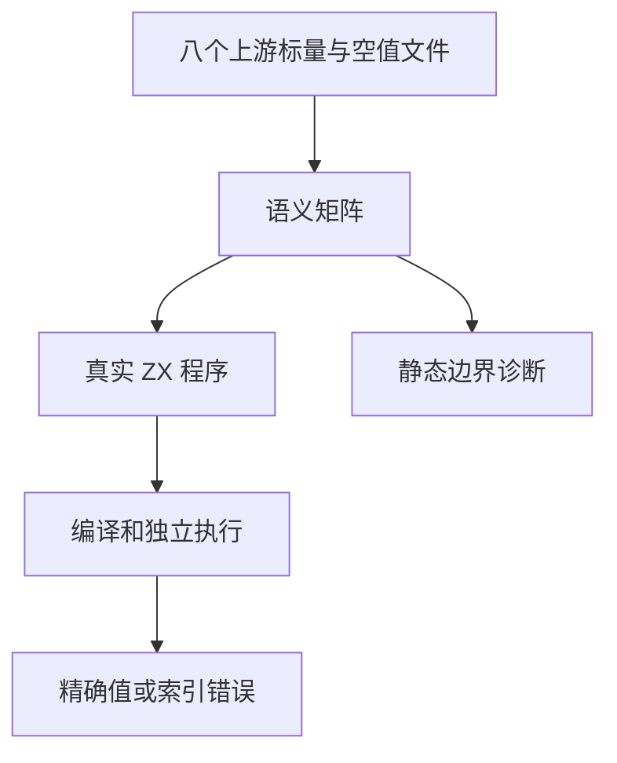
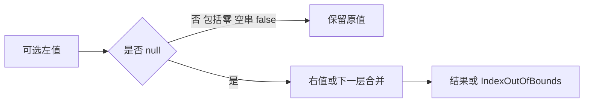

# 空值合并标量保留验证

## Intent：最终目标

对 Test262 中零、42、空字符串、字符串 undefined、false、true 的非空保留断言建立实际执行证据，区分空值与假值。

## Data：可用证据

六个 short-circuit-number-* 标量文件各十一项，另有 follows-null 与 chainable。ZX 的 ?? 要求 T? 左值及 T 回退值，已有 bool 调用轨迹但缺少对应数字/字符串的直接值、嵌套位置及错误回退证据。

## Edges：边界与限制

原 undefined、null 结果、异型 fallback 和左结合任意类型链不直接支持，不将这些默认为等价。数字使用 f64 的精确 0/42，此批不涵盖 NaN 或有符号零位模式。保持四个未加括号混合负例待契约确认。

## Answer：交付与成功标准

分别验证 f64、bool、string 的直接回退、双层有括号回退、索引失败分支；对非可选 lhs、可选 rhs、null rhs、左结合链保留静态诊断。每种值与位置独立具名，执行后关联原文件 SHA、具体结果及差异。

## 执行与审阅

新增 108 条运行案例：每种类型直接合并六条、嵌套合并十八条、索引回退十二条。三个与阶段 65 相同的布尔类型诊断在复核时删除，复用既有 ID；最终新增九条前端诊断。第一轮专项 789/789 步骤、41,997/41,997 测试通过（含随后移除的三个重复诊断），日志 `/tmp/zxc-test262-coalesce-values-special.log`；最终根回归以去重后的目录为准。

六个标量保留文件、follows-null、chainable 共八个文件登记 adapted，保留原 0/42/空字符串/字符串 undefined/false/true 的精确值；不以一般 bool 结果代替原值。SHA、结果和诊断均由审计核对。登记 53,348：runtime 38,898、frontend 3,096、evaluation_order 208、safety 464、RX 10,446、Store 236。上游 279/53,597 已审阅（157 adapted、102 equivalent、20 excluded），关联 952，仍有 53,318 未审阅。

## 自我批判

索引分支断言既有空输入失败，也有非空值跳过同一错误的成功，避免只验证最终数值而漏掉错误求值。嵌套使用括号并显式可选输入，无法代表原 JavaScript 任意类型链；原含 undefined 的断言不提供，null 结果不能偷偷替换。f64 的 0/42 精确结果不证明负零或 NaN payload，后续对应位模式应单独验证。去重后的布尔诊断复用原案例，未靠重复声明增加数量。

未发现新的生产失败；本阶段无生产源码修改。混合文法仍未收到用户决策，owner 正在其他规则任务，四个负例继续保留未审阅。类型检查、生成一致性、审计、格式和 diff 检查通过。

最终根级实际 Z3 回归为 974/974 步骤、53,344/53,344 条 Zig 测试通过，日志 `/tmp/zxc-test262-coalesce-values-root.log`；此结果包含去重后的 3,096 条前端案例。
