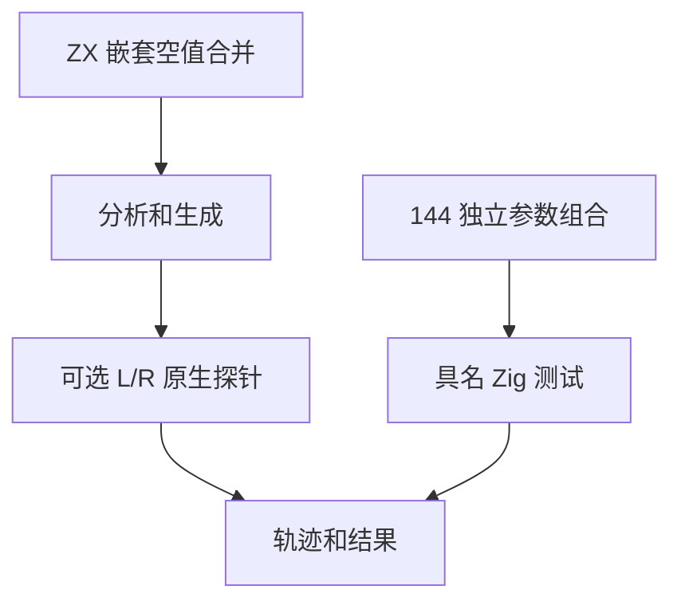
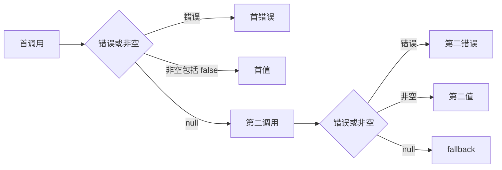

# 空值合并求值顺序验证

## Intent：最终目标

补齐空值合并在非空短路、空值回退和失败传播时的真实调用证据，避免只检查最终值掩盖多余调用。

## Data：可用证据

固定上游 coalesce/abrupt-is-a-short-circuit.js 和 short-circuit-prevents-evaluation.js 分别要求首错误阻止后续调用、首个非空值跳过 poison。ZX 分析器要求 ?? 左侧可选、右侧载荷类型；既有 L/R 探针可分别失败并记录顺序。

## Edges：边界与限制

ZX 没有 undefined 或源级 throw；左结合的 JS 任意类型链不能直接复制。使用 `left() ?? (right() ?? fallback)`，明确是静态契约适配，不能声称原链语法等价。左右探针返回 bool?，分别包含 null/false/true；将 false 错当空值必须失败。反向源码顺序也要验证。

## Answer：交付与成功标准

增加可选返回探针，复用轨迹断言与独立具名发射器；组合两种源码顺序、左右三种值、两种 fallback、各自失败，共 144 个独立案例。每例核对调用轨迹和错误身份或 bool 结果。增加原链类型限制的前端证据，执行后关联原文件并记录自我批判。

## 执行证据

新增 144 条具名轨迹案例和三条分析期 type_mismatch 案例。可选原生探针只记录调用并返回输入给定值，失败身份继续复用已有 LeftFailure/RightFailure。联合 test-evaluation-order、test-frontend 为 18/18 步骤、3,286/3,286 测试通过，其中 208 条目录轨迹、一个历史乘法轨迹、3,077 条前端案例。日志 `/tmp/zxc-test262-coalesce-order-special.log`。

上游两个文件完成 adapted 登记，SHA、轨迹、结果、错误与诊断均由审计核对。目录统计 53,149：runtime 38,718、frontend 3,077、evaluation_order 208、safety 464、RX 10,446、Store 236。上游审查 269/53,597（147 adapted、102 equivalent、20 excluded），关联 762，剩余 53,328；coalesce 目录另外 22 个文件尚未登记，不能推断全部已对齐。

## 自我批判

探针使用 bool? 而非上游数字 42，因此证据直接覆盖空值/非空分支和错误控制流，不声称原数字值或 undefined 本身等价。右括号嵌套是在明确类型契约下的合法表达式，不用修改期待掩盖原左结合链的静态拒绝。原生测试状态仅是观测手段，不构成应用层共享可变状态能力。其他空值合并值类型、逻辑混合和括号文法仍需独立审查。

TypeScript、生成一致性、格式与 diff 检查通过。查询工具曾因 --limit 0 拒绝参数，改为正整数后正常，属于调用纠正。没有生产源码修改，也没有新实现缺陷需要通知。

最终根级实际 Z3 回归为 928/928 步骤、53,145/53,145 条 Zig 测试通过，日志 `/tmp/zxc-test262-coalesce-order-root.log`。登记 JSONL 总数与 Zig 汇总统计口径不同，分别报告。
