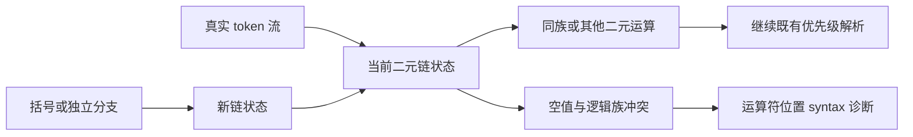

# 空值合并混合修复方案

## Intent：最终目标

优先处理测试会话报告的 `??` 与 `&&`/`||` 无括号混合差异。先确认 ZX 的文法契约，再决定解析器修复或正式差异记录；不将类型不匹配冒充语法拒绝。

## Data：可用证据

当前 syntax.zig 定义 `??`、`||`、`&&` 优先级分别为 1、2、3。parser_expressions.zig 的 precedence-climbing 解析器没有混合限制。实际 bool? 与 bool 输入的复现文件已由现有 CLI 编译成功。测试反馈所列 Test262 四个负例要求解析期 SyntaxError；两个显式括号用例允许混用。

## Edges：边界与限制

- 用户已确认采用 Test262 的显式括号要求；本轮只修改该文法边界。
- 若采用括号要求，只约束同一个未分组二元运算链；括号、函数参数、lambda body、条件表达式分支各自有独立的解析上下文。
- 不改变现有 AST/IR 形状、运算符优先级或短路执行顺序，不用源码字符串搜索运算符。
- 不新增测试用例，不覆盖另一测试会话的源码或审阅记录；复用其真实复现及已有编译回归。

## Answer：交付与成功标准

若采用 Test262 规则：在二元解析链中维护 empty/coalesce/logical 三态。递归解析右操作数时共享当前链状态；进入显式分组和新的独立表达式时创建新状态。遇到另一运算符族时，在该运算符源码位置报告 syntax。条件表达式的 yes/no 分支重新开始各自的链，避免把条件中的 ?? 错误传播到分支中的逻辑运算。

原备选是保留 ZX 优先级混合并记录设计差异；用户未选择该方案，因此没有将这四个负例登记为设计排除。

## 自我复核

用户已明确选择遵循 Test262：无括号混用报语法错误。已将上述局部链状态方案应用到正式 parser_expressions.zig，开始编译及真实行为验证；没有修改运算符优先级、AST/IR 或分析器类型规则。

这不是压缩问题的延伸，也不是运行时错误；根因是两种文法契约不同。可审阅代码草稿位于 [parser_expressions.zig](空值合并混合修复/parser_expressions.zig)，只新增局部二元链状态；草稿经用户确认后已应用到正式解析器，分发构建通过。真实 CLI 手工核对 5 个无括号混合拒绝和 9 个显式分组、条件分支、列表独立表达式成功；临时文件已清除，未新增测试用例。根回归使用真实 Z3 路径执行，974/974 步骤、53,344/53,344 测试通过，日志 `/tmp/zxc-nullish-grammar-regression.log`。格式与 diff 检查通过。
