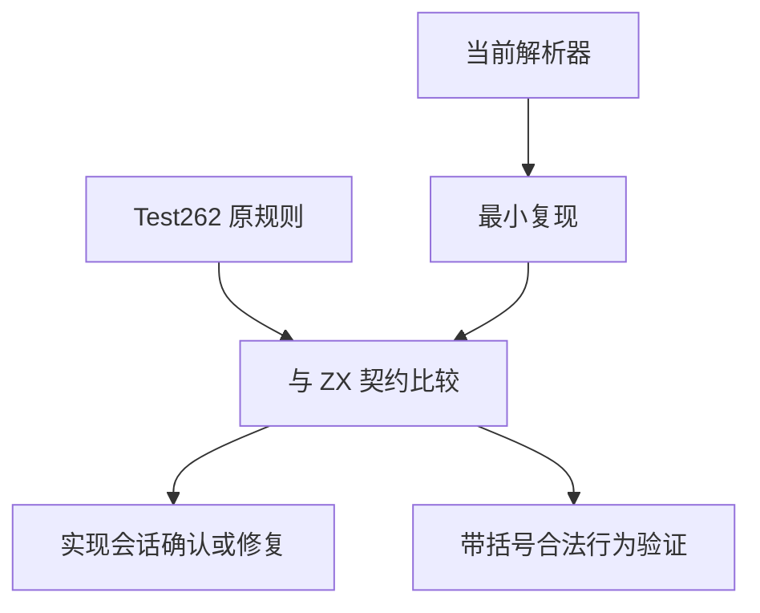
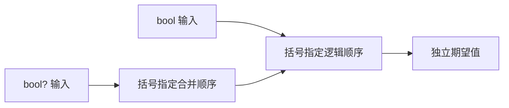

# 空值合并逻辑混合验证

## Intent：最终目标

验证 Test262 对 ?? 与 &&/|| 混合括号的要求，区分语法差异、类型差异和合法表达式的运行行为。

## Data：可用证据

上游四个 cannot-chain 文件要求不带括号的直接混合在 parse 阶段拒绝，另两个 chainable-if-parenthesis-covered 文件允许带括号混合。当前 ZX syntax.zig 将 ??、||、&& 分别定义为优先级 1、2、3；parser_expressions.zig 通用优先级解析未限制混合。实测 `in.value ?? in.left && in.right` 可编译，其中 value 为 bool?。

## Edges：边界与限制

设计文档列出运算符但未明确混合限制。不能只凭现有实现把缺少限制认定成正式设计排除，也不能把数字逻辑操作数引起的 type_mismatch 冒充原 parse SyntaxError。保留上游失败期待，向实现会话报告契约差异；在契约确认前不登记四个负例为已对齐。

## Answer：交付与成功标准

保存最小复现及当前源码证据；验证括号明确且类型合法的运行组合，保留原 JS 数值真值与异型空值回退差异。待实现会话确认混合文法后再决定四个负例的正式测试与审阅状态。

## 实际执行

重建 `zig build dist` 为 9/9 步骤通过，再运行最小复现成功，生成 `return ((in).value orelse ((in).left and (in).right));`。不是旧二进制造成的观察偏差。已将证据和文档路径发送至用户指定实现会话；该会话已提出语言文法选择问题，当前等待用户确认。四个 cannot-chain 负例继续保留未审阅。

新增 72 条运行组合：AND/OR 各三种括号结构，每种覆盖 bool? 的 null/false/true 与左右两个 bool 的全部组合。用例能够区分 `(value ?? left) op right` 与 `value ?? (left op right)`，而非仅测两者结果恰好相同的输入。另有上游两正向文件共十条原数字/null 表达式，逐项验证分析期 type_mismatch。

完整前端与执行联合 753/753 步骤、41,877/41,877 测试通过，日志 `/tmp/zxc-test262-coalesce-logical-special.log`。两个 parenthesis-covered 文件登记 adapted，明确原数字真值与非可选 lhs 差异，不把类型拒绝说成运行等价。

## 自我批判

先检查实现再设期待容易固化实现缺陷，因此未给未加括号混合添加通过期待，也未登记四个上游负例。正向 bool 适配覆盖分组与静态类型契约，不能声称原 JS 结果 42 已运行。最初误在根目录调用包内 test-runtime，构建系统拒绝后在 packages/test 正确重跑，不计作语言失败。

当前登记 53,231：runtime 38,790、frontend 3,087、evaluation_order 208、safety 464、RX 10,446、Store 236。上游已审查 271/53,597（149 adapted、102 equivalent、20 excluded），关联 844，剩余 53,326。类型检查、生成一致性、审计、格式和 diff 检查通过；没有生产源码修改。

最终根级实际 Z3 回归：937/937 步骤、53,227/53,227 条 Zig 测试通过，日志 `/tmp/zxc-test262-coalesce-logical-root.log`。未决文法问题不会被该通过结果覆盖。
