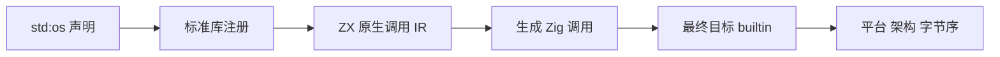
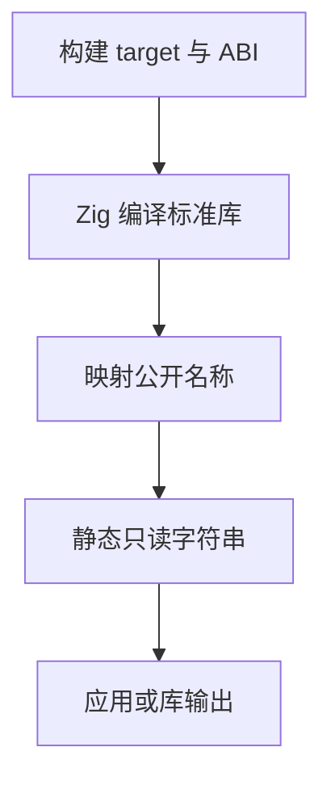

# 系统目标信息实施计划

## Intent：最终目标

为 std:os 接通 arch、platform、endianness 三个编译目标查询，作为系统与进程标准库的一部分。交叉编译时必须返回产物目标的信息，不能把运行 zxc 的开发机器信息固化进生成源码。

## Data：可用证据

[Node.js OS 文档](https://nodejs.org/api/os.html)将这三个接口定义为编译目标属性。Zig builtin 提供最终模块的 cpu.arch、os.tag、abi，CPU 架构提供 endian()。现有标准库通过 modules.json、声明接口和 standard/src/root.zig 接入，CLI 库发布会递归打包静态 Zig 源码。

## Edges：边界与限制

三个接口无参数、返回 string，无 I/O、无环境变量读取。常见 Node 架构名称与 Zig 枚举名称不同，需显式做语言 API 映射；其余 Zig 目标采用 Zig 原生 tag 名作为扩展。Android 由 ABI 区分，macOS 映射 darwin、Windows 映射 win32、illumos 映射 sunos。不读取运行时内核版本，不宣称实现 os 的文件、进程、网络或性能功能。

## Answer：交付与成功标准

提供真实 .d.zx 接口、Zig 实现、目录注册、ZX 示例和参考。构建实际 ZX 应用，与当前 Node 输出对照；交叉编译并核查目标常量；导出 lib 后用 ZX/Zig 消费。复用现有构建回归，不新增测试用例，不使用浏览器。

## 执行与自我复核

已接入四个正式文件：standard/src/os.zig、interfaces/os.d.zx、src/root.zig 与 modules.json。实现只使用最终目标 builtin；不在 CLI 分析阶段提前求值。

根构建 14/14 步成功，现有 compiler 回归 347/347 通过。首轮目标探针发现 Zig 0.16 已无 solaris tag，已删除不存在的枚举分支，采用其实际支持的 illumos；其后实际 ZX 应用、库和七个底层目标编译均通过。现有 compiler 回归不实例化所有 Zig 标准实现，因此不能单靠该回归证明新接口可用。

实际应用、ZX 发布库再消费、Zig 发布库独立消费均输出 x64/darwin/LE，与 Node 相同，见运行结果.json。独立 Zig 消费者构建 3/3 步成功。发布库复制至消费者目录后构建，不依赖开发仓库路径。

七个目标的 LLVM 常量记录见目标编译结果.json：x86_64-linux、aarch64-macos、aarch64-windows、x86-linux、s390x-linux、aarch64-linux-android、x86_64-illumos。s390x 为 BE，其余上述目标为 LE；Android 返回 android，illumos 返回 sunos。真实 ZX 应用另已交叉编译为 x86_64 Linux ELF，但未在 Linux 执行。

自我批判：架构/平台查询仅覆盖编译目标属性，不是完整 os 库；静态 LLVM 常量不能冒充跨平台运行。Zig 扩展目标的 tag 命名有明确文档，未为全部架构声称与 Node 等价。未新增测试用例，目标探针和宿主是 docs 中可复现的示例资源。
