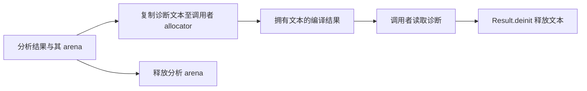

# 编译诊断文本所有权修复

## Intent：最终目标

编译返回错误后，调用者仍可读取错误文本；释放结果时同时释放文本，避免悬垂引用与泄漏。

## Data：可用证据

native 接口错误文本由 modules/native.zig 在分析 arena 内动态格式化。compileProject 与 verified_compile 原先仅复制 Diagnostic 结构，然后释放分析结果；message 切片随之失效。连续构建审查暴露该历史问题。

修复后现有编译器回归 49/49 步、347/347 测试通过；根构建 14/14 步通过。复用已有原生示例，将临时副本声明中的 f64 改为未知类型，CLI 退出 1，显示完整接口路径、行列与 unknown or unsupported type，未发布可执行文件。没有新增测试用例。检查与结果来自包含增量构建工作的当前工作区，不声称隔离提交树已单独运行全套回归。

## Edges：边界与限制

静态及借用诊断保持原先默认语义。只有明确 clone 的诊断拥有其文本，并需释放一次；不要把拥有文本的 Diagnostic 按值复制后分别释放。compiler.Result 的既有 deinit 调用负责该释放，调用者无需额外释放 message。修改不改变错误码、span、source_index 或文本格式。

## Answer：交付与成功标准

Diagnostic 增加 clone/deinit 与可选 message_allocator。compileWithContext、compileProject 和 verified compile 返回分析诊断前复制到调用者 allocator，Result.deinit 释放该副本。

自我批判：外层 CLI arena 可能暂时掩盖失效引用，成功打印一次不能证明原实现的所有权正确。修复依据是完整的分配、返回与释放链路，回归结果只提供兼容性证据。早期手工注入替换了示例不存在的 u64；已增加前置断言并按实际 f64 重跑，未将该无效注入算作修复证据。
