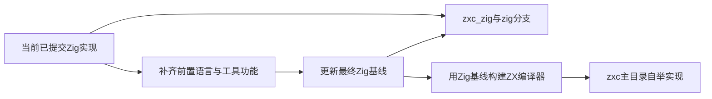
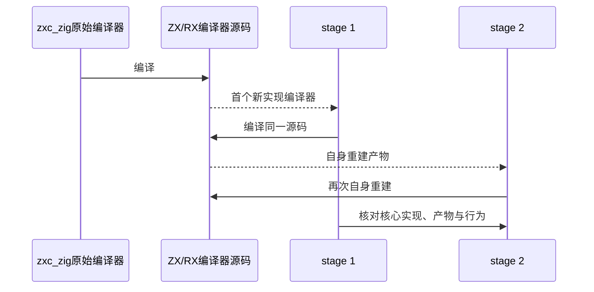

# 自举仓库分离实施计划

## Intent：最终目标

用户新增明确交付：原始 Zig 实现保留在 `/Users/xiewendao/Documents/MatrixAges/zxc_zig`，建立本地与远端 `zig` 分支；`/Users/xiewendao/Documents/MatrixAges/zxc` 最终承载用 zxc 自身实现的编译器。

完整前置功能与自举目标不缩小。当前先建立原始实现的可追溯基线；项目仍在补齐 RX 服务与完整流程，不能把目录分离或调用旧编译器的包装器当成自举完成。

## Data：可用证据

当前工作区在 master，已提交 Zig 实现为 17e78f390c74edf07ed7567ac000b4f289084326。已检查目标目录不存在、本地及 origin 均无 zig 分支，origin 为 MatrixAges/zxc。compiler、core、cli、genz、dsl、lint 的正式源码没有未提交差异。另一个会话仍有未提交测试与执行记录，继续留在当前工作区。

## Edges：边界与限制

使用指定路径的 Git worktree 保留同一仓库历史，分支严格命名为 zig。建立基线不移动当前工作区、不删除已有文件，也不把另一会话未提交的工作混入当前提交。

自举切换之前，必须将最终 Zig 实现和应交付的验证材料更新到 zig 分支及 zxc_zig，再替换 zxc 中的实现。若分支已有独立修改，先核对并保留；不通过强制推送覆盖它。当前基线不能永久停留在尚未完成前置功能的版本。

Zig 可继续作为目标代码后端或工具链，但词法、语法、语义、模块联结和生成等属于编译器自身的核心实现必须逐项迁入 ZX/RX，不能通过调用原始 Zig 编译器 API 或子进程来冒充已经迁移。

不新增测试、不执行全量测试。实现阶段使用构建与既有案例，完整回归交由测试会话。

## Answer：交付格式与成功标准

1. 本地 zxc_zig 目录检出 zig 分支，远端 origin/zig 指向同一可核对提交。
2. 原始实现具备完整可重建的源码与文档；最终切换前再次核对提交和前置功能。
3. zxc 主工作区最终由 ZX/RX 实现编译器核心。使用保留的 Zig 版本构建 stage 1，再由 stage 1 编译相同源码得到 stage 2，继续自身重建并核对稳定产物与实际行为。
4. 对照实际入口确认各阶段执行的是新编译器核心，而非原实现代理；保存构建命令、源码和产物身份，以及独立回归证据。
5. 按功能补齐使用说明与 reference。目录存在、分支推送、单例运行或输出文件相同都不能独自证明全部自举完成。

## 实施与自我复核

建立基线中。当前尚未迁移编译器核心，也未完成自举。
