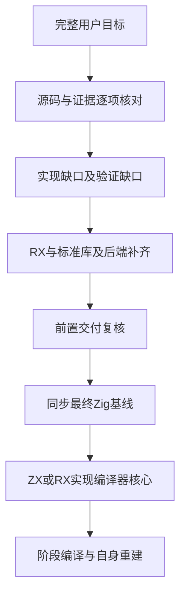
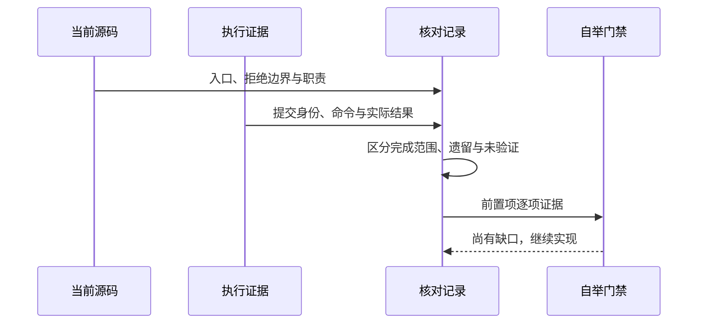

# 自举前实现核对

## Intent：最终目标

在开始用 ZX/RX 实现编译器核心前，逐项核对完整目标的遗留实现、能力边界及证据缺口。核对不改变原目标，不将包装 Zig 编译器、已有目录或一次构建成功视为自举。

结论：当前不满足自举前置功能全部完成的条件。可以继续原始实现的功能建设，不能开始替换主仓库或宣称已经进入完整自举验收。

## Data：可用证据

核对基线为 master 的 dcdc202；正式 compiler/core/genz/dsl/lint/cli/pkgs 实现在本次审计开始时无未提交差异。读取实际构建依赖、CLI 命令与 RX 执行入口，并由两项只读分析分别复核模块与基础设施、标准库与工具后端。历史回归仅证明当时提交和用例范围，本轮没有重跑全量测试。

- `zxc_zig` 是真实 Git worktree，当前检出 zig 分支 f7275ed，工作区干净；远端 origin/zig 同为该提交，master 领先 6 个提交。
- 当前编译器构建仍从 `compiler/src/zx/frontend.zig`、`compiler/src/root.zig` 和 `rx/analysis/root.zig` 等 Zig 入口开始。尚无由 ZX/RX 编译器核心完成 stage 1 → stage 2 → stage 3 的证据。
- GitHub 当前提交的 [run 37201342559](https://github.com/MatrixAges/zxc/actions/runs/37201342559) 已终止为 failure，workflow job 没有任何执行步骤，build job 被 skipped。检查注解明确说明账户付款失败或 spending limit 需要提高；不是本轮源码编译错误。此前六平台成功绑定旧提交，不能替代当前 HEAD 验证。

[核对基线](自举前核对/核对基线.json)保存提交身份、关键源码摘要及上述远端状态。

## Edges：边界与限制

数据库、动态插件和懒加载已按用户先前决定排除，不重新引入。Node.js 作为功能参考，不增加 JavaScript/V8/npm 兼容承诺。既有纯计算、所有权、无环、显式宿主边界继续有效。

审计中“已接通”表示有对应实现入口；不等于任意平台、任意输入均已获证。“未完成”保留在完整目标中；“缺少当前验证”不擅自推断为代码故障。CLI 没有 publish/update/remove 或公开包索引为空，不自动扩充为用户从未要求的全部 pnpm 命令。

正式源码仍按职责分包。其他测试会话的未提交代码和记录保持原位；本次只修改审计与已核实过时的使用文档，不改写他人的总计划。

## Answer：逐项结果与成功标准

| 要求                        | 当前源码与证据                                                                                                        | 遗留或验收缺口                                                                                                                      |
| --------------------------- | --------------------------------------------------------------------------------------------------------------------- | ----------------------------------------------------------------------------------------------------------------------------------- |
| zig:/c:/std:/裸包模块       | ZX 项目解析、声明接口、包拥有者、共享名义身份及无环校验已接通；见 compiler/src/zx/modules 与原生包作用域实施计划      | 不等于动态加载任意外部实现；公开契约维持显式声明与静态链接                                                                          |
| Node 功能参考标准库         | standard/modules.json 注册 8 个 specifier、6 个功能族；encoding、crypto、path、querystring、zlib、os 有真实接口与实现 | 完整 URL、数据表示、文件、进程、网络、流与背压、时间事件、并发、终端、诊断及国际化等对齐仍有缺口；不能以 Zig 内置能力代替 ZX 接口   |
| 插件与懒加载                | 用户已取消，静态原生模块机制承担扩展                                                                                  | 非待实现项，不恢复动态加载器                                                                                                        |
| 编译器命名限制              | 官方 compiler 入口执行 lint，普通值 snake_case、callable camelCase、类型 PascalCase                                   | 保留外部字段与框架契约；后续新增语法仍须接入同一门禁                                                                                |
| GCS 对齐与格式化            | lint 使用真实 AST 结构与空行 edits，fmt 复用该逻辑；已有 GCS 对齐记录                                                 | 不是通用缩进、引号或行宽格式器；不能将人工审美规则视为可机械证明的全部一致性                                                        |
| 形式化证明                  | verification 从共享语义生成前提可满足与违例不可满足查询，真实 Z3 路径及 emit 门禁存在                                 | 仅受支持纯函数子集；浮点、动态集合、Store 和外部语义未全面建模；独立证明证书检查未完成                                              |
| 约束逆解与程序合成          | 现有符号图与验证反例可作为基础                                                                                        | 没有正式输入逆解或 CEGIS/SyGuS 候选合成入口；反例 get-model 不是合成器                                                              |
| 汇编与优化                  | build 正式支持 asm/target/cpu/optimize，Zig 后端实际生成汇编                                                          | 缺独立候选搜索、代价模型、变换等价验证及机器码语义证据；普通 Release 优化不等于超级优化交付                                         |
| FPGA                        | 硬件图、SystemVerilog、端口清单和组合/时钟握手路径已有实现与独立对照记录                                              | 受限纯计算子集；器件映射、布局布线、时序收敛、板上运行及一般形式等价尚无完整交付证据                                                |
| app/lib                     | ZX app/lib、ZX/Zig 库消费、原生静态资源和 C 显式资源搬迁均已接通；dcdc202 定向构建与实际消费已通过                    | 系统 SDK 与未打包库仍是明确外部要求；RX lib 尚未接入                                                                                |
| 包管理/monorepo             | pkg.yaml 内嵌 workspace、版本图、归档安装、锁文件重放、共享缓存、offline/frozen、隔离消费已实现                       | 公开内嵌索引为空；有限 workspace pattern 不是通用 glob。pkg graph 不代表外部依赖已安装                                              |
| GitHub Actions              | Bun + gha-ts、六平台矩阵、真实独立运行核验、打包、摘要与 artifacts 上传已有实现和历史成功                             | 当前 HEAD 因账户账单/额度限制未执行；恢复账户可运行条件后需要取得当前版本的六平台证据                                               |
| translib lib转换            | Skill、Bun 步骤、依赖次序、双审查记录及输入/产物摘要失效门禁已有实现                                                  | 是受证据约束的迁移流程；不保证任意库自动等价转换，不能代替编译器迁移本身                                                            |
| compiler/genz/dsl/lint 分工 | 构建依赖已分离；core 保存共享模型，CLI 独立承担 IO 与命令，genz/dsl/lint 各有模块                                     | genz 是后端需要的 Zig 构造子集，不是完整 Zig 编译器；未发现本轮必须再次拆包的证据                                                   |
| 增量编译                    | ZX 解析、模块语义与原生声明缓存、独立函数生成及跨进程生成缓存已实现                                                   | RX 每轮仍共同推导；共享 ABI 和 Zig 后端失效不保证零重编译；不能声称只有改动源码会发生任何计算                                       |
| watch/热重载                | ZX/RX watch 记录实际输入并重建、错误恢复与产物发布已接通                                                              | 不启动应用、不切换运行中代码、不迁移状态；持续构建尚不等于用户要求的完整热重载                                                      |
| RX 完整应用                 | 普通顺序 Call.fn/Call.service/Return 已生成可执行 Program；真实服务项目已运行                                         | Task/Parallel/Switch/Emit 执行、Store 类型化初值/授权/生命周期、Gateway 宿主及 app.rx 仍未接通；RX fmt/verify/fpga/lib 也有入口缺口 |
| zxc 自举与仓库分离          | 指定 zxc_zig 工作区及本地/远端 zig 分支已存在                                                                         | 最终 Zig 基线还需同步；核心未迁入 ZX/RX，阶段编译、稳定重建与独立语言回归未完成                                                     |
| feature 使用与 reference    | 各功能 README、接口与实施记录已逐步形成                                                                               | 未完成全部 feature 对照；实施记录不能代替稳定使用文档，已发现并修正部分互相矛盾的旧说明                                             |

### 直接核对的执行边界

RX 的 prepare.zig 目前只接受顺序 Call/Return，setter 明确拒绝。Store 文件在 collection.zig 中只进入定义检查；program 的表达式映射仍拒绝 Store 读取，runner 没有持久状态宿主。Gateway 的 Route 装载不创建协议监听。app.rx 在根 Schema 中明确报未定义。

因此下一项实施应接通 RX 控制流及显式宿主能力，而非直接迁移编译器。Store 与受控 I/O 需要先明确快照、提交和 arena 生命周期；调用方请求 arena 释放后不能保留其中的状态引用。分支必须保存路径作用域、返回路径、服务约束和所有权检查，不能把所有分支线性执行。

### 后续执行顺序

1. 补齐 RX 控制流与 Store 显式授权、初值类型及宿主生命周期，再接入事件/Gateway 与受控标准库 I/O。每项保存真实文本输入到独立产物的执行证据。
2. 补齐约束合成与变换验证、FPGA 目标交付、运行中热重载，按明确语义和目标平台建立专项证据，不用示例成功替代通用结论。
3. 恢复当前版本远端构建验证，并核对功能使用文档、reference 与源码是否一致；账户问题不阻止本地继续实现。
4. 前置项逐项闭合后，将最终 Zig 实现同步到 zig 分支和 zxc_zig；再迁移编译器核心，完成 stage 1/2/3、可追溯身份与真实回归。

## 文档修正与自我批判

本轮修正 compiler README 中“外部包安装/锁/共享存储未实现”“RX CLI/service 未接通”等过时描述；修正 RX reference 的旧 zxc.json 示例、结构检查与执行检查混淆，以及无使用输入的推导说明。缓存示例执行目录改为实际拥有案例的 CLI 包。

本核对是开始自举前的基线审计，不是所有目标的最终验收：没有逐一重新运行全部特性，也没有证明标准库全部输入或所有后端变换。CI 失败已查到外部运行条件，应修正验证状态，不能无依据改代码。后续代码变化会使本次源码摘要过时，最终进入自举前必须再次核对。
